```{css, echo=FALSE} 
@media print { # print out incremental slides; see https://stackoverflow.com/questions/56373198/get-xaringan-incremental-animations-to-print-to-pdf/56374619#56374619
  .has-continuation {
    display: block !important;
  }
}
```

```{r setup, include=FALSE}
# figures formatting setup
options(htmltools.dir.version = FALSE)
library(knitr)
opts_chunk$set(
  prompt = T,
  fig.align="center", #fig.width=6, fig.height=4.5, 
  # out.width="748px", #out.length="520.75px",
  dpi=300, #fig.path='Figs/',
  cache=T, #echo=F, warning=F, message=F
  engine.opts = list(bash = "-l")
  )

## Next hook based on this SO answer: https://stackoverflow.com/a/39025054
knit_hooks$set(
  prompt = function(before, options, envir) {
    options(
      prompt = if (options$engine %in% c('sh','bash')) '$ ' else 'R> ',
      continue = if (options$engine %in% c('sh','bash')) '$ ' else '+ '
      )
})

library(tidyverse)
library(hrbrthemes)
library(fontawesome)
```


# Überblick

</br></br>

1. [Willkommen!](#welcome)

2. [Was ist Data Science?](#whatisdatascience)

3. [Was kann Data Science?](#science)

4. [Ziele für dieses Modul](#goals)


---
class: inverse, center, middle
name: welcome

# Herzlich Willkommen!
<html><div style='float:left'></div><hr color='#EB811B' size=1px style="width:1000px; margin:auto;"/></html>


---
# Vorstellungsrunde


.pull-left-vwide[
### Über mich

`r fa('address-book')` Ich bin [Simon Munzert](https://simonmunzert.github.io/) [si’mən munsɜrt], oder Simon [saɪmən].

`r fa('envelope')` [munzert@hertie-school.org](mailto:munzert@hertie-school.org)

`r fa('graduation-cap')` Professor für Data Science und Public Policy | Director, Data Science Lab
]

.pull-right-vsmall[
<div align="center">
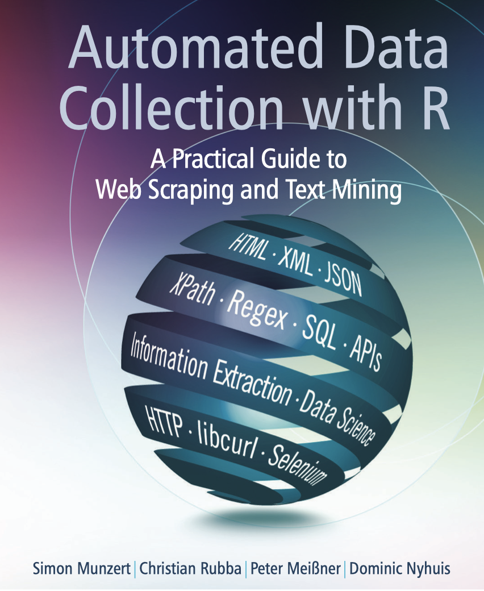
</div>
]

<br><br><br><br><br><br><br><br><br>

<div align="center">


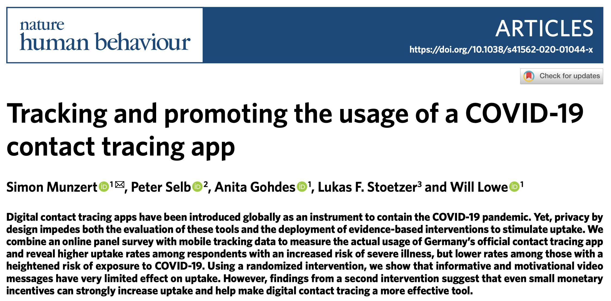

</div>


---
# Vorstellungsrunde


.pull-left[
### Über Euch

`r fa('address-book')` Euer Name

`r fa('envelope')` Eure Behörde und Rolle

`r fa('graduation-cap')` Was erhofft Ihr Euch vom Modul? Maximal 3 Wörter!
]

.pull-right[
<br><br>
<div align="center">

</div>
]


---
# Onboarding-Befragung

<div align="center">
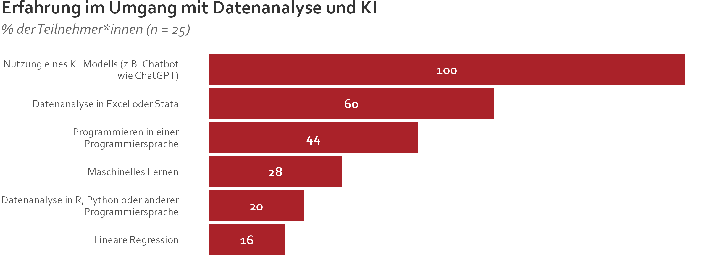
</div>

---
# Onboarding-Befragung

<div align="center">
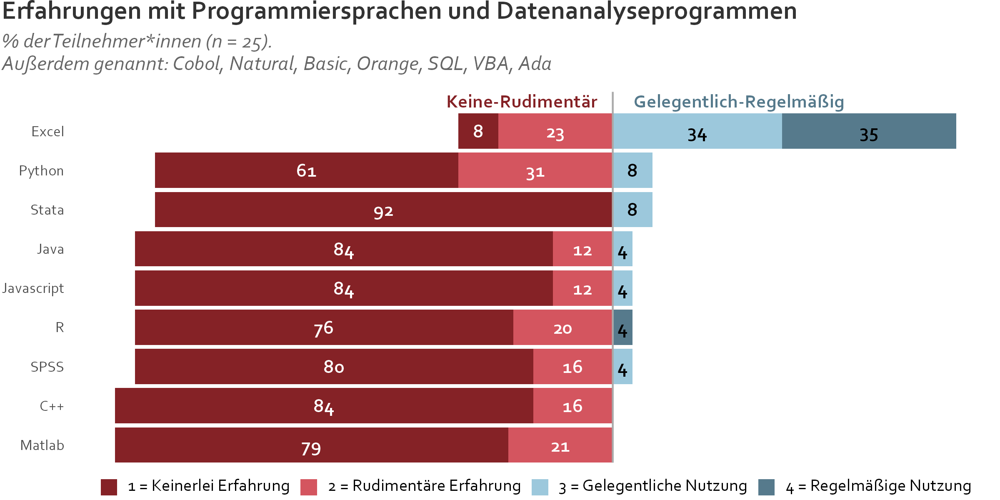
</div>

---
# Onboarding-Befragung

<div align="center">
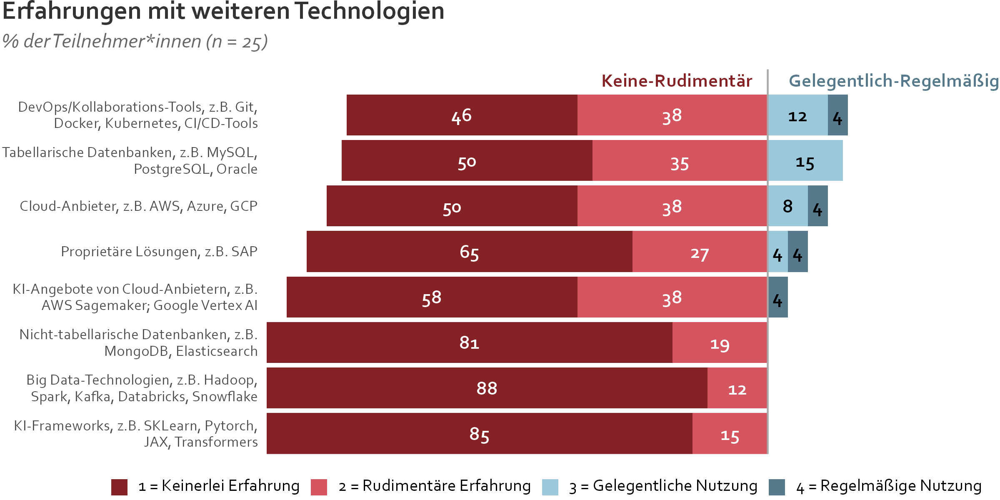
</div>

---
# Onboarding-Befragung

<div align="center">
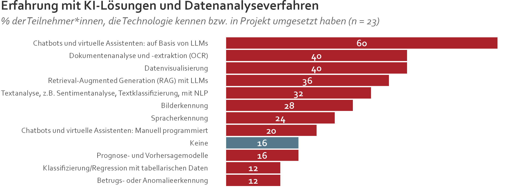
</div>


---
# Workshop-Etikette

.pull-left-wide[
<br>

- Wir haben viele Themen vor uns. Ich habe Material vorbereitet, aber entscheidend ist: **Signalisieren Sie Ihre Interessen und Bedarfe** – ich vertiefe gerne, schwenke um oder greife andere Beispiele auf, soweit möglich.  

- Ich bin kein Experte für Ihre Behörde oder Ihre spezifischen Themen. **Bringen Sie Ihr Fachwissen und Ihre Erfahrung ein.** Sie bilden die Grundlage für eine fundierte, evidenzbasierte Diskussion über Data Science im öffentlichen Sektor.  

- Bitte nutzen Sie die Gelegenheit, **jederzeit Fragen zu stellen**. Es gibt keine schlechten Fragen – jede trägt zur gemeinsamen Diskussion bei.  
]

.pull-right-small-center[
<div align="center">
<br><br>

</div>
]

---
class: exercise, center, middle

# Diskussion

.content-box-white[
**Was möchten Sie über Daten und Data Science lernen?**

**Was sind Ihre Erwartungen an dieses Modul?**

**Excalidraw - **[excalidraw.com](https://excalidraw.com/)
]


---
class: inverse, center, middle
name: whatisdatascience

# Was ist Data Science?
<html><div style='float:left'></div><hr color='#EB811B' size=1px style="width:1000px; margin:auto;"/></html>

---
# Was ist Data Science?

.pull-left-wide2[
## Was ist Data Science?

> "Der interdisziplinäre Forschungszweig Data Science befasst sich mit dem Management und der Analyse von Daten." - [Daniel Keim, Kai-Uwe Sattler](https://www.plattform-lernende-systeme.de/files/Downloads/Publikationen/AG1_Whitepaper_Von_Daten_zu_KI.pdf)

> "Data Science ist ein interdisziplinäres Wissenschaftsfeld, welches wissenschaftlich fundierte Methoden, Prozesse, Algorithmen und Systeme zur Extraktion von Erkenntnissen, Mustern und Schlüssen sowohl aus strukturierten als auch unstrukturierten Daten ermöglicht." - [Wikipedia](https://de.wikipedia.org/wiki/Data_Science)

> "Data Science ist ein Konzept, das Statistik, Datenanalyse, Informatik und die damit verbundenen Methoden vereint, um aktuelle Phänomene anhand von Daten zu verstehen und zu analysieren." - [Chikio Hayashi](https://www.springer.com/book/9784431702085)

️✎ **Zwischen Disziplinen** angesiedelt, anwendungsorientiert
]

--

.pull-right-small2[
## Eine Arbeitsdefinition

<div align="center"><br>

</div>

`Quelle` [Drew Conway, 2010](https://drewconway.com/zia/2013/3/26/the-data-science-venn-diagram) (angepasst)
]


---
# Was Data Science mit KI zu tun hat

.pull-left[

## Künstliche Intelligenz (KI)

- Teilbereich von (u.a.) Data Science, der sich mit der Automatisierung von intelligentem Verhalten befasst.
- Praktisch alle KI-Modelle sind ohne Daten nutzlos.
- Das "I" in KI bezieht sich in der Regel darauf, dass die Modelle **lernen** können, d.h. auf variablen Input angemessen reagieren.

## Data Science 

- Überbegriff für Methoden und Technologien, die auch KI mit einschließen.
- Aber auch Methoden zur Datenerhebung, -verarbeitung, -modellierung, -visualisierung, -kommunikation, -archivierung.
- Damit bereitet Data Science die essentielle Grundlage für KI-Anwendungen.

]

.pull-right[
<br>
<br>
<div align="center">
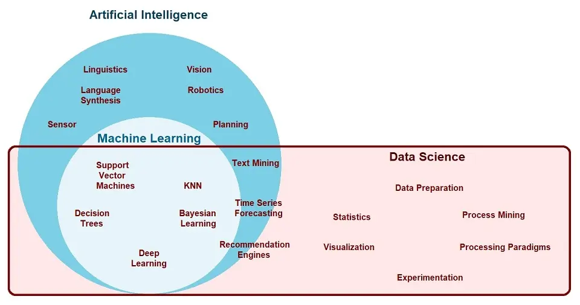
<a href="https://www.ejable.com/tech-corner/ai-machine-learning-and-deep-learning/data-science-artificial-intelligence-and-machine-learning/">Ekta Shah, EJable</a>
</div>
]


---
# Data Science in der Forschung - mehr als KI

.pull-left-small2[
## 1. Beschreibung
- Wie ist der Zustand der Welt?
- Wie entwickeln sich Trends?
- Wie gestalten sich Gruppenunterschiede?

## Der Wert für die Politikgestaltung
- Im Zentrum des **Monitorings**
- „Wie viele Menschen konsumieren Fehlinformationen im Internet?“
- „Wie entwickelt sich die Arbeitslosigkeit in Bezirken?“
- „Wie viele Radunfälle gab es pro Straßenabschnitt?“
]

--

.pull-left-small2[
## 2. Erklärung
- Welche Wirkung hat eine Maßnahme?
- Ist sie über Gruppen heterogen?
- Was sind Wirkungsmechanismen?

## Der Wert für die Politikgestaltung
- Im Mittelpunkt der **Evaluation**
- „Hat die Digitalisierungsmaßnahme zu Zeitersparnis geführt?“
- „Bei wem wirkte die Anti-Fake-News-Kampagne?“
- „Warum hat die Intervention nicht zu den erwarteten Ergebnissen geführt?“
]

--

.pull-left-small2[
## 3. Vorhersage
- Wie wird Person X sich verhalten?
- (Wann) wird Ereignis X eintreten?
- Zu welchem Typ gehört eine Beobachtung?


## Der Wert für die Politikgestaltung
- Steht im Mittelpunkt der **Vorhersage**, aber auch der **Zielsetzung** und **Messung**.
- „Wird die Person rückfällig werden?“
- „Enthält dieser Post Hate Speech?“
- „Wie stark wird die Wasserverschmutzung an einem bestimmten Tag sein?“
]


---
background-image: url("../pics/vintage-pipeline.jpeg")
background-size: contain
background-color: #000000

# Die Data-Science-Pipeline


---
# Die Data-Science-Pipeline

.pull-left[

**Vorbereitung**

- **Problemstellung** Vorhersage, Inferenz, Beschreibung
- **Design** Konzept erstellen, Datenerfassung aufsetzen
- **Datenerhebung** rekrutieren, sammeln, überwachen
]

---
# Die Data-Science-Pipeline

.pull-left[
**Vorbereitung**

- **Problemstellung** Vorhersage, Inferenz, Beschreibung
- **Design** Konzept erstellen, Datenerfassung aufsetzen
- **Datenerhebung** rekrutieren, sammeln, überwachen

**Datenverarbeitung**
]

.pull-right-center[
<br><br><br>
<div align="center">

</div>

`Quelle` [H. Wickham, M. Çetinkaya-Rundel, G. Gronemund: R for Data Science](https://r4ds.hadley.nz/)
]

---
# Die Data-Science-Pipeline

.pull-left[
**Vorbereitung**

- **Problemstellung** Vorhersage, Inferenz, Beschreibung
- **Design** Konzept erstellen, Datenerfassung aufsetzen
- **Datenerhebung** rekrutieren, sammeln, überwachen

**Datenverarbeitung**

   - **Aufbereiten**: importieren, bereinigen, anreichern
]

.pull-right-center[
<br><br><br>
<div align="center">

</div>

`Quelle` [H. Wickham, M. Çetinkaya-Rundel, G. Gronemund: R for Data Science](https://r4ds.hadley.nz/)
]


---
# Die Data-Science-Pipeline

.pull-left[
**Vorbereitung**

- **Problemstellung** Vorhersage, Inferenz, Beschreibung
- **Design** Konzept erstellen, Datenerfassung aufsetzen
- **Datenerhebung** rekrutieren, sammeln, überwachen

**Datenverarbeitung**

   - **Aufbereiten**: importieren, bereinigen, anreichern
   - **Explorieren**: visualisieren, beschreiben, entdecken
]

.pull-right-center[
<br><br><br>
<div align="center">

</div>

`Quelle` [H. Wickham, M. Çetinkaya-Rundel, G. Gronemund: R for Data Science](https://r4ds.hadley.nz/)
]


---
# Die Data-Science-Pipeline

.pull-left[
**Vorbereitung**

- **Problemstellung** Vorhersage, Inferenz, Beschreibung
- **Design** Konzept erstellen, Datenerfassung aufsetzen
- **Datenerhebung** rekrutieren, sammeln, überwachen

**Datenverarbeitung**

   - **Aufbereiten**: importieren, bereinigen, anreichern
   - **Explorieren**: visualisieren, beschreiben, entdecken
   - **Modellieren**: testen, inferieren, vorhersagen
]

.pull-right-center[
<br><br><br>
<div align="center">

</div>

`Quelle` [H. Wickham, M. Çetinkaya-Rundel, G. Gronemund: R for Data Science](https://r4ds.hadley.nz/)
]


---
# Die Data-Science-Pipeline

.pull-left[
**Vorbereitung**

- **Problemstellung** Vorhersage, Inferenz, Beschreibung
- **Design** Konzept erstellen, Datenerfassung aufsetzen
- **Datenerhebung** rekrutieren, sammeln, überwachen

**Datenverarbeitung**

   - **Aufbereiten**: importieren, bereinigen, anreichern
   - **Explorieren**: visualisieren, beschreiben, entdecken
   - **Modellieren**: testen, inferieren, vorhersagen

**Verbreitung**

  - **Kommunikation**: Öffentlichkeit, Entscheidungsträger
  - **Veröffentlichen**: Zeitschriften, Software, Berichte
  - **Produktivieren**: nutzbar, robust, skalierbar machen
]

.pull-right-center[
<br><br><br>
<div align="center">

</div>

`Quelle` [H. Wickham, M. Çetinkaya-Rundel, G. Gronemund: R for Data Science](https://r4ds.hadley.nz/)
]


---
# Die Data-Science-Pipeline

.pull-left[
**Vorbereitung**

- **Problemstellung** Vorhersage, Inferenz, Beschreibung
- **Design** Konzept erstellen, Datenerfassung aufsetzen
- **Datenerhebung** rekrutieren, sammeln, überwachen

**Datenverarbeitung**

   - **Aufbereiten**: importieren, bereinigen, anreichern
   - **Explorieren**: visualisieren, beschreiben, entdecken
   - **Modellieren**: testen, inferieren, vorhersagen

**Verbreitung**

  - **Kommunikation**: Öffentlichkeit, Entscheidungsträger
  - **Veröffentlichen**: Zeitschriften, Software, Berichte
  - **Produktivieren**: nutzbar, robust, skalierbar machen

**Meta-Fähigkeit: Programmierung**
]

.pull-right-center[
<br><br><br>
<div align="center">

</div>

`Quelle` [H. Wickham, M. Çetinkaya-Rundel, G. Gronemund: R for Data Science](https://r4ds.hadley.nz/)
]


---
class: inverse, center, middle
name: science

# Was kann Data Science?

<html><div style='float:left'></div><hr color='#EB811B' size=1px style="width:1000px; margin:auto;"/></html>


---
# Das Billion-Prices-Projekt (MIT)

.pull-left[
<div align="center">

</div>
]

.pull-right[
<div align="center">

</div>
]

<br>
**Siehe auch:** [https://thebillionpricesproject.com/](https://thebillionpricesproject.com/) und [https://www.pricestats.com/](https://www.pricestats.com/)

---
# Das Billion-Prices-Projekt (MIT)

.pull-left[
<div align="center">

</div>
]

.pull-right[
<div align="center">
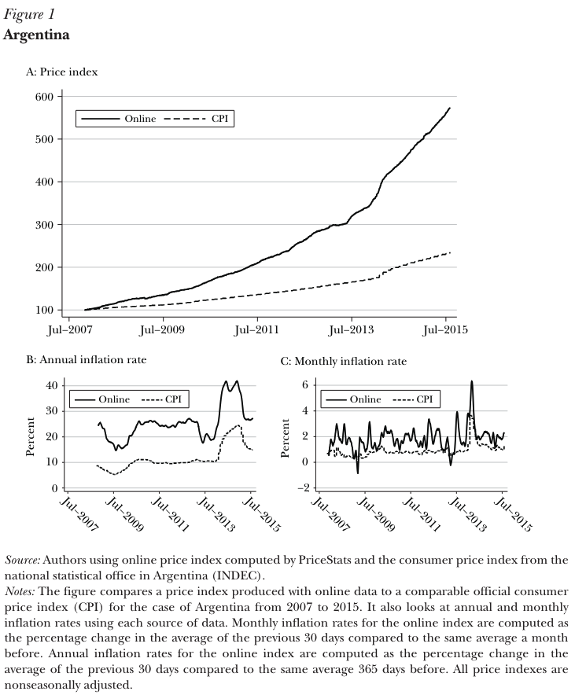
</div>
]

<br>
**Siehe auch:** [https://thebillionpricesproject.com/](https://thebillionpricesproject.com/) und [https://www.pricestats.com/](https://www.pricestats.com/)


---
# COMPAS: Vorhersage der Rückfälligkeit von Straftätern

.pull-left[
## Hintergrund

- Correctional Offender Management Profiling for Alternative Sanctions (COMPAS) ist ein von Northpointe (jetzt Equivant) entwickeltes Entscheidungshilfeinstrument, das von US-Gerichten zur **Bewertung der Rückfallwahrscheinlichkeit** eingesetzt wird.
- Erstellt mehrere Skalen (Risiko der vorzeitigen Entlassung, allgemeine Rückfälligkeit, gewalttätige Rückfälligkeit) auf der Grundlage von Faktoren wie Alter, Vorstrafen und Drogenmissbrauch
- Der Algorithmus ist urheberrechtlich geschützt und seine inneren Abläufe sind nicht öffentlich.

<br><br>

`Quelle` [Leitfaden für Praktiker zum COMPAS Core](https://s3.documentcloud.org/documents/2840784/Practitioner-s-Guide-to-COMPAS-Core.pdf)
]

.pull-right[
<div align="center">
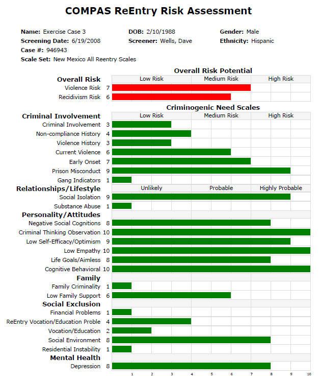
</div>
]


---
# Vertrauen in Data Science

.pull-left[
<div align="center">
<br>
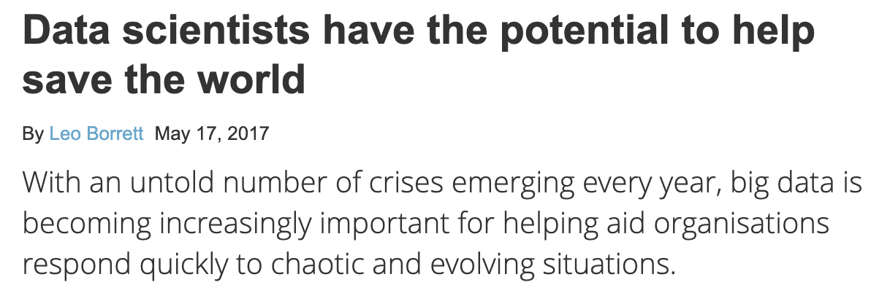
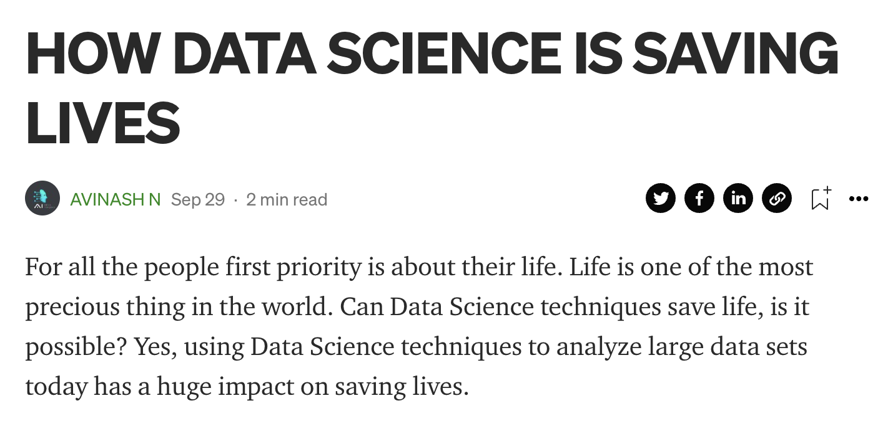
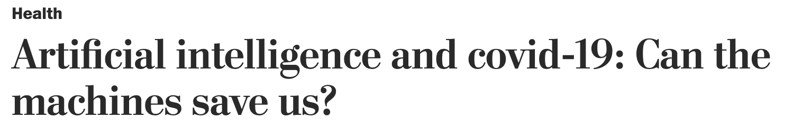
</div>
]

.pull-left[
<div align="center">
<br>
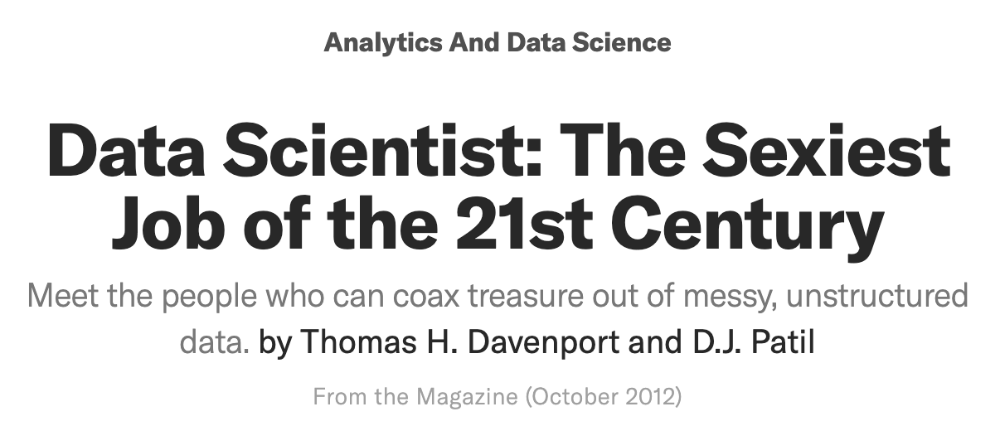


</div>
]

---
# Vertrauen in Data Science?

.pull-left[
<div align="center">
<br><br><br>


</div>
]

.pull-left[
<div align="center">
<br><br><br>
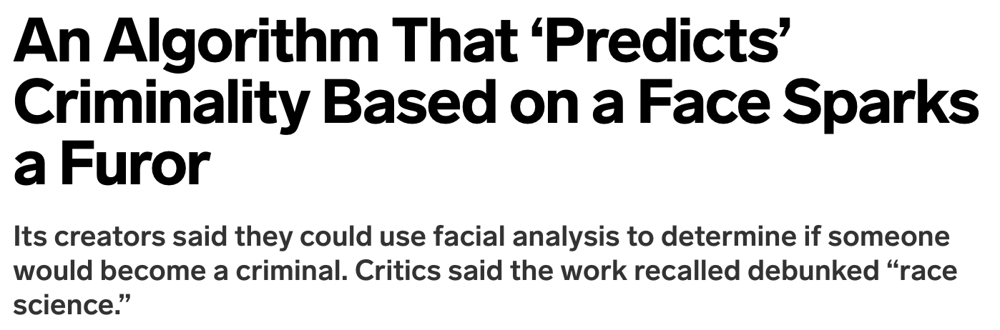

</div>
]


---
class: exercise, center, middle

# Übung

.content-box-white[
**Was kann Data Science und AI tun, was nicht?**

Whiteboard | AI-Anwendungen | Performanz | Schädlichkeit
]


---
# Was kann Data Science und AI tun, was nicht?

<div align="center">
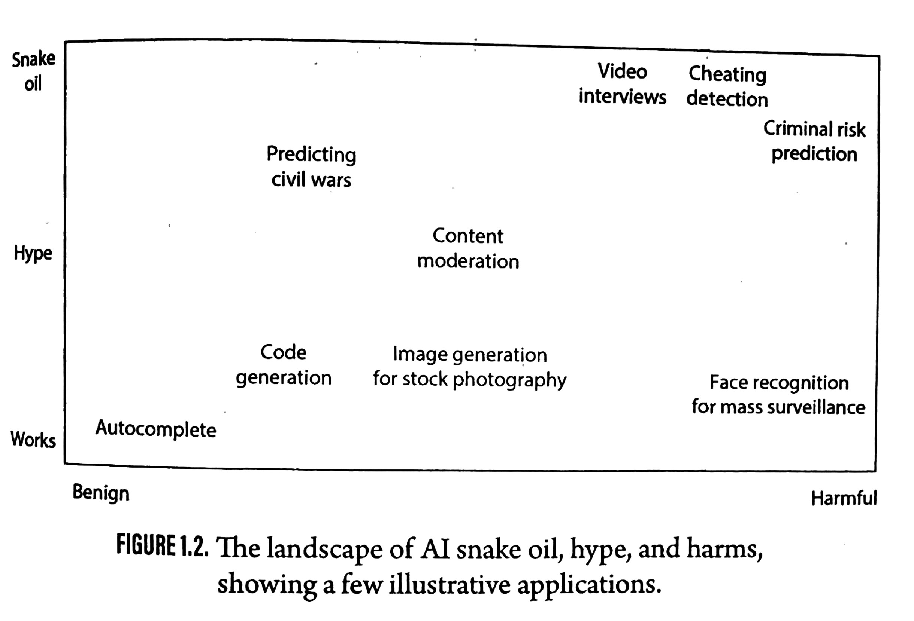
</div>

`Quelle` [Narayanan/Kapoor, AI Snake Oil, S.29](https://press.princeton.edu/books/hardcover/9780691249131/ai-snake-oil)


---
class: inverse, center, middle
name: goals

# Ziele für dieses Modul
<html><div style='float:left'></div><hr color='#EB811B' size=1px style="width:1000px; margin:auto;"/></html>


---
# Modulüberblick

<div align="center">
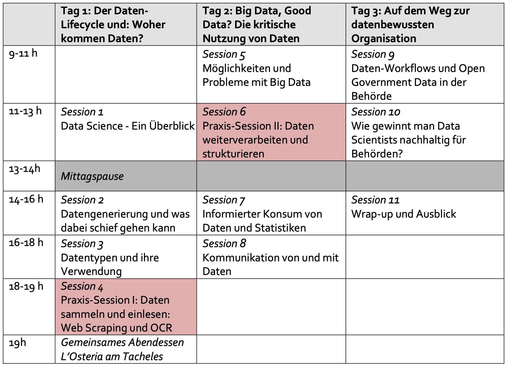
</div>


---
# Was wir nicht behandeln werden

.pull-left-small2[
## Programmierung
- Kenntnisse in Python, R, SQL usw. sind für die Datenwissenschaft unerlässlich
- Die Lernkurve ist steil und erfordert viel Übung
- Wir werfen einen (kleinen) Blick hinter die Kulissen
<br><br><br>

<div align="center">
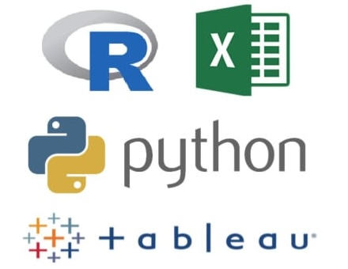 
</div>
]

.pull-left-small2[
## Aktive Modellierung
- Seriöse AI-Modellierung erfordert mehr theoretisches und praktisches Wissen, als wir in diesem Workshop abdecken können.
- Die Konzentration auf die Grundsätze statistischer Argumentation sollte ausreichen, um Daten und Modelle kritisch zu beurteilen.
<br>

<div align="center">
 
</div>
]

.pull-right-small2[
## Fortgeschrittenes Maschinelles Lernen, NLP
- ML, DL, NLP sind Technologien, die viele der spannendsten Anwendungen der Datenwissenschaft vorantreiben.
- Modul 3 wird hier anschließen; wir werden uns auf die Datengrundlagen konzentrieren.

<br>

<div align="center">
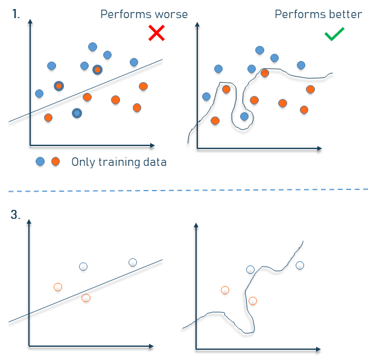 
</div>
]


---
# Weiterführende Literatur

<div align="center">


<br>


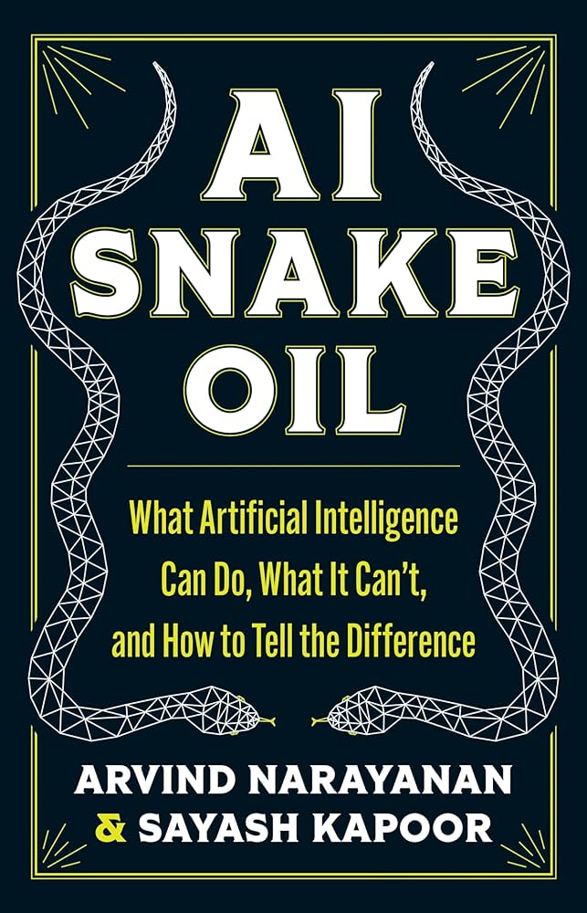
</div>


---
# Weiterführende Podcasts

<div align="center">
<br><br><br>


<br>


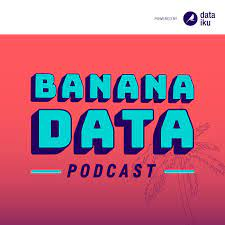


</div>


