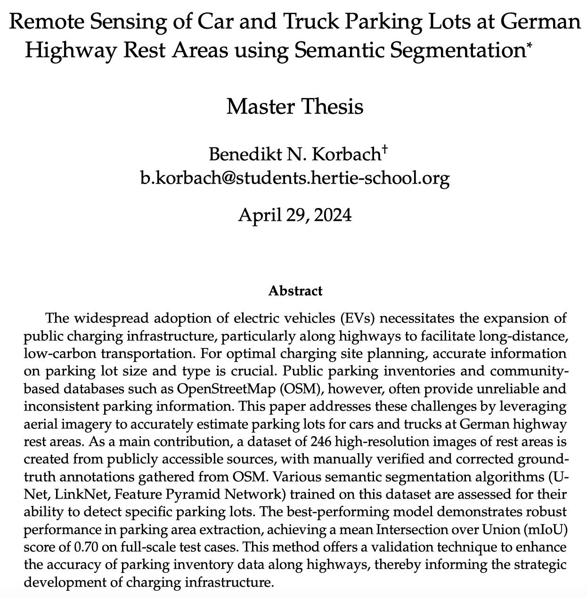

```{css, echo=FALSE} 
@media print { # print out incremental slides; see https://stackoverflow.com/questions/56373198/get-xaringan-incremental-animations-to-print-to-pdf/56374619#56374619
  .has-continuation {
    display: block !important;
  }
}
```

```{r setup, include=FALSE}
# figures formatting setup
options(htmltools.dir.version = FALSE)
library(knitr)
opts_chunk$set(
  prompt = T,
  fig.align="center", #fig.width=6, fig.height=4.5, 
  # out.width="748px", #out.length="520.75px",
  dpi=300, #fig.path='Figs/',
  cache=T, #echo=F, warning=F, message=F
  engine.opts = list(bash = "-l")
  )

## Next hook based on this SO answer: https://stackoverflow.com/a/39025054
knit_hooks$set(
  prompt = function(before, options, envir) {
    options(
      prompt = if (options$engine %in% c('sh','bash')) '$ ' else 'R> ',
      continue = if (options$engine %in% c('sh','bash')) '$ ' else '+ '
      )
})

library(tidyverse)
library(hrbrthemes)
library(fontawesome)
```


# Überblick

<br><br>

1. [Datentypen - ein Überblick](#datatypes)

2. [Datenformat: JSON](#json)

3. [Datentypen und Anwendungen](#datatypes)

4. [Ihre Daten](#yourdata)


---
class: inverse, center, middle
name: datatypes

# Datentypen - ein Überblick
<html><div style='float:left'></div><hr color='#EB811B' size=1px style="width:1000px; margin:auto;"/></html>


---
# Grundgedanken

.pull-left-wide[
## 1. Alles ist Daten.
]

.pull-right-small[
<div align="center">


</div>
]


---
# Grundgedanken

.pull-left-wide[
## 1. Alles ist Daten.

## 2. Daten sind nicht gleich Information.
]

.pull-right-small[
<div align="center">


</div>
]


---
# Grundgedanken

.pull-left-wide[
## 1. Alles ist Daten.

## 2. Daten sind nicht gleich Information.

## 3. Wir können Daten klassifizieren danach, ...

]

.pull-right-small[
<div align="center">


</div>
]


---
# Grundgedanken

.pull-left-wide[
## 1. Alles ist Daten.

## 2. Daten sind nicht gleich Information.

## 3. Wir können Daten klassifizieren danach, ...

- wer sie generiert (Mensch vs. Maschine) bzw. woher sie stammen (*z.B. Verwaltung, Geschichte, Medizin usw.*)
]

.pull-right-small[
<div align="center">


</div>
]


---
# Grundgedanken

.pull-left-wide[
## 1. Alles ist Daten.

## 2. Daten sind nicht gleich Information.

## 3. Wir können Daten klassifizieren danach, ...

- wer sie generiert (Mensch vs. Maschine) bzw. woher sie stammen (*z.B. Verwaltung, Geschichte, Medizin usw.*)

- wie bewusst sie erhoben werden (prozessgeneriert vs. aktiv erhoben)

]

.pull-right-small[
<div align="center">


</div>
]


---
# Grundgedanken

.pull-left-wide[
## 1. Alles ist Daten.

## 2. Daten sind nicht gleich Information.

## 3. Wir können Daten klassifizieren danach, ...

- wer sie generiert (Mensch vs. Maschine) bzw. woher sie stammen (*z.B. Verwaltung, Geschichte, Medizin usw.*)

- wie bewusst sie erhoben werden (prozessgeneriert vs. aktiv erhoben)

- wie strukturiert sie sind (maschinenlesbar vs. nicht maschinenlesbar)
    
]

.pull-right-small[
<div align="center">


</div>
]


---
# Grundgedanken

.pull-left-wide[
## 1. Alles ist Daten.

## 2. Daten sind nicht gleich Information.

## 3. Wir können Daten klassifizieren danach, ...

- wer sie generiert (Mensch vs. Maschine) bzw. woher sie stammen (*z.B. Verwaltung, Geschichte, Medizin usw.*)

- wie bewusst sie erhoben werden (prozessgeneriert vs. aktiv erhoben)

- wie strukturiert sie sind (maschinenlesbar vs. nicht maschinenlesbar)

- was sie abbilden (welche Art von Information, z.B. Text, Bild, Geodaten, Netzwerkdaten)

]

.pull-right-small[
<div align="center">


</div>
]


---
# Grundgedanken

.pull-left-wide[
## 1. Alles ist Daten.

## 2. Daten sind nicht gleich Information.

## 3. Wir können Daten klassifizieren danach, ...

- wer sie generiert (Mensch vs. Maschine) bzw. woher sie stammen (*z.B. Verwaltung, Geschichte, Medizin usw.*)

- wie bewusst sie erhoben werden (prozessgeneriert vs. aktiv erhoben)

- wie strukturiert sie sind (maschinenlesbar vs. nicht maschinenlesbar)

- was sie abbilden (welche Art von Information, z.B. Text, Bild, Geodaten, Netzwerkdaten)

Und nach vielem mehr (Beständigkeit, Digitalisierung, etc.). Für uns eher relevant: Welche **Datentypen** sind **im Data-Science- und AI-Kontext** besonders relevant und wie machen wir sie nutzbar?
]

.pull-right-small[
<div align="center">


</div>
]


---
# Daten vs. Datenformate


.pull-left-vwide[
## Datenformate

- [Datenformate](https://de.wikipedia.org/wiki/Datenformat) sind die **Art und Weise, wie Daten gespeichert und übertragen werden**.
- Sie sind **nicht** dasselbe wie Datentypen.
- Datenformate legen fest, wie Daten strukturiert und abgelegt werden, und wie sie bei ihrer Verarbeitung zu interpretieren sind.
- Es gibt eine nahezu unerschöpfliche Masse an Datenformaten, die sich zum Beispiel in der Vielfalt von [Dateinamenserweiterungen](https://de.wikipedia.org/wiki/Liste_von_Dateinamenserweiterungen) widerspiegelt.

## Wahl von Datenformaten

- Datenwissenschaftler haben oft mehr oder weniger ausgeprägte Präferenzen für bestimmte Datenformate und -strukturen.
- **Beispiel 1** (für einfach strukturierte Daten): Excel Binary File Format (.XLS) < Office Open XML (.XLSX) < [CSV](https://de.wikipedia.org/wiki/CSV_(Dateiformat)) 
- **Beispiel 2** (für semistrukturierte Daten): 
[JSON](https://de.wikipedia.org/wiki/JavaScript_Object_Notation) vs. [XML](https://de.wikipedia.org/wiki/Extensible_Markup_Language) 
- **Beispiel 3** (für vektorielle Geodaten):  [Shapefile](https://de.wikipedia.org/wiki/Shapefile) vs. [GeoJSON](https://de.wikipedia.org/wiki/GeoJSON) 
]

.pull-right-vsmall[
<br><br><br>
<div align="center">

</div>
]


---
class: inverse, center, middle
name: json

# Beispiel: Datenformat JSON

<html><div style='float:left'></div><hr color='#EB811B' size=1px style="width:1000px; margin:auto;"/></html>


---
# Was ist JSON?

.pull-left-wide[
### Zusammengefasst
- <b>J</b>ava<b>S</b>cript <b>O</b>bject <b>N</b>otation
- Beliebtes Datenaustauschformat für Webservices / APIs
- "die fettfreie Alternative zu XML"
- JSON ≠ Java, sondern ein Teilmengen-Format von JavaScript
- Sehr flexibel; nicht von einer bestimmten Programmiersprache abhängig
- Import von JSON-Daten z.B. in R ist mit dem `jsonlite`-Paket unkompliziert

<div align="center">

</div>
]

.pull-right-small[
<br><br>
<div align="center">

</div>
]

---
# Beispiel

.pull-left[
## Daten in JSON-Format

```{}
[
   {
      "name" : "van Pelt, Lucy",
      "sex" : "weiblich",
      "age" : 32
   },
   {
      "name" : "Peppermint, Patty",
      "sex" : "weiblich",
      "age" : null
   },
   {
      "name" : "Brown, Charlie",
      "sex" : "männlich",
      "age" : 27
   }
]
```
]

.pull-right[
## JSON Daten in R-Datentabelle überführt
```{r, echo = TRUE}
library(jsonlite)
json_dat <- 
'[{  "name" : "van Pelt, Lucy",
      "sex" : "weiblich",
      "age" : 32},
   {  "name" : "Peppermint, Patty",
      "sex" : "weiblich",
      "age" : null},
   {  "name" : "Brown, Charlie",
      "sex" : "männlich",
      "age" : 27}
]'
fromJSON(json_dat, flatten = TRUE)
```
]

---
# Grundsyntax

.pull-left[
### Arten von Klammern

1. Geschweifte Klammern, `{` und `}`, umfassen Objekte. Objekte funktionieren ähnlich wie Elemente in XML/HTML und können andere Objekte, Schlüssel-Wert-Paare oder Arrays enthalten.  
2. Eckige Klammern, `[` und `]`, umfassen Arrays. Ein Array ist eine geordnete Sequenz von Objekten oder Werten.

### Datenstruktur

JSON kann komplexe Datenstrukturen abbilden (verschachtelte Objekte etc.), was die Umwandlung in flache Datenstrukturen (z. B. Tabellen) erschweren kann.  

Zum Glück sind JSON-Dateien aus Webservices meist nicht sehr komplex.
]

.pull-right[
### Key-Value-Paare

Keys stehen in Anführungszeichen; Values nur, wenn es sich um Strings handelt.

```{}
"name" : "van Pelt, Lucy"
"age" : 32
```

Keys und Values werden durch `:` getrennt.

```{}
"age" : 32
```

Key-Value-Paare werden durch `,` getrennt.

```{}
{"name" : "van Pelt, Lucy", "age" : 32}
```

Werte in Arrays werden durch `,` getrennt.

```{}
["van Pelt, Lucy", "Peppermint, Patty"]
```
]


---
# JSON einlesen

.pull-left[
### Beispiel: JSON in R einlesen

- Es gibt verschiedene Pakete zum Einlesen von JSON in R.  
- [`jsonlite`](https://cran.r-project.org/web/packages/jsonlite/index.html) von Jeroen Ooms: Gut gepflegt und mit überzeugenden Abbildungsregeln.

### Zentrale Funktionen

Es gibt zwei zentrale Funktionen in `jsonlite`:

- `fromJSON()`: konvertiert JSON-Daten in R-Objekte nach bestimmten [Konventionen](https://arxiv.org/abs/1403.2805).  
- `toJSON()`: konvertiert R-Objekte in JSON-Daten  

Zum Ausprobieren: [Code-Vignette](https://cran.r-project.org/web/packages/jsonlite/vignettes/json-aaquickstart.html).
]

.pull-right[
### Konvertierungsregeln von `jsonlite`

```{r, message=FALSE}
library(jsonlite)
x <- '[1, 2, true, false]'
fromJSON(x)
x <- '["foo", true, false]'
fromJSON(x)
x <- '[1, "foo", null, false]'
fromJSON(x)
```
]


---
class: inverse, center, middle
name: datatypes

# Datentypen und Anwendungen
<html><div style='float:left'></div><hr color='#EB811B' size=1px style="width:1000px; margin:auto;"/></html>


---
# Textdaten: GitHub Copilot

.pull-left-wide2[
## "Your AI Pair Programmer"
- [GitHub Copilot](https://en.wikipedia.org/wiki/GitHub_Copilot) ist ein KI-gestütztes Tool, das Entwickler/innen beim Schreiben von Code unterstützt.
- Es wurde von GitHub und OpenAI entwickelt und basierte ursprünglich auf GPT-3.
- Copilot kann Codevorschläge machen, die auf dem Kontext des Codes basieren, den Sie gerade schreiben.
- Es kann auch ganze Funktionen schreiben, wenn man eine Beschreibung gibt (🖥️ Demonstration).
- Copilot ist in der Lage, in vielen verschiedenen Programmiersprachen zu arbeiten.

## Datengrundlage
- Massen an Code, vermutlich von Plattformen wie [GitHub](https://github.com/), [StackOverflow](https://stackoverflow.com/), etc.
- Substantieller Impact auf Developer-Community, aber auch [Kritik](https://www.theverge.com/2021/7/7/22561180/github-copilot-legal-copyright-fair-use-public-code) bzgl. Urheberrechten und Datenschutz.
]

.pull-right-small2[
<div align="center">


</div>

`Quelle` [Scalablepath.com](https://www.scalablepath.com/full-stack/ai-pair-programming-github-copilot-review)
]


---
# Textdaten: Facebook Suicide Prediction
.pull-left[
## Absicht

- Suizidrisiko vorhersagen mit Nutzerdaten und Interaktionen auf Facebook
- **Behauptung**: Vorhersage von Suizidgefährdung zur Prävention

## Hintergrund

- **Belege**: keine konkreten Genauigkeitszahlen oder Details veröffentlicht [(s. Facebook Blogpost)](https://engineering.fb.com/2018/02/21/ml-applications/under-the-hood-suicide-prevention-tools-powered-by-ai/)
- **Anfechtbarkeit:** keine Zustimmung durch Nutzer/innen, keine Einsicht welche Daten verwendet wurden
- **Training der Modelle**: insb. Facebook-Kommentare und Meldungen, potenzielle Verzerrungen durch unterschiedliche Nutzergruppen und Sprachbarrieren
]

.pull-right[
<div align="center">


</div>
`Quelle` [Murellio et al., 2018](https://engineering.fb.com/2018/02/21/ml-applications/under-the-hood-suicide-prevention-tools-powered-by-ai/)
]


---
# Satellitenbilder zur Messung von räumlichen Phänomenen

.pull-left[
## Das Potential von Satellitenbildern und Luftaufnahmen

- Mit massiv gestiegener **Auflösung** sowie **räumlicher** und **zeitlicher Abdeckung** werden Satellitenbilder mittlerweile für viele Forschungs- und kommerzielle Zwecke eingesetzt
- Rohdaten alleine sind wenig nützlich: Machine-Learning-Techniken, um Muster zu erkennen bzw. inferieren

## Beispiele

- Vorhersage von Armut [(Neal Jean et al., Science)](https://www.science.org/doi/10.1126/science.aaf7894)
- Vorhersage von ökonomischer Entwicklung [(Burke et al.)](https://www.nber.org/system/files/working_papers/w27879/w27879.pdf)
- Erkennung von Photovoltaik-Anlagen [(de Hoog et al.)](https://dl.acm.org/doi/abs/10.1145/3396851.3397681?casa_token=k1cHq7bdfDwAAAAA:Q4NCtoVgj_QZzDHtomreQisLf-iMaScXE5UGEzj2IRWTFvn49pGjYya80n-v-my0PbiSUaP0wC_K)
]

.pull-right[
<div align="center">


</div>
]

---
# Luftaufnahmen: Autobahnparkplatzerkennung

.pull-left[
<div align="center">

</div>
]

.pull-right[
<div align="center">

</div>
]

---
# Fotos: Googles Kindesmissbrauch-Prävention
.pull-left-wide[
## Absicht

- Image Content Moderation mit KI: [Google's efforts to combat Child Sexual Abuse Material (CSAM)](https://support.google.com/transparencyreport/answer/10330933?hl=en-GB) über Google Photos; Sperren von Accounts mutmaßlicher Täter
- Launch 2018: [Google Blogpost](https://blog.google/products/photos/using-technology-fight-child-exploitation/); letzter Stand [hier](https://blog.google/technology/safety-security/an-update-on-our-child-safety-efforts-and-commitments/)

## Hintergrund

- **Belege**: keine Angaben zu Accuracy des Tools; siehe auch [Narayanan/Kapoor, 2024: S. 181, 194](https://http://aisnakeoil.com/)
- **Anfechtbarkeit:** Google Nutzer/innen kennen Kriterien nicht oder können Missklassifikation anfechten
- [NYT Recherche:](https://www.nytimes.com/2022/08/21/technology/google-surveillance-toddler-photo.html) Familienvater fotografierte geschwollenen Intimbereich seines Babys für den Hausarzt, Missklassifikation als Kindesmissbrauch und Zugang zu allen Google Services, Google SIM Karte und Google beruflicher Account gesperrt
- Zahllose weitere [Berichte](https://www.theverge.com/2022/8/21/23315513/google-photos-csam-scanning-account-deletion-investigation) von gesperrten Eltern

]

.pull-right-small[
<br>
<div align="center">

</div>
[Bildquelle](www.photos.google.com)
]


---
# Digitale Spurendaten: COVID-19-App-Nutzung

.pull-left[

<div align="center">


</div>
]

.pull-right[
<br>
<div align="center">

</div>
]


---
class: inverse, center, middle
name: yourdata

# Ihre Daten
<html><div style='float:left'></div><hr color='#EB811B' size=1px style="width:1000px; margin:auto;"/></html>


---
class: exercise, center, middle

# Übung

.content-box-white[
**Daten-Poster-Karrussell**

<div align="left">
<ol>
  <li> 5 Gruppen à 5 Personen</li>
  <li> Jede Gruppe hat einen festen Poster-Standort.</li>
  <li> Jeweils eine Person bleibt beim eigenen Poster stehen und erklärt es.</li>
  <li> Die 4 anderen hören zu, stellen Fragen.</li>
  <li> Nach 3–4 Minuten wird gewechselt: Die nächste Person ist dran, bis alle 5 vorgestellt haben.</li>
</ol>
</div>
]


