```{css, echo=FALSE} 
@media print { # print out incremental slides; see https://stackoverflow.com/questions/56373198/get-xaringan-incremental-animations-to-print-to-pdf/56374619#56374619
  .has-continuation {
    display: block !important;
  }
}
```

```{r setup, include=FALSE}
# figures formatting setup
options(htmltools.dir.version = FALSE)
library(knitr)
opts_chunk$set(
  prompt = T,
  fig.align="center", #fig.width=6, fig.height=4.5, 
  # out.width="748px", #out.length="520.75px",
  dpi=300, #fig.path='Figs/',
  cache=T, #echo=F, warning=F, message=F
  engine.opts = list(bash = "-l")
  )

## Next hook based on this SO answer: https://stackoverflow.com/a/39025054
knit_hooks$set(
  prompt = function(before, options, envir) {
    options(
      prompt = if (options$engine %in% c('sh','bash')) '$ ' else 'R> ',
      continue = if (options$engine %in% c('sh','bash')) '$ ' else '+ '
      )
})

library(tidyverse)
library(hrbrthemes)
library(fontawesome)
```


# Überblick

<br><br>

1. [Woher kommen die Daten?](#datageneration)

2. [Was bei der Datengenerierung schiefgehen kann](#dataflaws)

3. [Das Problem mit der Repräsentativität](#sampling)

4. [Problematische Messung](#measurement)
    


---
class: inverse, center, middle
name: datageneration

# Woher kommen die Daten?
<html><div style='float:left'></div><hr color='#EB811B' size=1px style="width:1000px; margin:auto;"/></html>


---
# AI-Produkte und ihre Datenbasis

<table style="width:100%; border-collapse:collapse; table-layout:fixed;">
  <thead>
    <tr style="height:3em;">
      <th style="width:25%; border:1px solid #ddd; padding:8px; vertical-align:middle;"><b>AI-Tool/Anwendung</b></th>
      <th style="width:40%; border:1px solid #ddd; padding:8px; vertical-align:middle;"><b>Funktion</b></th>
      <th style="width:35%; border:1px solid #ddd; padding:8px; vertical-align:middle;"><b>(vermutete) Datenquellen</b></th>
    </tr>
  </thead>
  <tbody>
    <tr style="height:3em;">
      <td style="border:1px solid #ddd; padding:8px; vertical-align:middle;"><b>ChatGPT (OpenAI)</b></td>
      <td style="border:1px solid #ddd; padding:8px; vertical-align:middle;">Sprachmodell für Textgenerierung, Dialoge, Programmierung</td>
<td style="border:1px solid #ddd; padding:8px; vertical-align:middle; color:#8B0000; font-weight:bold;">???</td>
    </tr>
    <tr style="height:3em;">
      <td style="border:1px solid #ddd; padding:8px; vertical-align:middle;"><b>Stable Diffusion</b></td>
      <td style="border:1px solid #ddd; padding:8px; vertical-align:middle;">Open-Source-Bildgenerator</td>
<td style="border:1px solid #ddd; padding:8px; vertical-align:middle; color:#8B0000; font-weight:bold;">???</td>
    </tr>
    <tr style="height:3em;">
      <td style="border:1px solid #ddd; padding:8px; vertical-align:middle;"><b>Alexa (Amazon)</b></td>
      <td style="border:1px solid #ddd; padding:8px; vertical-align:middle;">Sprachbasierter Assistent für Smart Home</td>
<td style="border:1px solid #ddd; padding:8px; vertical-align:middle; color:#8B0000; font-weight:bold;">???</td>
    </tr>
    <tr style="height:3em;">
      <td style="border:1px solid #ddd; padding:8px; vertical-align:middle;"><b>Perspective API</b></td>
      <td style="border:1px solid #ddd; padding:8px; vertical-align:middle;">Automatisierte Erkennung und Blockierung unerwünschter Inhalte</td>
<td style="border:1px solid #ddd; padding:8px; vertical-align:middle; color:#8B0000; font-weight:bold;">???</td>
    </tr>
    <tr style="height:3em;">
      <td style="border:1px solid #ddd; padding:8px; vertical-align:middle;"><b>Patternizr</b></td>
      <td style="border:1px solid #ddd; padding:8px; vertical-align:middle;">Vorhersage von Straftaten, Einsatzplanung der Polizei</td>
<td style="border:1px solid #ddd; padding:8px; vertical-align:middle; color:#8B0000; font-weight:bold;">???</td>
    </tr>
  </tbody>
</table>


---
# AI-Produkte und ihre Datenbasis

<table style="width:100%; border-collapse:collapse; table-layout:fixed;">
  <thead>
    <tr style="height:3em;">
      <th style="width:25%; border:1px solid #ddd; padding:8px; vertical-align:middle;"><b>AI-Tool/Anwendung</b></th>
      <th style="width:40%; border:1px solid #ddd; padding:8px; vertical-align:middle;"><b>Funktion</b></th>
      <th style="width:35%; border:1px solid #ddd; padding:8px; vertical-align:middle;"><b>(vermutete) Datenquellen</b></th>
    </tr>
  </thead>
  <tbody>
    <tr style="height:3em;">
      <td style="border:1px solid #ddd; padding:8px; vertical-align:middle;"><b>ChatGPT (OpenAI)</b></td>
      <td style="border:1px solid #ddd; padding:8px; vertical-align:middle;">Sprachmodell für Textgenerierung, Dialoge, Programmierung</td>
      <td style="border:1px solid #ddd; padding:8px; vertical-align:middle;">Web-Texte, Bücher, Wikipedia, Foren, Code-Repositories (z. B. GitHub)</td>
    </tr>
    <tr style="height:3em;">
      <td style="border:1px solid #ddd; padding:8px; vertical-align:middle;"><b>Stable Diffusion</b></td>
      <td style="border:1px solid #ddd; padding:8px; vertical-align:middle;">Open-Source-Bildgenerator</td>
      <td style="border:1px solid #ddd; padding:8px; vertical-align:middle;">Bilder aus dem LAION-5B-Datensatz (Internetbilder mit Textbeschreibungen)</td>
    </tr>
    <tr style="height:3em;">
      <td style="border:1px solid #ddd; padding:8px; vertical-align:middle;"><b>Alexa (Amazon)</b></td>
      <td style="border:1px solid #ddd; padding:8px; vertical-align:middle;">Sprachbasierter Assistent für Smart Home</td>
      <td style="border:1px solid #ddd; padding:8px; vertical-align:middle;">Sprachaufnahmen, Amazon-Konten, Smart-Home-Geräte-Daten</td>
    </tr>
    <tr style="height:3em;">
      <td style="border:1px solid #ddd; padding:8px; vertical-align:middle;"><b>Perspective API</b></td>
      <td style="border:1px solid #ddd; padding:8px; vertical-align:middle;">Automatisierte Erkennung und Blockierung unerwünschter Inhalte</td>
      <td style="border:1px solid #ddd; padding:8px; vertical-align:middle;">Online-Kommentare (z. B. aus Foren, News-Seiten), moderierte Textkorpora</td>
    </tr>
    <tr style="height:3em;">
      <td style="border:1px solid #ddd; padding:8px; vertical-align:middle;"><b>Patternizr</b></td>
      <td style="border:1px solid #ddd; padding:8px; vertical-align:middle;">Vorhersage von Straftaten, Einsatzplanung der Polizei</td>
      <td style="border:1px solid #ddd; padding:8px; vertical-align:middle;">Polizeiliche Falldatenbanken, Tatortdaten, Kriminalstatistiken</td>
    </tr>
  </tbody>
</table>


---
# Human in the loop

.pull-left[

## Menschlicher Input für KI-Modelle

- **Menschliche Expertise** ist oft unverzichtbar, um Daten zu generieren, zu annotieren und zu validieren.
- **Menschliche Expertise** ist auch unverzichtbar, um die Qualität von Daten zu beurteilen und zu verbessern.

## Beispiele

- **Crowdsourcing**: z. B. Amazon Mechanical Turk
- **Content Moderation**: z. B. Facebook, Twitter
- **CAPTCHA** ("Completely Automated Public Turing test to tell Computers and Humans Apart): z. B. Google reCAPTCHA 

]

.pull-right[
<div align="center">
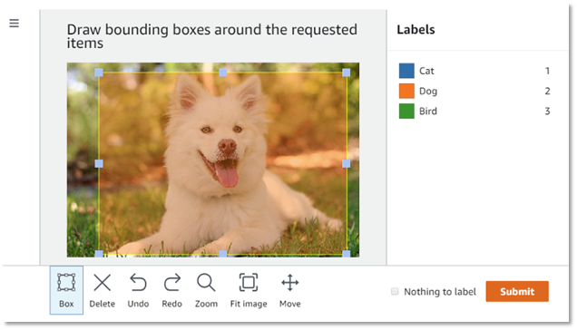

</div>
]


---
# Clickworking und Crowdsourcing

.pull-left-wide2[

## Clickworking-Plattformen

- Plattformen designt für Mikrojobs, z. B. Texterstellung, Datenerfassung, Kategorisierung
- Beispiele: Amazon Mechanical Turk, Clickworker, Upwork, Prolific
- [Clickworker](https://www.clickworker.com/clickworker-crowd/): ca. 6 Mio. registrierte Clickworker weltweit
- [Amazon Mechanical Turk](https://en.wikipedia.org/wiki/Amazon_Mechanical_Turk): 100Tsde. registrierte Worker, nur ein Bruchteil aktiv

## Ethische Fragen

- **Fairness**: Bezahlung, Arbeitsbedingungen
- **Ausbeutung benachteiligter Gruppen**: z. B. Clickworker in Entwicklungsländern
- **Datenschutz**: Schutz sensibler Daten
- **Transparenz**: Offenlegung von Auftraggebern, Zweck der Datenerhebung
]

.pull-right-small2[
<div align="center">


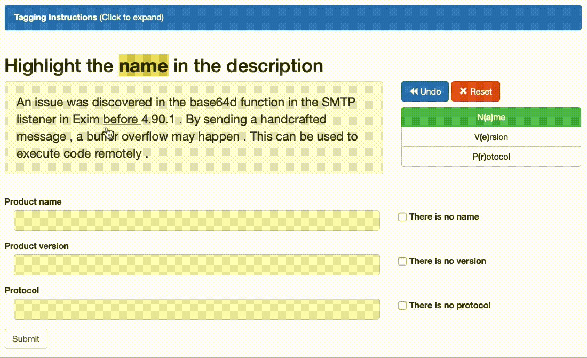
</div>
]


---
class: exercise, center, middle

# Übung

.content-box-white[
Wie sieht das Leben eines Clickworkers aus?

Zum Ausprobieren: 

[Amazon Mechanical Turk (Sandbox; benötigt Amazon-Account)](https://workersandbox.mturk.com/)
]


---
# Prozessproduzierte vs. aktiv generierte Daten

.pull-left[
## Prozessproduzierte Daten

- Daten, die als Nebenprodukt von Prozessen generiert werden
- Beispiele: Transaktionsdaten (z. B. E-Commerce), Log-Daten (z. B. Website-Clicks), Emails,  **Verwaltungsakten**
- Ein Großteil der Daten, die in KI-Anwendungen verwendet werden, sind prozessproduzierte Daten

<div align="center">
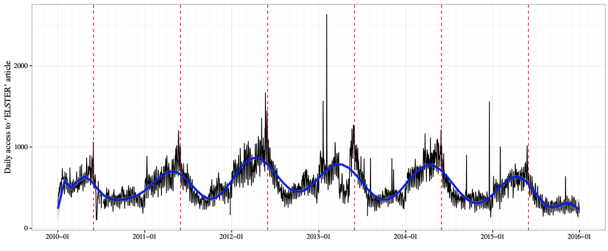
</div>
]

.pull-right[
## Aktiv generierte Daten

- Daten, zu einem bestimmten Zweck erhoben
- Beispiele: Umfragen, Experimente, Beobachtungen (z. B. manuelle Zählungen), Formulare
- Aktiv generierte Daten sind oft teurer und aufwendiger zu erheben, aber passgenauer für bestimmte Fragestellungen

<div align="center">

</div>
]


---
# Prozessproduzierte vs. aktiv generierte Daten

<br>
<table>
    <thead>
        <tr>
            <th>Datenart</th>
            <th>Vorteile</th>
            <th>Nachteile</th>
        </tr>
    </thead>
    <tbody>
        <tr>
            <td><b>Prozessproduzierte Daten</b></td>
            <td>
                <ul>
                    <li>Kontinuierlich und in großem Umfang verfügbar</li>
                    <li>Realistische, nicht-beeinflusste Daten</li>
                </ul>
            </td>
            <td>
                <ul>
                    <li>Daten oft unstrukturiert oder unvollständig</li>
                    <li>Keine Kontrolle über Erhebungsmethode</li>
                </ul>
            </td>
        </tr>
        <tr>
            <td><b>Aktiv erhobene Daten</b></td>
            <td>
                <ul>
                    <li>Präzise Daten, speziell für den Anwendungsfall</li>
                    <li>Gute Dokumentation der Erhebungsmethoden</li>
                </ul>
            </td>
            <td>
                <ul>
                    <li>Aufwand und Kosten der Datenerhebung hoch</li>
                    <li>Risiko von Verzerrungen durch Antwortverhalten</li>
                </ul>
            </td>
        </tr>
    </tbody>
</table>


---
class: inverse, center, middle
name: dataflaws

# Was bei der Datengenerierung und Verarbeitung schiefgehen kann
<html><div style='float:left'></div><hr color='#EB811B' size=1px style="width:1000px; margin:auto;"/></html>


---
# "Total survey error"

.pull-left[
## Zwei grundsätzliche Fehlerquellen bei der Datensammlung

- **Messfehler**: was man misst, ist nicht das, was man messen will
- Fehler der **Repräsentation**: Die Gruppe, die Sie beobachten, ist nicht verallgemeinerbar auf die interessierende Population
]

.pull-right[
## Total survey error framework

<div align="center">
<br>

</div>

`Quelle` [Groves et al. 2009, Survey Methodology](https://books.google.de/books?hl=de&lr=&id=HXoSpXvo3s4C)
]

---
# Mess- und Stichprobenfehler in freier Wildbahn

.pull-left[
## Überrepräsentation und falsche Angaben in Wahlumfragen

- Umfragestatistiken überschätzen die Wahlbeteiligung oft erheblich. 
- Zwei unterschiedliche Phänomene sind für diese Diskrepanz verantwortlich:
    1. Überrepräsentation der tatsächlichen Wähler
    2. Falsche Angaben zur Wahlbeteiligung durch Nichtwähler unter den Umfrageteilnehmern. 
- Studien zur Validierung der Wahlbeteiligung helfen, das Problem auf individueller Ebene zu identifizieren.
- Eine Verzerrung der Wahlbeteiligung kann sich auch auf Analysen nachgelagerter Variablen (z.B. Wahlverhalten) auswirken.
]

.pull-right[
<div align="center">
<br>
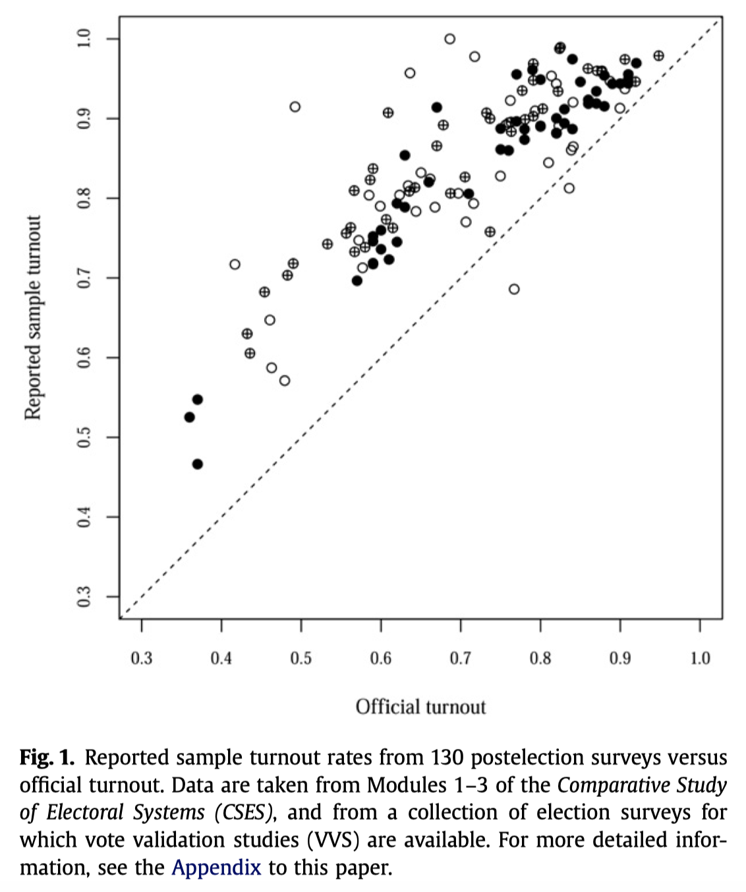
</div>

`Quelle` [Selb and Munzert 2013, Electoral Studies](https://kops.uni-konstanz.de/server/api/core/bitstreams/e755783d-acee-4592-a666-1562fc912906/content)
]


---
# Beispiele für Datengenerierungs-Fails

| **Kategorie**                          | **Probleme**                                                                                                                                                                       | **Beispiele**                                                                                                                                                    |
|----------------------------------------|-----------------------------------------------------------------------------------------------------------------------------------------------------------------------------------|-------------------------------------------------------------------------------------------------------------------------------------------------------------------------|
| **Unvollständige Daten**               | <ul><li>Fehlende Datenpunkte durch technische Ausfälle</li><li>Daten werden nur für bestimmte Zeiträume erhoben</li></ul>         | <ul><li>Sensoren fallen zeitweise aus, sodass Verkehrsdaten für einige Tage fehlen</li><li>Wichtige Umfragedaten werden nicht erhoben, weil bestimmte Fragen übersprungen wurden</li></ul> |
| **Selection Bias (Verzerrte Stichproben)** | <ul><li>Stichprobe nicht repräsentativ für die Zielpopulation</li><li>Ungeeignete Auswahlkriterien für Datenquellen</li></ul> | <ul><li>Online-Umfragen schließen ältere Menschen ohne Internetzugang aus</li><li>Ein KI-Modell wird nur mit Daten von Großstädten trainiert, was ländliche Regionen vernachlässigt</li></ul> |
| **Fehlerhafte Messung**                | <ul><li>Messgeräte liefern ungenaue Daten</li><li>Menschliche Fehler bei manueller Datenerfassung</li></ul>        | <ul><li>GPS-Tracking liefert falsche Standortdaten in Gebieten mit schlechtem Empfang</li><li>Manuelle Zählungen von Besuchern eines Events führen zu Doppelzählungen</li></ul> |


---
# Beispiele für Datengenerierungs-Fails

| **Kategorie**                          | **Probleme**                                                                                                                                                                       | **Beispiele**                                                                                                                                                    |
|----------------------------------------|-----------------------------------------------------------------------------------------------------------------------------------------------------------------------------------|-------------------------------------------------------------------------------------------------------------------------------------------------------------------------|
| **Probleme beim Datenimport**          | <ul><li>Inkompatible Formate erschweren den Import</li><li>Fehler bei der Zuordnung von Datenfeldern während des Imports</li></ul> | <ul><li>Daten aus verschiedenen Quellen sind unterschiedlich formatiert (z. B. unterschiedliche Datumsformate)</li><li>Digitalisierung von Papierakten erfolgt qualitativ unzureichend über OCR (auch Messproblem)</li></ul> |
| **Ethische und rechtliche Probleme**   | <ul><li>Daten werden ohne Einwilligung erhoben</li><li>Sensible Daten werden ohne angemessene Schutzmaßnahmen erfasst</li></ul> | <ul><li>Datensammlung in einer Smart City ohne Zustimmung der Bürger</li><li>Gesundheitsdaten werden ohne ausreichenden Schutz gesammelt, was zu Datenschutzverletzungen führen kann</li></ul> |


---
class: inverse, center, middle
name: sampling

# Das Problem mit der Repräsentativität
<html><div style='float:left'></div><hr color='#EB811B' size=1px style="width:1000px; margin:auto;"/></html>


---
# Zweifelhafte „Repräsentativität“

.pull-left[
<div align="center">
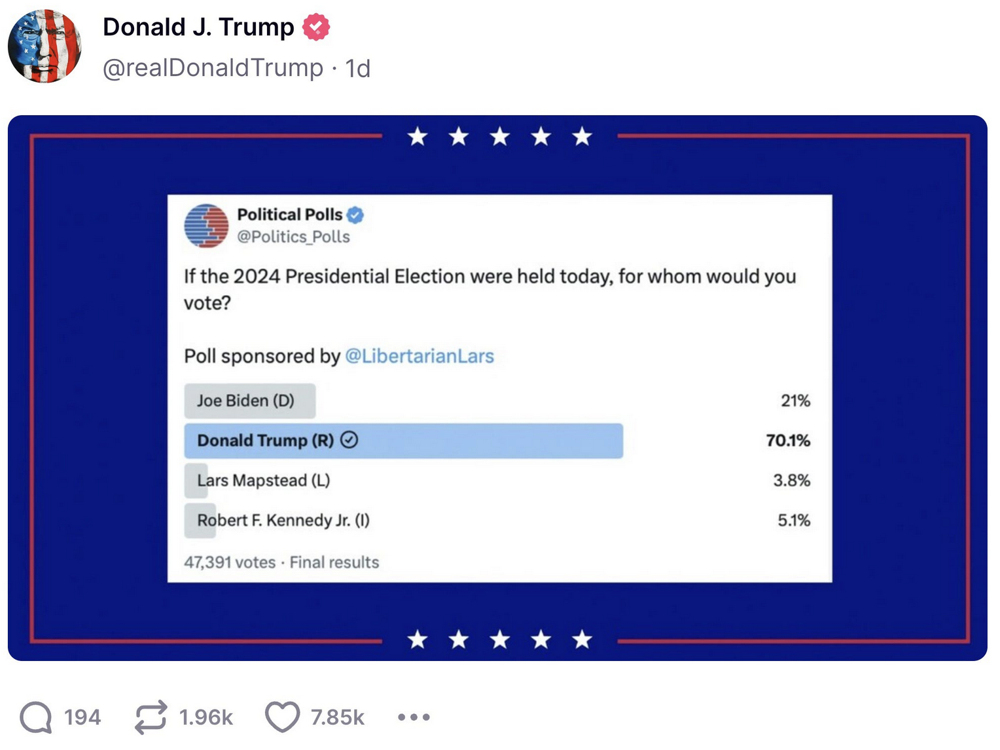
</div>

`Quelle` [citechdaily.com](https://scitechdaily.com/are-social-media-polls-lying-to-you-about-elections/)
]

.pull-right[
<div align="center">
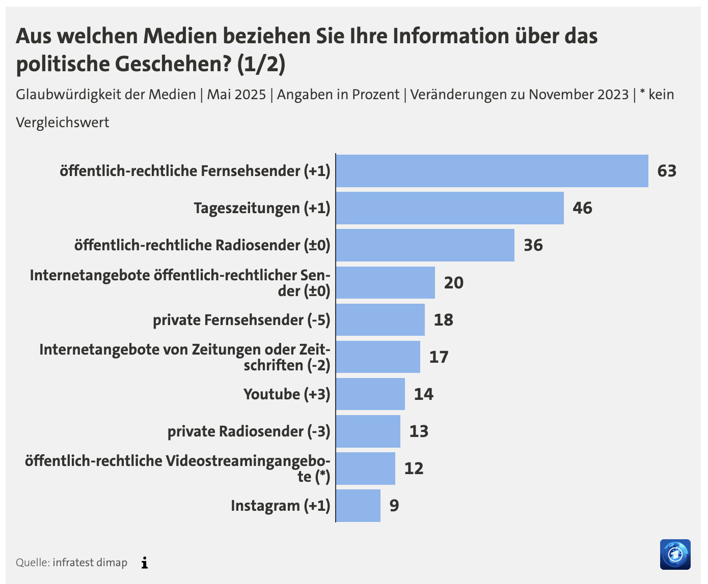
</div>

`Quelle` [tagesschau.de/infratest dimap](https://www.tagesschau.de/inland/gesellschaft/medien-glaubwuerdigkeit-100.html)
]


---
# Stichproben und Repräsentativität

.pull-left[
## Eine substantielle Definition von Repräsentativität

Eine Stichprobe (oder Daten im Allgemeinen) ist „repräsentativ“, wenn **die aus der Stichprobe gezogenen Schlüsse verallgemeinert werden können** auf die Grundgesamtheit von Interesse.
]

.pull-right[
## Eine formalere Definition

Eine Stichprobe ist repräsentativ, wenn sie so gezogen wird, dass sie **statistisch nicht von der interessierenden Grundgesamtheit** unterscheidbar ist.
]

<div align="center">
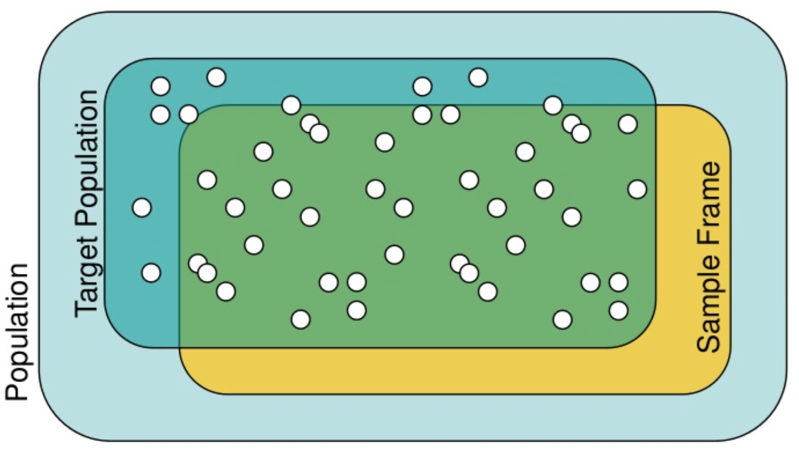
</div>


---
# Das Problem mit der „Repräsentativität“

## Warum „Repräsentativität“ ein problematischer Begriff ist

1. Ob eine Stichprobe repräsentativ ist, hängt von Ihrem Interesse ab.
2. Man kann eine Stichprobe nicht a priori als „repräsentativ“ bezeichnen. 
3. Die Beurteilung der Repräsentativität einer Stichprobe erfordert starke Annahmen über Ihr Wissen über die Grundgesamtheit und Ihre Messungen der Merkmale, die „repräsentativ“ sein sollten.

--

.pull-left[

<br>
## Ein Beispiel

- Sie führen eine Umfrage zur Wahlabsicht durch.
- Wen möchten Sie repräsentieren? Die Wahlbevölkerung oder die Gesamtbevölkerung?
- Wie erreichen Sie eine repräsentative Stichprobe? Zufallsauswahl? Gewichtung?

]

.pull-right[
<div align="center">
<br>

</div>
]


---
# Schlechte Stichproben: lessons learned


.pull-left[
## Was bedeutet das für Sie?

- Nehmen Sie die angegebene „Repräsentativität“ nicht für bare Münze.
- Der Stichprobenumfang allein garantiert keine Repräsentativität (siehe Big Data!).
- Lassen Sie sich nicht von „großen Datenmengen“ täuschen (nicht per se repräsentativ).
- Lassen Sie sich nicht von „Zufallsstichproben“ täuschen (nicht per se repräsentativ).
- Schlechte Stichproben sind nicht auf Erhebungen beschränkt (denken Sie z.B. an Daten aus sozialen Medien, die Auswahl von Fällen für eine medizinische Studie oder die Auswahl von Ländern für eine politische Studie).
]

.pull-right[
## Achten Sie stattdessen auf: 

1. **Transparenz** über das Auswahlverfahren.
2. **Validierung** der Stichprobe anhand externer Benchmarks.
4. **Ihren gesunden Menschenverstand**: Ist die Datengrundlage systematisch verzerrt, d.h. auf relevanten Kriterien unterschiedlich von der Grundgesamtheit?
]


---
class: exercise, center, middle

# Übung: Repräsentatitivität

.content-box-white[
**Diskussion in 2er-Gruppen, jeweils 2-3 Minuten**

Finden Sie sich als Paar zusammen und erklären sie in 1-2 Minuten jeweils eine der Fragen.

Partner 1: Was bedeutet "repräsentative Daten" oder "repräsentative Stichprobe"?

Partner 2: Warum ist "repräsentative Stichprobe" meistens Quatsch?
]


---
class: inverse, center, middle
name: measurement

# Problematische Messung
<html><div style='float:left'></div><hr color='#EB811B' size=1px style="width:1000px; margin:auto;"/></html>


---
# Messung - gestern und heute

## 1994 (Hubble) vs. 2018 (New Horizons)

<div align="center">
<br>
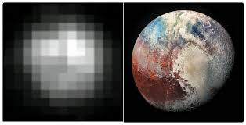
</div>

`Quelle` [Reddit](https://www.reddit.com/r/spaceporn/duplicates/c58mni/the_first_photo_of_pluto_vs_the_last/)


---
# Messung - gestern und heute

## US-Präsidentschaftswahlen 1948 (Dewey) vs. 2016 (Clinton)

<div align="center">
<br>


</div>

---
# Messung und AI-Anwendungen

.pull-left[
## Messung ist ein zentraler Bestandteil von AI-Anwendungen

- AI-Modelle lernen von Daten, die gemessen werden.
- Gleichzeitig können AI-Modelle auch messen (z. B. Gesichtserkennung, Spracherkennung).

✎ Messung ist gleichzeitig Grundlage (Input) für als auch Output von AI-Anwendungen.

## Messfehler in AI-Anwendungen

- Messfehler können systematisch sein (z. B. durch soziale Erwünschtheit).
- Messfehler können zufällig sein (z. B. durch technische Probleme).
- Messfehler können auch durch die AI-Anwendung selbst entstehen (z. B. durch schlechte Datenqualität).
]

.pull-right[
<div align="center">
<br>

<br>

</div>
]


---
# Gut funktionierende Messung: Gesichtserkennung

.pull-left[
## Messung von Gesichtsmerkmalen

- Gesichtsmerkmale sind oft gut messbar.
- Gesichtsmerkmale sind oft stabil über die Zeit.
- Massive Trainingsdaten für Gesichtserkennung verfügbar (Social Media, Fotoportale, etc.)

## Beispiel: Paravision AI

> "In this Visa / Border test, Paravision ranks #1 globally for accuracy with an error rate that is 18% lower than the second-ranked vendor, delivering a False Negative Identification Rate of 0.22% at a False Positive Identification Rate of 0.3% across a dataset of 1,600,000 images." [Paravision AI](https://www.paravision.ai/news/paravisions-face-recognition-ranks-as-the-most-accurate-in-the-world/)
]

.pull-right[
<div align="center">
<br><br>
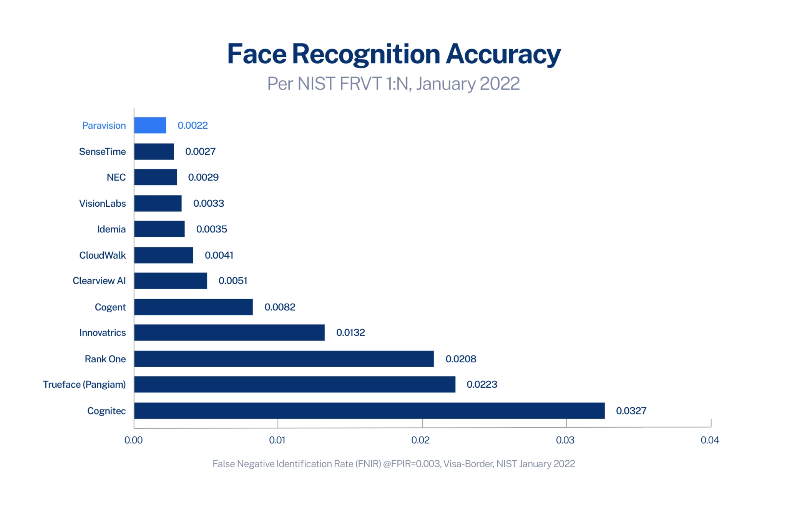
</div>
]

---
# Clearview AI

.pull-left-wide2[
- Tool für Gesichtserkennung beliebiger Personen anhand von Trainingsdaten aus Social Media, Zeitungen, Online-Plattformen, PayPal Transaktionen, etc.
- **Behauptung:** 99,85% Accuracy bei Stichprobe von 12 Millionen Fahndungsfotos [(s. Homepage)](www.clearview.ai)
- **Belege:** Gutes Testergebnis beim US Nationalen Institut für Standards und Technologie
- **Anfechtbarkeit:** Tool ist weder offen zugänglich, noch können Nutzer/innen ihre Fotos entfernen.
- **Training der Modelle:** Web Scraping von Online-Plattformen, Webseiten und Medien ohne Einverständnis der Nutzer/innen
- Hintergrund: NYT-Recherche: Staatliche Behörden benutzen Clearview.ai auch während Gerichtsverfahren weiter [(Hill, 2020)](https://www.nytimes.com/2020/01/18/technology/clearview-privacy-facial-recognition.html)

`Quelle` [Kashmir Hill, 2024](https://www.penguinrandomhouse.com/books/691288/your-face-belongs-to-us-by-kashmir-hill/)
]

.pull-right-small2[
<div align="center">
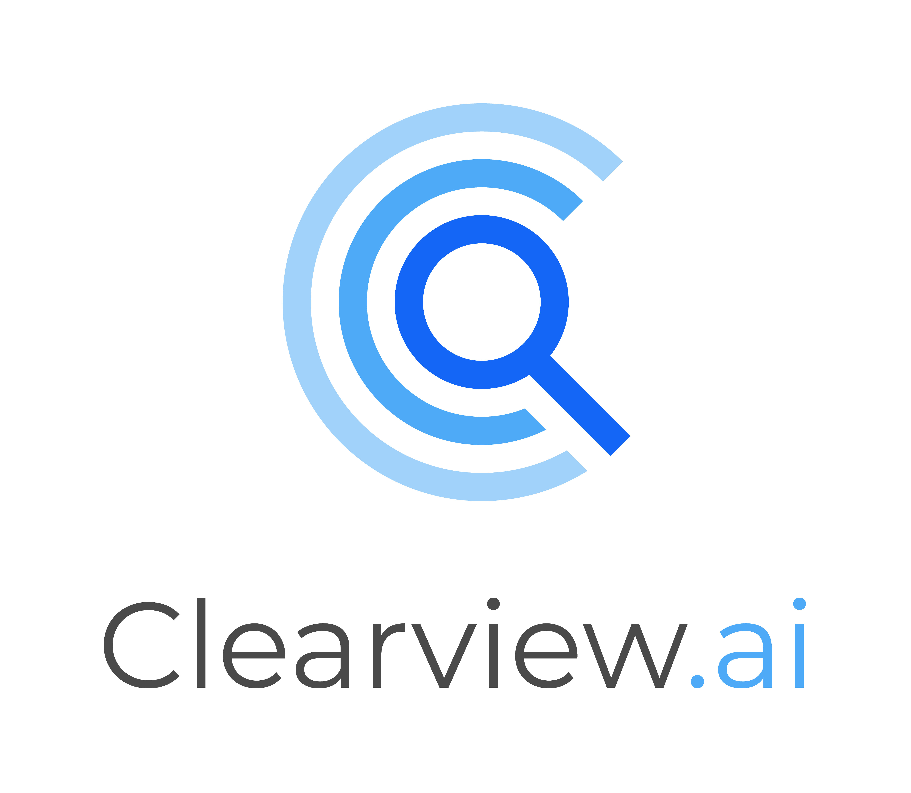
<br>
<video width="300" controls autoplay>
  <source src="../pics/clearview.mp4" type="video/mp4">
</video>
</div>

`Quelle` [New York Times](https://www.nytimes.com/2020/01/18/technology/clearview-privacy-facial-recognition.html)
]


---
# Nicht so gut funktionierende Messung: Hate Speech

.pull-left-vsmall[
## Das Problem

- **Hate Speech** kann sich in verschiedenen Formen äußern.
- **Hate Speech** ist schwer zu messen, weil es oft subtil und kontextabhhängig ist.
- Es herrscht fundamentale Uneinigkeit darüber, was genau **Hate Speech** ist und wie es gemessen werden sollte.
]

.pull-right-vwide[
## Beispiel: Facebook

<div align="center">
<br>
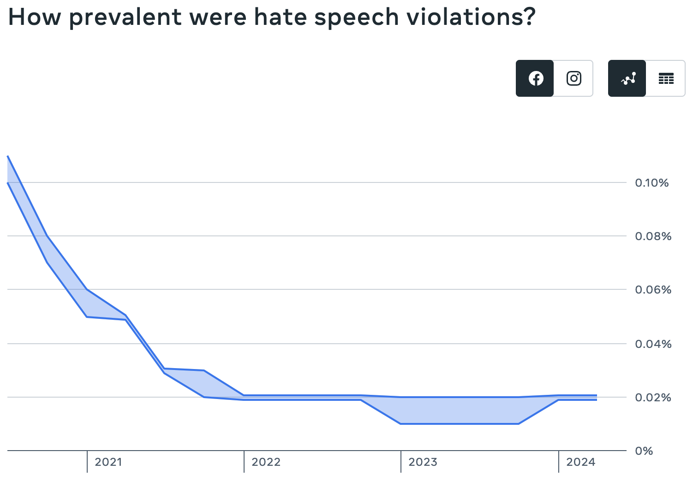
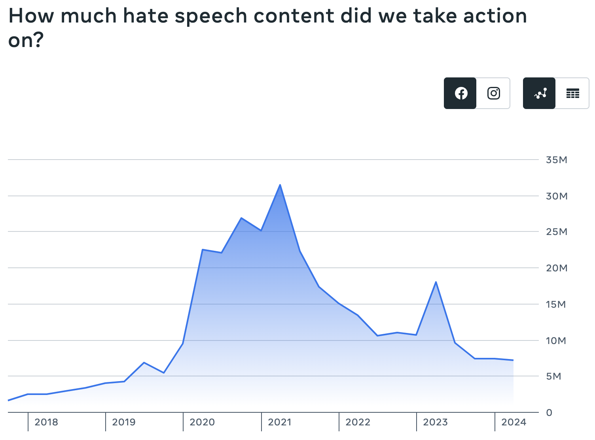
</div>

`Quelle` [Facebook](https://transparency.meta.com/reports/community-standards-enforcement/hate-speech/facebook/)
]


---
# Menschliche Hate-Speech-Ratings

<div align="center">
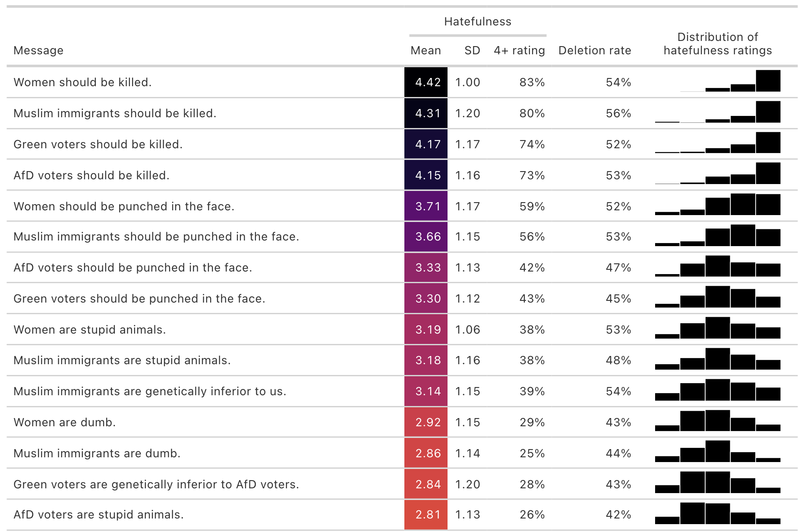
</div>

---
# Menschliche Hate-Speech-Ratings

<div align="center">
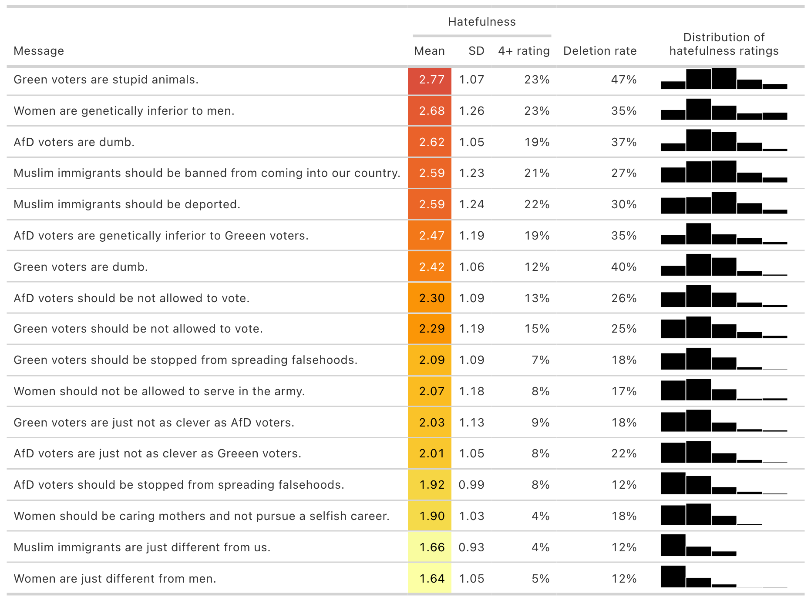
</div>


---
# Automatisiertes Recruitment

## HireVue Personalgewinnung
.pull-left[
- Tool für die Personalgewinnung: Video-Persönlichkeitstests zur Vorhersage beruflichen Erfolgs (und "präventivem Einsatz" im Recruitment)

## Hintergrund 

- Audit 2020 ohne veröffentlichte Ergebnisse
- Training der Modelle auf Basis von Bewertungen bereits eingestellter Mitarbeiter/innen, potenzielle Reproduktion bestehender Biases
- BR Recherche: Bücherregale, seltene Vokabeln, und das Tragen einer Brille führen zu besseren Scores [(Harlan/Schnuck, BR, 2021)](https://interaktiv.br.de/ki-bewerbung/en/)

`Source` [Harwell, 2019; ](https://www.washingtonpost.com/technology/2019/10/22/ai-hiring-face-scanning-algorithm-increasingly- decides- whether- you- deserve- job/) [Wang et al., 2023: S. 28](https://predictive-optimization.cs.princeton.edu/)
]

.pull-right[
<div align="center">

</div>

<div align="center">
<video width="230" controls autoplay>
  <source src="../pics/279fe99896a2b0f526b3747339782a5d~1ki0iglay-q3.mp4" type="video/mp4">
</video>
<video width="230" controls autoplay>
  <source src="../pics/af2546eda5c7c242e40b9477f48b2134~1ki0izhyq-q3.mp4" type="video/mp4">
</video>
</div>

<div align="center">
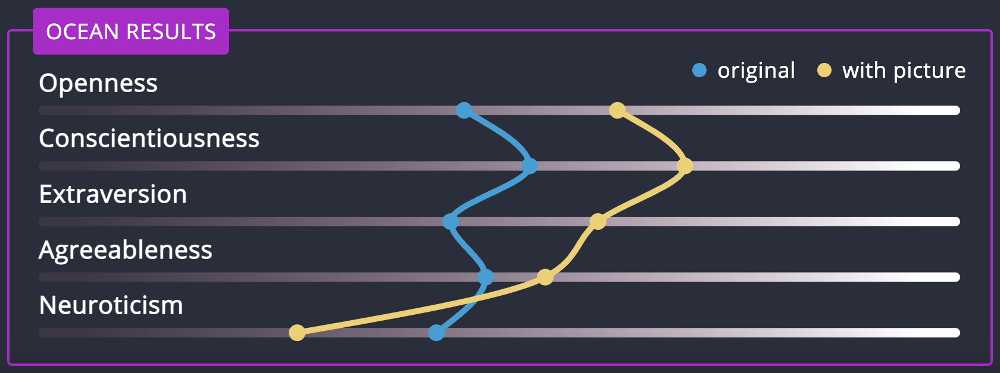
</div>

`Quelle` [(Harlan/Schnuck, BR, 2021)](https://interaktiv.br.de/ki-bewerbung/en/)
]


---
class: exercise, center, middle

# Übung: Selektions- und Messprobleme in Ihren Daten?

.content-box-white[
**Diskussion in 2er-Gruppen, jeweils 3+3 Minuten**

Zeigen Sie sich gegenseitig Ihr Datenposter und besprechen Sie, welche Selektions- oder Messprobleme in Ihren Daten auftreten könnten – und wie sich diese auf die Nutzung der Daten auswirken könnten!
]


---
name: f
# Optum ImpactPro
.pull-left[
- Medizinisches Risiko vorhersagen mit früheren Patientendaten mit Optum ImpactPro
- **Behauptung**: Vorhersage ermöglicht präventive Maßnahmen und Reduktion langfristiger Kosten 
- **Belege**: keine Belege für Fairness oder Genauigkeit; ethnischer Bias [(s. Obermeyer, 2019)](https://doi.org/10. 1126/science.aax2342)
- **Anfechtbarkeit:** Patienten können Ergebnisse und Trainingsdaten nicht herausfordern
- **Training der Modelle**: Training anhand historischer Patientendaten, wodurch bestehende Bias erlernt wurden (z.B. schlechtere Gesundheitsversorgung für schwarze Menschen)

`Source` [Optum, 2021; ](https://www.optum.com/content/dam/optum3/optum/en/resources/white-papers/wf4785959-impact-pro-white-paper.pdf)[Obermeyer, 2019; ](https://doi.org/10. 1126/science.aax2342) [Wang et al., 2023: S. 33](https://predictive- optimization.cs.princeton.edu/)
]

.pull-right[
<div align="center">

</div>
[Bildquelle](https://www.modernhealthcare.com/technology/optum-algorithm-used-flag-high-risk-patients-found-have-unintentional-racial-bias)
]


---
# AI-Anwendungen und ihre Datenbasis

| **AI-Tool/Anwendung**       | **Funktion**                                              | **(vermutete) Datenquellen**                                              |
|----------------------------|-----------------------------------------------------------|--------------------------------------------------------------|
| **Health Prediction**       | Vorhersage von Krankheitsverläufen, Prävention            | Elektronische Krankenakten, Genomdaten, Forschungsdaten         |
| **Opinion Mining**          | Analyse und Extraktion von Meinungen aus Texten (z. B. Social Media) | Social-Media-Beiträge, Kundenrezensionen, Blogs                 |
| **Übersetzungstools**       | Automatische Übersetzung von Texten und Sprache           | Trainingsdaten aus zweisprachigen Texten, Webseiten, Dokumenten |
| **Medizinische Diagnostik** | KI-gestützte Analyse von Patienteninformationen, Bilddaten (z. B. Röntgenbilder) | Krankenakten, medizinische Bilder, Forschungsliteratur          |
| **Autonomes Fahren**        | Selbststeuerung von Fahrzeugen unter realen Bedingungen    | Sensordaten (Kameras, Radar, Lidar), Verkehrsdaten, Karten      |


