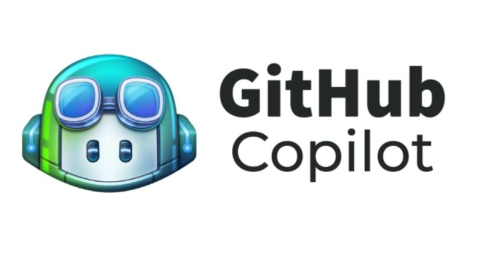
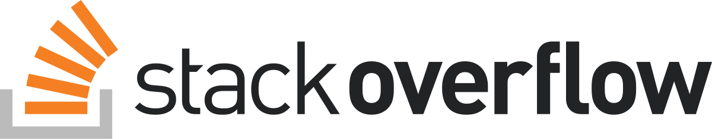
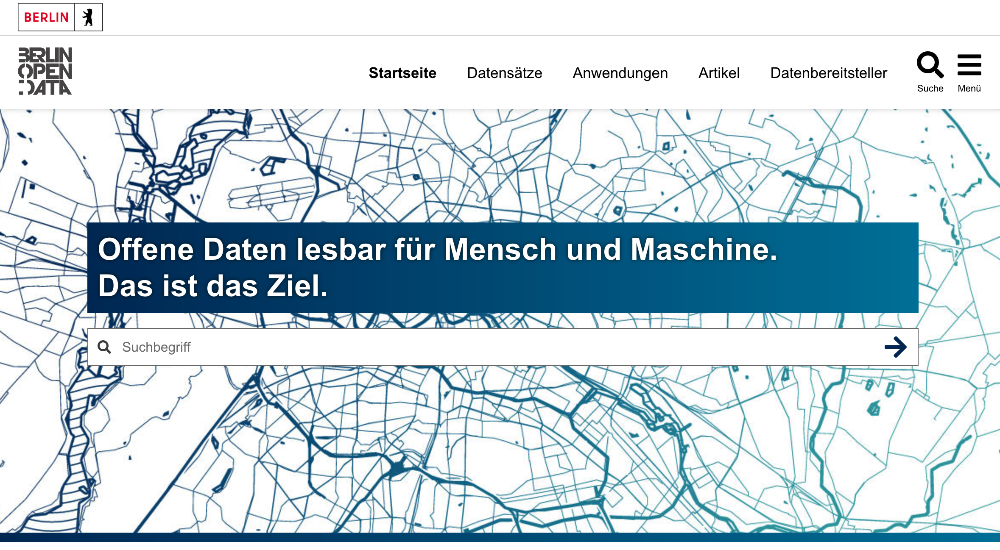
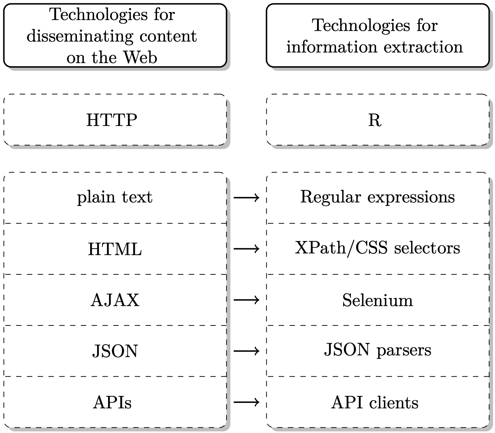
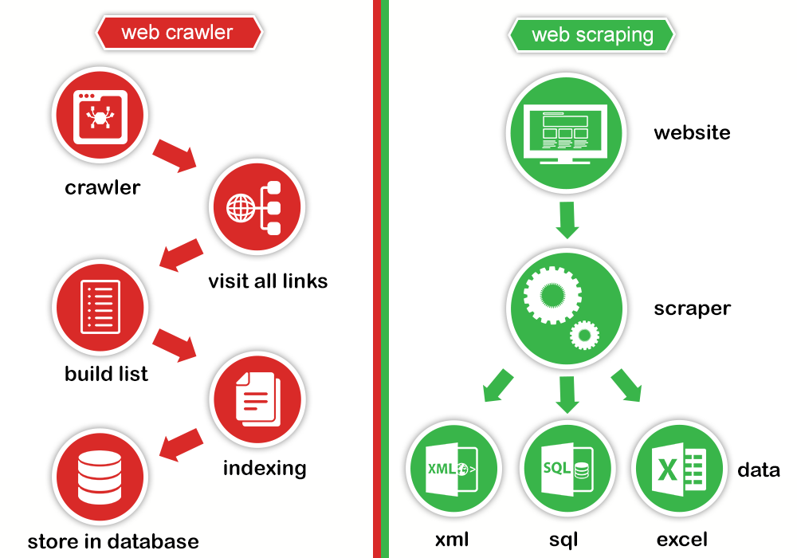
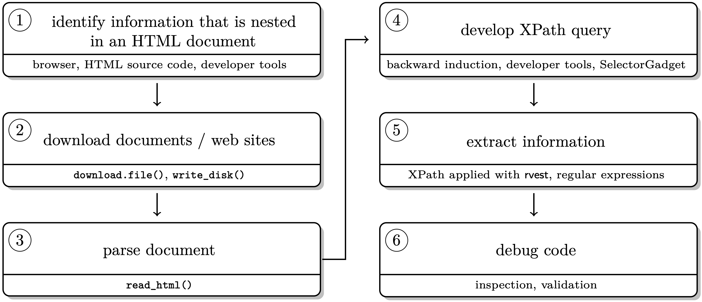
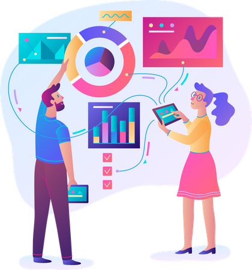

```{css, echo=FALSE} 
@media print { # print out incremental slides; see https://stackoverflow.com/questions/56373198/get-xaringan-incremental-animations-to-print-to-pdf/56374619#56374619
  .has-continuation {
    display: block !important;
  }
}
```

```{r setup, include=FALSE}
# figures formatting setup
options(htmltools.dir.version = FALSE)
library(knitr)
opts_chunk$set(
  prompt = T,
  fig.align="center", #fig.width=6, fig.height=4.5, 
  # out.width="748px", #out.length="520.75px",
  dpi=300, #fig.path='Figs/',
  cache=T, #echo=F, warning=F, message=F
  engine.opts = list(bash = "-l")
  )

## Next hook based on this SO answer: https://stackoverflow.com/a/39025054
knit_hooks$set(
  prompt = function(before, options, envir) {
    options(
      prompt = if (options$engine %in% c('sh','bash')) '$ ' else 'R> ',
      continue = if (options$engine %in% c('sh','bash')) '$ ' else '+ '
      )
})

library(tidyverse)
library(rvest)
library(httr)
library(knitr)
library(hrbrthemes)
library(fontawesome)
```


# Überblick

<br><br>

1. [Wozu Webdaten?](#webdata)

2. [Web scraping](#scrapingstatic)

3. [Web APIs](#apibasics)


---
class: inverse, center, middle
name: webdata

# Wozu Webdaten?

<html><div style='float:left'></div><hr color='#EB811B' size=1px style="width:1000px; margin:auto;"/></html>


---
# Was sind Webdaten?

.pull-left-wide2[

## Definition

- Webdaten sind **Daten, die im, für oder über das Web generiert oder über Webtechnologien zur Verfügung gestellt werden**. 

## Beispiele für Webdaten
  - Online-Nachrichtenartikel
  - Netzwerkstrukturen in sozialen Medien
  - Crowdsourced-Datenbanken (z. B. Wikidata)
  - Serverprotokolle (z. B. Statistiken über die Zuschauerzahlen)
  - Online-Verhalten
  - Jede beliebige Website
  
## Keine genuinen Webdaten
  - Offline generierte Datensätze, die über das Web disseminiert werden (z.B. nicht web-basierte Umfragen; offizielle Statistiken)
]

.pull-right-small2[
<div align="center">

</div>

`Quelle` [eDiscoveryToday, LTMG](https://ediscoverytoday.com/2023/04/20/2023-internet-minute-infographic-by-ediscovery-today-and-ltmg-ediscovery-trends/
)
]


---
# Die Bedeutung von Webdaten für AI-Technologien

.pull-left[

## Datenquelle für KI-Modelle

- **Web als Datenlieferant:** Das Web ist eine riesige Quelle von Daten, die für das Training von KI-Modellen unerlässlich sind. Durch öffentlich zugängliche Webseiten, soziale Medien, Blogs, Nachrichtenportale und andere Online-Plattformen wird eine Vielzahl von Informationen erzeugt, die in Form von Text, Bildern, Videos und Audiodaten vorliegen.

- **KI-Training durch das Web:** Plattformen wie Amazon Mechanical Turk nutzen das Web, um KI-Systeme mit menschlichen Beiträgen zu trainieren. Crowdsourcing ermöglicht es, menschliche Intelligenz zu nutzen, um Daten zu labeln oder komplexe Aufgaben zu lösen, die für KI-Algorithmen schwierig sind.
]

.pull-right[
## Plattform für KI-Dienste

- **Cloud-basierte KI-Services:** Viele KI-Dienste werden über das Web in der Cloud angeboten. Diese Dienste ermöglichen es Entwicklern, leistungsstarke KI-Anwendungen ohne den Bedarf an eigenen Infrastrukturen zu nutzen. Beispiele sind Amazon Web Services (AWS), Microsoft Azure oder Google Cloud, die KI-Modelle bereitstellen, die über APIs aufgerufen werden können.

- **KI in Web-Anwendungen:** KI wird zunehmend in Web-Anwendungen integriert. Beispiele sind intelligente Suchmaschinen, personalisierte Inhalte in sozialen Netzwerken und Empfehlungssysteme in Online-Shops, die auf dem Web basieren.
]


---
# Die Bedeutung von Webdaten für AI-Technologien (2)

.pull-left-wide[
## Kollaboration und Wissensaustausch

- **Open-Source-Communities:** KI-Entwicklung profitiert von der offenen Zusammenarbeit, die das Web ermöglicht. Plattformen wie GitHub, Stack Overflow oder spezielle KI-Foren bieten Möglichkeiten für Entwickler, Code zu teilen, zu lernen und innovative KI-Projekte gemeinsam voranzutreiben.

- **KI-Forschung:** Viele bahnbrechende KI-Forschungsarbeiten und Datensätze werden im Web veröffentlicht und zugänglich gemacht. Dies erleichtert die Verbreitung von Wissen und die schnelle Entwicklung neuer KI-Ansätze.

- **Verfügbarkeit von KI-Tools:** Über das Web stehen KI-Entwicklungstools, Bibliotheken und Frameworks wie TensorFlow, PyTorch und OpenAI zur Verfügung, die es Entwicklern ermöglichen, eigene KI-Anwendungen zu erstellen und zu trainieren.
]

.pull-right-small[
<div align="center">




</div>
]


---
# Die Bedeutung von Webdaten in der Verwaltung

.pull-left-wide[
## Verwaltung als Webdaten-Provider
- **Open Government Data**: Bereitstellung offener Datensätze durch Regierung und Verwaltung
- **E-Government**

## Verwaltung als Webdaten-Nutzer
- **Erhebung von Verwaltungsdaten,** z.B. Unternehmensregister, Immobilienpreise, Arbeitsmarktdaten
- **Echtzeit-Monitoring,** z. B. Analyse von Verkehrsdaten, Wetterinformationen oder Gesundheitsdaten
- **Bürgerbeteiligung,** z.B. Auswertungen von Foren, sozialen Medien (eher fragwürdig)
]


.pull-right-small[
<div align="center">


</div>
]


---
class: inverse, center, middle
name: scrapingstatic

# Web scraping

<html><div style='float:left'></div><hr color='#EB811B' size=1px style="width:1000px; margin:auto;"/></html>


---
# Webtechnologien

.pull-left[

- Um Webdaten für Data-Science-Anwendungen verfügbar zu machen, greifen wir auf bestimmte Webtechnologien zurück.
- Konkret sind folgende Fragen relevant:
  - Wie unser Rechner/Browser/R mit Webservern kommuniziert (→ **HTTP/S**)
  - Wie Webseiten aufgebaut sind (→ **HTML**, **CSS**, Grundlagen von **JavaScript**)
  - Wie Inhalte in Webseiten effektiv gefunden werden können (→ **XPath**, **CSS-Selektoren**)
  - Wie dynamische Webanwendungen ausgeführt und abgegriffen werden (→ **AJAX**, **Selenium**)
  - Wie Daten von Webdiensten verteilt und verarbeitet werden (→ **APIs**, **JSON**, **XML**)
]

.pull-right-center[
<div align="center">
<br>

</div>
`Quelle` [ADCR](http://r-datacollection.com/)
]


---
# Web scraping

.pull-left-wide2[
## Was ist Web Scraping?

1. Auslesen von (unstrukturierten) Daten aus Websites (HTMLs)
2. Aufbereitung der Daten, Überführung in saubere Datenstruktur (analysefähiges Format)

## Skriptbasiertes Vorgehen

- Kein händisches Copy-and-Paste-Verfahren
- Skripting (Programmierung) des gesamten Prozesses
- Automatisiert wird:
  - Das Herunterladen von Dateien und Webseiten
  - Das Parsing von Webinhalten
  - Das gezielte Auslesen von Informationen
  - Anzapfen von APIs
  - Datenbereinigung, Textdatenverarbeitung
- Scraping-Programme skalieren und können wiederholt große Datenmengen sammeln
]

.pull-right-small2[
<br>
<div align="center">

</div>
`Credit` [prowebscraping.com](http://prowebscraping.com/web-scraping-vs-web-crawling/)
]


---
# Der Scraping-Workflow

.pull-left[
## Die wichtigsten Werkzeuge für das Scraping statischer Webseiten

1. Untersuchen von HTML-Seiten mit den Webentwickler-Tools im Browser
2. Parsing von HTML mit dedizierten Programmen/Computercode (z.B. Python, R)
3. Auslesen bestimmter Information mit XPath oder CSS-Selektoren (Mini-Sprachen)
4. Weiterverarbeitung der Daten in skriptbasierten Programmen (z.B. mit `dplyr` oder `pandas` in R/Python)
5. Speichern der Daten in einem geeigneten Format (z.B. CSV, JSON, Datenbank)
]

.pull-right[
<br><br><br>
<div align="center">

</div>
]


---
# Mehr zu Web Scraping

.pull-left-wide2[
## Weitere Möglichkeiten

Scraping ist nicht auf Inhalte von statischen Webseiten beschränkt. Die Mächtigkeit von Scraping-Tools entfaltet sich in Szenarien, in denen:

- **Daten von mehreren Seiten** gesammelt werden sollen
- Automatisiert mit Webinhalten **interagiert** werden soll (z.B. über Formulare), um konditionale Inhalte abzugreifen
- **Authentifizierung** erforderlich ist
- **Dynamische Inhalte** (mit JavaScript angereichert) abgegriffen werden sollen


## Weiterführende Materialien

Weitere Beispiele, Scraping-Tutorials und Lernmaterialien finden sich [hier](https://github.com/hertie-data-science-lab/ds-workshop-webscraping) und [hier](https://github.com/yusuzech/r-web-scraping-cheat-sheet).
]


.pull-right-small2[
<br>
<div align="center">

</div>
]


---
class: inverse, center, middle
name: apibasics

# Web APIs: Grundlagen

<html><div style='float:left'></div><hr color='#EB811B' size=1px style="width:1000px; margin:auto;"/></html>


---
# Was sind Web APIs?

.pull-left[
### Definition

- Ein <b>A</b>pplication <b>P</b>rogramming <b>I</b>nterface erlaubt den programmatischen Zugriff auf Daten, die auf einem Server vorgehalten werden.
- Web-APIs als „Datensuchmaschinen“: Man stellt eine Anfrage für spezifische Daten, die API antwortet.
- Viele beliebte Webdienste bieten APIs an (Google, Twitter, Wikipedia, ...).
- Oft stellen APIs Daten in den Formaten JSON oder XML bereit (kann aber jedes beliebige Format sein).

<div align="center">

</div>
`Credit` [Brian Cooksey](https://zapier.com/learn/apis/chapter-1-introduction-to-apis/)
]

--

.pull-right[
### Konzepte

- **Server:** Ein Computer, auf dem eine API läuft und mit dem gesprochen werden kann.
- **Client:** Ein Programm, das über eine API Daten mit einem Server austauscht.
- **Protocol:** Das Regelwerk, das der Kommunikation zwischen Computern zugrunde liegt (z. B. HTTP).
- **Method:** Die „Verben“, die Clients verwenden, um mit einem Server zu kommunizieren (in der HTTP-Sprache: `GET`, `POST` und andere).
- **Enpoint:** URLs, die auf eine bestimmte Weise angegeben werden können, um die API abzufragen.
- **Request:** Die Anfrage des Clients an den Server (siehe Methoden oben).
- **Response:** Die Antwort des Servers. Enthält *Statuscode* (z. B. „200“, „404“), *Header* (Meta-Info) und *Body* (der eigentliche Inhalt).
]

---
# Was macht APIs attraktiv?

.pull-left[
### Wichtige Vorteile

- APIs bieten unmittelbaren Zugang zu "sauberen" Daten.
- Machen manuelle konstruierte Scraper potentielle überflüssig.
- Sie erleichtern einem Computer die Interaktion mit Daten auf dem Server.
- Die Verwendung von APIs setzt ein gegenseitiges Einverständnis mit der Datenerfassung voraus.

<div align="center">

</div>


]

--

.pull-right[
### Restaurant-Analogie<sup>1</sup><br><br>

| Restaurant | Web API |
|---|---|
| Sie, der Kunde | Ihr Programm/Computer |
| Das Restaurant | API-Anbieter |
| Der Kellner | API-Frontend | 
| Die Speisekarte | API-Dokumentation |
| Ihre Bestellung | API-Enpoint (Request) | 
| Die Küche | API-Datenbank |
| Das Essen | API-Response |
| Die Rechnung | API-Pricing |

.footnote[<sup>1</sup> [Restaurant-Beispiel inspiriert von Jason Johl](https://blogs.mulesoft.com/learn-apis/api-led-connectivity/what-are-apis-how-do-apis-work/)]
]


---
# Warum stellen Organisationen APIs bereit?

.pull-left-vwide[
### Skalierbarkeit und Regulierung des Zugangs

- APIs erlauben einen skalierbaren Zugriff auf Daten und Dienste.
- Mit APIs können Organisationen ihren Kunden eine geregelte und strukturierte Möglichkeit bieten, gezielt Datenmengen abzurufen ohne ihre Server zu überlasten, zum Absturz zu bringen oder ihre Nutzungsbedingungen zu verletzen.
- APIs können auch dazu beitragen, die Sicherheit zu erhöhen, indem sie den Zugriff auf sensible Daten kontrollieren und überwachen.


### Weitere Gründe

- **Monetarisierung:** Daten können in ein verkaufbares Produkt umgewandelt werden.
- **Innovation:** Kunden haben Zugang zu Daten und können ihre eigenen Produkte und Lösungen entwickeln.
- **Expansion:** APIs können Unternehmen helfen, in andere Märkte vorzudringen oder Partnerschaften mit anderen Unternehmen einzugehen.
]

.pull-right-vsmall[
<div align="center">
<br>
<br>
<br>
<br>
<br>
</div>
]


---
# Weiterführende Informationen zu Web APIs

## APIs als Goldstandard der Web-Datenabfrage

Das Sammeln von Daten aus dem Web unter Verwendung von APIs, die vom Dateneigentümer zur Verfügung gestellt werden, stellt den **Goldstandard der Web-Datenabfrage** dar. Sie ermöglicht eine saubere Datenerfassung, einen standardisierten Datenzugriff, eine faktische Übereinkunft zur Datenerfassung sowie die Robustheit und Skalierbarkeit der Datenerfassung.

Auf der anderen Seite ist die Verbreitung von Web-APIs zulasten eines offenen Web nicht unproblematisch. Sie schafft Abhängigkeiten von API-Anbietern. APIs haben zwar das Potenzial, den Datenzugriff zu demokratisieren, können aber auch dazu beitragen, Informationen zu isolieren.

Mehr Informationen finden sich in [dieser Einführung in APIs](https://zapier.com/learn/apis/chapter-1-introduction-to-apis/) oder diesem [Einführungsvideo zu APIs in R](https://www.youtube.com/watch?v=kZU240u9H3E&t=2248s).

## API-Ressourcen

Es gibt viele Ressourcen, die einen Überblick über bestehende öffentliche APIs geben, einschließlich dieser [Liste öffentlicher APIs auf GitHub](https://github.com/public-apis/public-apis). Eine weitere nützliche Ressource ist [APIs for social scientists - a collaborative review](https://bookdown.org/paul/apis_for_social_scientists/).


