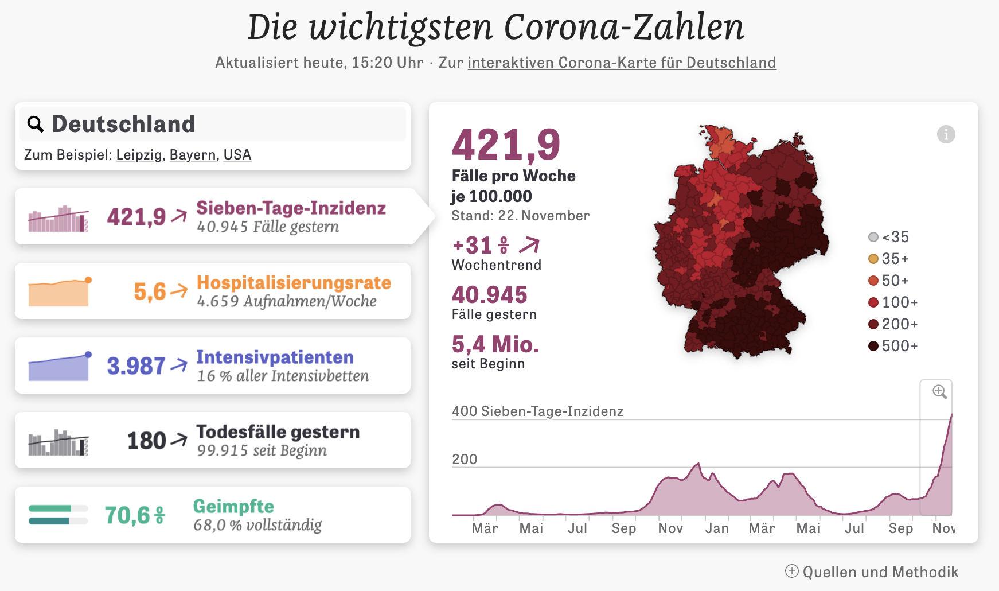
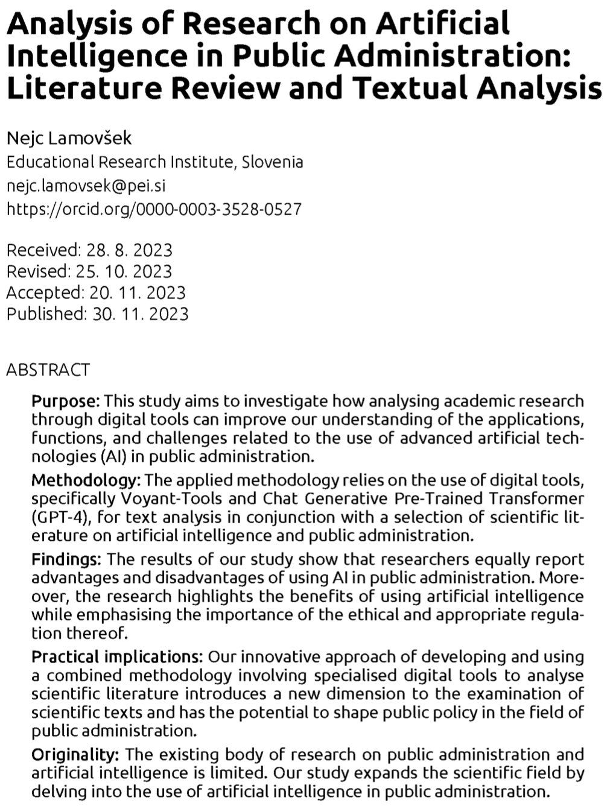
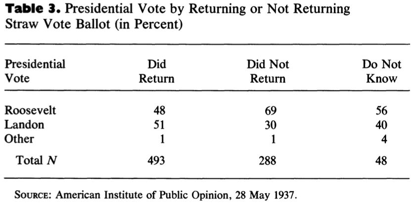

```{css, echo=FALSE} 
@media print { # print out incremental slides; see https://stackoverflow.com/questions/56373198/get-xaringan-incremental-animations-to-print-to-pdf/56374619#56374619
  .has-continuation {
    display: block !important;
  }
}
```

```{r setup, include=FALSE}
# figures formatting setup
options(htmltools.dir.version = FALSE)
library(knitr)
opts_chunk$set(
  prompt = T,
  fig.align="center", #fig.width=6, fig.height=4.5, 
  # out.width="748px", #out.length="520.75px",
  dpi=300, #fig.path='Figs/',
  cache=T, #echo=F, warning=F, message=F
  engine.opts = list(bash = "-l")
  )

## Next hook based on this SO answer: https://stackoverflow.com/a/39025054
knit_hooks$set(
  prompt = function(before, options, envir) {
    options(
      prompt = if (options$engine %in% c('sh','bash')) '$ ' else 'R> ',
      continue = if (options$engine %in% c('sh','bash')) '$ ' else '+ '
      )
})

library(tidyverse)
library(hrbrthemes)
library(fontawesome)
```


# Inhaltsverzeichnis

<br><br>
1. [Was ist Big Data?](#whatisbigdata)

2. [Das Big-Data-Paradoxon](#bigdataparadox)

3. [Garbage in, garbage out](#garbageingarbageout)

4. [Übung](#exercise)


---
class: inverse, center, middle
name: exercise

# Übung
<html><div style='float:left'></div><hr color='#EB811B' size=1px style="width:1000px; margin:auto;"/></html>


---
# Umgang mit Evidenz als Detektivarbeit

.pull-left-wide[
## Der Ansatz

- Auswertung von Daten ist wie Detektivarbeit
- Wir müssen die **Evidenz genau unter die Lupe nehmen**, um herauszufinden, ob der Verdächtige - der vermutete Zusammenhang, der deskriptive Befund - tatsächlich hält, was er verspricht
- Dazu müssen wir versuchen **Alternativerklärungen auszuschließen**

## Die Ausstattung

- **Unsere Toolbox:** Kritisches Denken, Beobachtung (Datenerhebung), Wahrnehmung (Messung), externes Wissen, statistische Methoden
- Ohne qualitative Beurteilung sind die quantitativen Werkzeuge häufig ohne Wert
]


.pull-right-small[
<div align="center">
<br>

</div>
]

---
# Ein paar einfache Fälle

<br>

.pull-left[
## Drückende Schuhe (?)

> Umfrageergebnisse zeigen, dass Menschen, die mit Schuhen schlafen, viel häufiger mit Kopfschmerzen aufwachen.

## Gezuckerte Getränke führen zu Fettleibigkeit (?)

> Personen, die regelmäßig zuckerhaltige Getränke konsumieren, haben einen 30% höheren BMI.

]

.pull-right[


## Lock-downs haben COVID-19-bedingte Tode herbeigeführt (?)

> Europäische Länder, die strengere und längere Lock-downs hatten, hatten höhere COVID-19-Todesraten.


## UN-Friedensmissionen schützen die Zivilbevölkerung nicht (?)

> UN-Friedensmissionen in Bürgerkriegsszenarien sind stark positiv mit höheren Todesraten unter Zivilisten korreliert

]


---
# Daten-Tatort I: Erkennen von Straftätern durch Gesichtsdaten

<div align="center">

</div>


---
# Weitere Evidenz: Erkennen von Straftätern durch Gesichtsdaten

<div align="center">

</div>


---
# Weitere Evidenz: Erkennen von Straftätern durch Gesichtsdaten

<div align="center"><br>


</div>


---
# Lösung des Falles

.pull-left-wide[

|                       	| Evidenz und Schlüsse                           	|
|-----------------------	|----------------------------------------------------	|
| **Der Tatort**   	| Gesichter sagen Straftäter vorher                 	|
| **Die Verdächtigen**    	| Lifestyle, Physiognomik |
| **Die Tatwaffe** 	| Konfundierung in Datenerhebung (biased training set)                    	|

> "Extraordinary claims require extraordinary evidence. The authors of this paper make the extraordinary claim that facial structure reveals criminal tendencies. We have argued that, given all publicly available information, their findings can be explained by a much more reasonable hypothesis: non-criminals are more likely to be smiling in photos chosen for publicity purposes than are criminals in the ID photos (not mugshots) chosen by police departments for wanted posters and other purposes. Notice that we did all of this without digging into the details of the machine learning algorithms at all. We didn’t need to. We know that a machine learning algorithm is only as good as its training data, and we can see that the training set used here is fundamentally flawed for the purpose it is used." <div align="right">Carl Bergstrom and Jevin West, <a href="https://callingbullshit.org/case_studies/case_study_criminal_machine_learning.html">Calling Bullshit</a><sup>1</sup></div>
]

.pull-right-small[
<div align="center">
<br>

</div>

`Quelle` [Bergstrom/West, Calling Bullshit](https://callingbullshit.org)
]


---
class: exercise, center, middle

# Data Detective, Fall 2: Predictive Policing

.content-box-white[
<div align="center">

</div>
]


---
class: exercise, center, middle

# Data Detective, Fall 3: SARS-CoV-2-Abwassermonitoring

.content-box-white[
<div align="center">

</div>
]


---
class: inverse, center, middle
name: whatisbigdata

# Was ist Big Data?
<html><div style='float:left'></div><hr color='#EB811B' size=1px style="width:1000px; margin:auto;"/></html>


---
background-image: url("../pics/big-data-5vs.png")
background-size: contain
background-color: #000000

# Was ist Big Data?


---
# Das Zeitalter von Big Data - Große Trends

.pull-left[
1. Massive Erzeugung von **vom Menschen erzeugten Daten** insbesondere im digitalen Bereich

2. Verwendung von **neuen Datentypen**: Text, Video, digitale Spuren

3.  **Rechen- und Speicherkosten** sind drastisch gesunken

4.  Mainstreaming von **maschinellem Lernen** und **KI**-Technologien

5. (Begrenzte) **Demokratisierung des Zugangs** zu großen Datenbeständen

6.  **Verlagerung der Forschungsavantgarde** von der akademischen Welt zur Industrie
]

.pull-right[
<div align="center">

</div>

`Quelle` Reinsel et al., 2017, ["Data Age 2025"](https://www.seagate.com/files/www-content/our-story/trends/files/Seagate-WP-DataAge2025-March-2017.pdf)

.footnote[<div class="font80"><sup>1</sup>Die Zahlen sind mit Vorsicht zu genießen. SIe sind fundamental schwer zu messen; deshalb weichen veröffentlichte Daten teilweise um ein Vielfaches voneinander ab.</div>]
]


---
# Big Data in der öffentlichen Gesundheit

.pull-left[
## Beispiel: COVID-19-Überwachung  
- Nutzung von Mobilfunk-, Social-Media- und Gesundheitsdaten durch WHO, CDC, RKI  
- Modellierung und Vorhersage von Infektionsclustern  
- Grundlage für politische Entscheidungen (Lockdowns, Impfpriorisierung)

## Auswirkungen  
- **Schnellere Reaktionen** auf Pandemien  
- **Evidenzbasierte Gesundheitspolitik**  
- **Datenschutz- und Ethikdebatten** über Bewegungs- und Gesundheitsdaten
]

.pull-right[
<div align="center">


</div>
]


---
# Smart Cities und urbane Datenplattformen

.pull-left[
## Beispiel: Singapur, Barcelona, London  
- Nutzung von Verkehrs-, Sensor- und Energiedaten  
- Steuerung von Verkehrsflüssen, Energieverbrauch und öffentlichem Raum  

## Auswirkungen  
- **Effizientere Infrastruktur** und geringere Emissionen  
- **Datengetriebene Stadtplanung**  
- **Kontroversen** um Überwachung, Fairness und Dateneigentum
]

.pull-right[
<div align="center">

</div>
]


---
# Integration von Migranten in den Arbeitsmarkt

.pull-left-small3[
<br>
<div align="center">

</div>

`Quelle` [Science](https://www.science.org/doi/10.1126/science.aao4408), [apolitical.co](https://apolitical.co/solution-articles/en/switzerlands-new-algorithm-could-get-up-to-30-more-refugees-into-work)
]

.pull-right-wide2[
<div align="center">


</div>
]


---
# LLMs für effizientere Verwaltung?

<div align="center">





</div>


---
class: inverse, center, middle
name: bigdataparadox

# Das Big-Data-Paradoxon
<html><div style='float:left'></div><hr color='#EB811B' size=1px style="width:1000px; margin:auto;"/></html>


---
# Ein frühes Big-Data-Disaster

<div align="center">

</div>

---
# Wahlumfrage 1936 der Zeitschrift Literary Digest 

.pull-left-wide2[
## Hintergrund

- Die Wochenzeitschrift *Literary Digest* hatte die Ergebnisse aller Präsidentschaftswahlen zwischen 1920 und 1932 anhand von Umfragen korrekt vorhergesagt.
- Die Umfrage von 1936 unter 10 Millionen Wählerinnen und Wählern ergab einen deutlichen Sieg des republikanischen Kandidaten Alfred Landon

## Nachwehen

- Landon verlor erdrutschartig gegen Franklin D. Roosevelt, der 46 von 48 Bundesstaaten für sich entschied und 60,8% der Wählerstimmen erhielt.
- Das Ergebnis wurde von George Gallup mit einem Sample von 50.000 Personen richtig vorhergesagt.
- Die Zeitschrift ging 1938 in Konkurs.
]

.pull-right-small2[
<br>
<div align="center">

</div>
]


---
# Wahlumfrage 1936 der Zeitschrift Literary Digest

<div align="center">

</div>

---
# Wahlumfrage 1936 der Zeitschrift Literary Digest

.pull-left[
## Anatomie eines Debakels

1. **Stichprobenrahmen**: (1) eigene Leser, (2) registrierte Autobesitzer, (3) registrierte Telefonnutzer
2. **Datenerhebung**: Jeder bekam einen Musterstimmzettel zugeschickt und wurde gebeten, den markierten Stimmzettel zurückzugeben
3. **Rücklaufquote**: 2,4 Mio. von 10 Mio.

**Stichprobenverzerrung** als Folge von **coverage error** und **non-reponse**: Überrepräsentation von wohlhabenderen Personen mit einer Präferenz für Landon

<br><br><br>
`Quelle` [Peverill Squire, 1988, Public Opinion Quarterly](https://www.jstor.org/stable/2749114)
]

.pull-right[
<div align="center">



</div>
]

---
# Umfrage-basierte Evidenz ist mit Vorsicht zu genießen

<div align="center">
<br><br><br><br>

</div>


---
# Ein modernes Big-Data-Umfrage-Desaster
 
.pull-left[
<div align="center">

</div>
]

.pull-right[
<div align="center"><br><br>

</div>
]


---
# Ein modernes Big-Data-Umfrage-Desaster

.pull-left-wide[
<div align="center"><br><br><br>

</div>
]

.pull-right-small[
<div align="center"><br><br>

</div>
]


---
# Das Big-Data-Paradoxon

.pull-left[
> „Wenn verzerrte Stichproben groß sind, sind sie doppelt irreführend: Sie erzeugen Konfidenzintervalle mit falschen Mitteln und erheblich unterschätzter Unsicherheit. Dies ist das **Big-Data-Paradoxon**: Je umfangreicher die Daten sind, desto sicherer täuschen wir uns selbst, wenn wir die Verzerrungen bei der Datenerhebung nicht berücksichtigen.“

<div align="right">Bradley et al. (2021), <i>Nature</i></div>

> „Die 'Größe' solcher Big Data (für Rückschlüsse auf die Population) sollte an der relativen Größe f = n/N der Stichprobe zur Population gemessen werden, nicht an der absoluten Größe n der Stichprobe.

<div align="right">Xiao-Li Meng (2018), <i>The Annals of Applied Statistics</i></div>

]

--

.pull-right[
## Besserung durch Korrektur für endliche Grundgesamtheiten?

- Die Intuition sagt uns, dass die Wahrscheinlichkeit eines Fehlers geringer sein sollte, wenn der Stichprobenumfang im Verhältnis zum Umfang der Grundgesamtheit groß ist.
- Das stimmt auch, aber der Zugewinn ist relativ langsam.
- Der endliche Populationskorrekturfaktor für den Standardfehler einer interessierenden Größe ist zum Beispiel gegeben durch $\sqrt{\frac{N-n}{N-1}}$. 

## Beispiel

- Wir führen eine Umfrage bei 100k Personen in einer Bevölkerung von 3,7 Mio. durch.
- Für $N=3.7m$ und $n=100k$ ist dies $\sqrt{0.973}$.
]


---
class: inverse, center, middle
name: garbageingarbageout

# Garbage in, Garbage out
<html><div style='float:left'></div><hr color='#EB811B' size=1px style="width:1000px; margin:auto;"/></html>


---
# Garbage in, Garbage out

.pull-left[
## Das GIGO Prinzip
- Die Qualität der Informationen, die ein Modell produziert (z.B. Vorhersagen), kann nicht besser sein als die Qualität der Informationen, die in das Modell eingespeist werden.
- Dieser Grundsatz ist wird umso relevanter in Big-Data-Kontexten, wenn Daten unzureichend validiert oder Datenqualität schlicht nicht gegeben ist.
- Das Problem verschärft sich potentiell in ML-Anwendungen, wenn Modelle komplex und intransparent sind.
]

.pull-right[
<div align="center"><br><br>

</div>
]


---
# Google Flu Trends

.pull-left[
<div align="center">

</div>

`Quelle` Ginsberg et al., 2009, [Nature](https://www.nature.com/articles/nature07634)
]

.pull-right[

<div align="center">
<br>

</div>
]


---
# Google Flu Trends


.pull-left-wide2[
<div align="center">

</div>

`Quelle` Lazer et al., 2014, [Science](https://science.sciencemag.org/content/343/6176/1203)

]

.pull-right-small2[
<div align="center"><br>

</div>
]


---
# Garbage in, Garbage out: Lessons learned

.pull-left[
1. **Messung-** und **Selektions-Fragen** sind bei der Big-Data-Analyse nach wie vor entscheidend.

2. Trauen Sie **Messungen** nicht, die nicht **richtig validiert** wurden.

3. Achten Sie darauf, was in ein Modell einfließt (der **Input**: Fälle, Variablen/Merkmale).

4. Achten Sie auf eine angemessene **Out-of-Sample-Validierung** von Modellen.

5. Vorsicht bei **unkritischer Nutzung von Online-/Sozialen Medien** als Datenquelle.
]

.pull-right-center[
<div align="center">

</div>
`Quelle` XKCD, [2295](https://xkcd.com/2295/), ([hier erklärt](https://www.explainxkcd.com/wiki/index.php/2295:_Garbage_Math))
]


