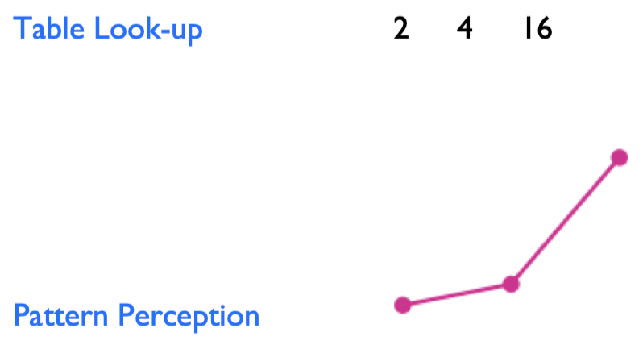
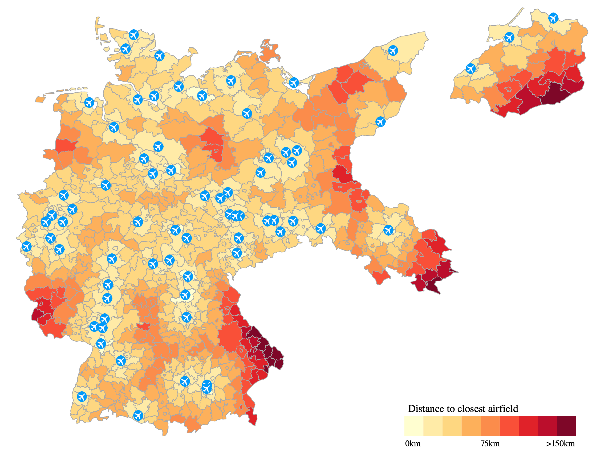
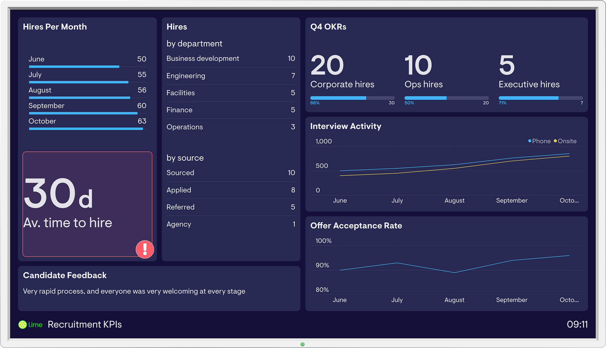
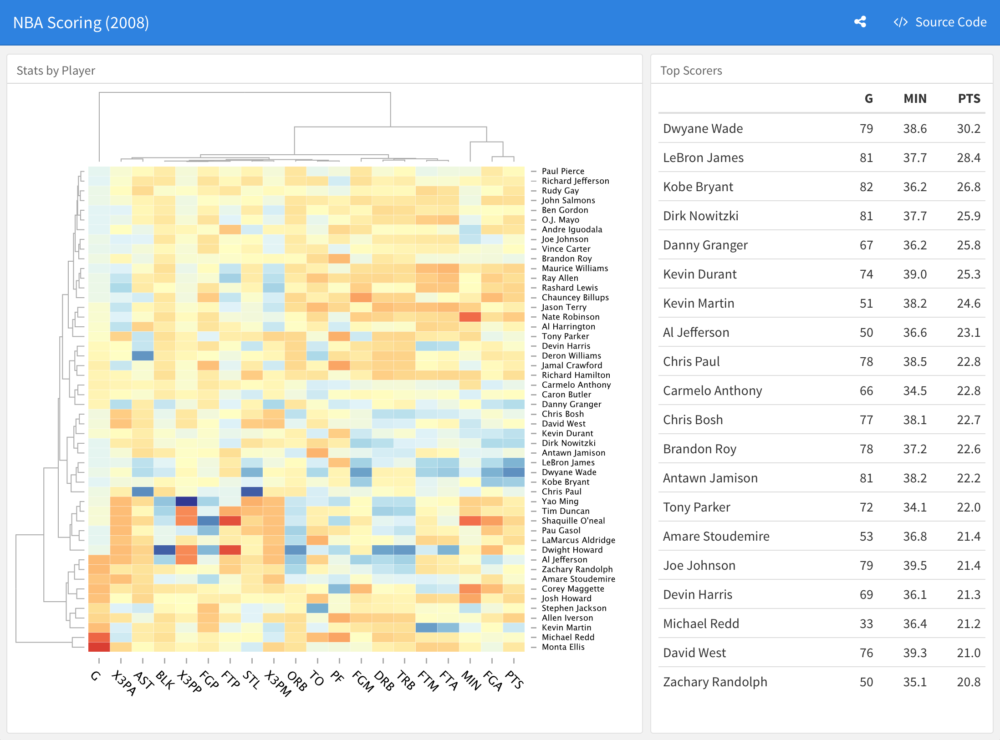

```{css, echo=FALSE} 
@media print { # print out incremental slides; see https://stackoverflow.com/questions/56373198/get-xaringan-incremental-animations-to-print-to-pdf/56374619#56374619
  .has-continuation {
    display: block !important;
  }
}
```

```{r setup, include=FALSE}
# figures formatting setup
options(htmltools.dir.version = FALSE)
library(knitr)
opts_chunk$set(
  prompt = T,
  fig.align="center", #fig.width=6, fig.height=4.5, 
  # out.width="748px", #out.length="520.75px",
  dpi=300, #fig.path='Figs/',
  cache=T, #echo=F, warning=F, message=F
  engine.opts = list(bash = "-l")
  )

## Next hook based on this SO answer: https://stackoverflow.com/a/39025054
knit_hooks$set(
  prompt = function(before, options, envir) {
    options(
      prompt = if (options$engine %in% c('sh','bash')) '$ ' else 'R> ',
      continue = if (options$engine %in% c('sh','bash')) '$ ' else '+ '
      )
})

library(tidyverse)
library(hrbrthemes)
library(fontawesome)
```


# Überblick

<br>


1. [Warum Datenvisualisierung?](#whyviz)

2. [Arten der Datenvisualisierung](#plottypes)

3. [Visualisierungstools](#clickvscode)

4. [Übung: Best (and worst) practices](#goodpractices)

5. [Interaktive Kommunikation und Monitoring mit Dashboards](#dashboards)

---
background-image: url("../pics/berlin-strassenabschnitte-geojson.png")
background-size: contain
background-color: #000000

# Was sehen Sie hier?

<!-- Source: https://daten.odis-berlin.de/de/dataset/detailnetz_strassenabschnitte/ -->


---
background-image: url("../pics/berlin-strassenabschnitte-map.png")
background-size: contain
background-color: #000000

# So besser?


<!-- ############################################ -->
---
class: inverse, center, middle
name: whyviz

# Warum Datenvisualisierung?

<html><div style='float:left'></div><hr color='#EB811B' size=1px style="width:1000px; margin:auto;"/></html>


---
# Warum Datenvisualisierung?

.pull-left[

### Eine mächtige Methode in der Data-Science-Toolbox

- Datenvisualisierung ist eine Methode zur Exploration (und nicht nur Darstellung) von Daten.
- Dabei geht es um mehr als Datenvisualisierung im engeren Sinne, d.h. um die **Kodierung quantitativer Informationen** in visuellen Objekten.
- Entscheidungsträger sind meist an **Mustern** und **Regelmäßigkeiten** interessiert, nicht an einzelnen und genauen Werten.
- Zwei Möglichkeiten, quantitative Informationen sinnvoll zu nutzen:

<div align="center">

</div>
]


.pull-right[

### Das Argument für Visualisierung

- Visualisierung setzt **wenig oder keine Annahmen** über die Natur der Daten voraus.
- Visualisierung **lässt Sie Dinge sehen**, die sonst unsichtbar wären, insbesondere Beziehungen zwischen Daten (Muster, Trends, Ausreißer).
- Visualisierung erleichtert die Interaktion zwischen Entscheidungsträger und Daten - **sie ist ein Mittel zur Hypothesenbildung und Entscheidungsfindung**.

<i>"Die entscheidende Frage ist, wie man die Daten am besten in etwas umwandelt, das Menschen verstehen können, um optimale Entscheidungen zu treffen." </i>
[Colin Ware, 2013](https://books.google.de/books?id=qFmS95vf6H8C&pg=PA5)
]


---
# Abbildungen vs. Tabellen

.pull-left[
- Die Tabelle auf der rechten Seite enthält die Datensätze I bis IV, die jeweils aus elf $(x,y)$-Punkten bestehen.
- .hlred[Studieren Sie die Tabelle sorgfältig]. Wie verhalten sich $x$ und $y$ sowie ihr Verhältnis zueinander in den verschiedenen Datensätzen?
]

.pull-right[
<br>
<div align="center">

</div>
]

---
# Abbildungen vs. Tabellen

.pull-left[
- Die Tabelle auf der rechten Seite enthält die Datensätze I bis IV, die jeweils aus elf $(x,y)$-Punkten bestehen.
- .hlred[Studieren Sie die Tabelle sorgfältig]. Wie verhalten sich $x$ und $y$ sowie ihr Verhältnis zueinander in den verschiedenen Datensätzen?
- Es zeigt sich, dass alle Datensätze nahezu identische einfache deskriptive Statistiken in Bezug auf Mittelwert, Standardabweichung, Korrelation und lineare Anpassung aufweisen!
]

.pull-right[
<br>
<div align="center">

</div>
]

---
# Abbildungen vs. Tabellen

.pull-left[
- Die Tabelle auf der rechten Seite enthält die Datensätze I bis IV, die jeweils aus elf $(x,y)$-Punkten bestehen.
- .hlred[Studieren Sie die Tabelle sorgfältig]. Wie verhalten sich $x$ und $y$ sowie ihr Verhältnis zueinander in den verschiedenen Datensätzen?
- Es zeigt sich, dass alle Datensätze nahezu identische einfache deskriptive Statistiken in Bezug auf Mittelwert, Standardabweichung, Korrelation und lineare Anpassung aufweisen!
- .hlred[Die grafische Darstellung der Daten zeigt sehr unterschiedliche Verteilungen] und widerspricht der Heuristik, dass "numerische Berechnungen genau sind, aber Grafiken grob sind". ([Anscombe 1973](https://www.tandfonline.com/doi/abs/10.1080/00031305.1973.10478966)).
]

.pull-right[
<br>
<div align="center">

</div>
]


---
# Visualisierung im Data-Science-Workflow

.pull-left[
Datenvisualisierung ist eine Schlüsselkompetenz für die Vermittlung von Erkenntnissen aus Daten. Sie ist in jedem Schritt des Workflows von Bedeutung.
]

.pull-right[

<div align="center">
<br>

</div>
]

---
# Visualisierung im Data-Science-Workflow

.pull-left[
Datenvisualisierung ist eine Schlüsselkompetenz für die Vermittlung von Erkenntnissen aus Daten. Sie ist in jedem Schritt des Workflows von Bedeutung.

**Datenaufbereitung**
- Sanity checks
- Identifizierung von Ausreißern
- Unterstützung von Data cleaning
]

.pull-right[

<div align="center">
<br>

</div>
]

---
# Visualisierung im Data-Science-Workflow

.pull-left[
Datenvisualisierung ist eine Schlüsselkompetenz für die Vermittlung von Erkenntnissen aus Daten. Sie ist in jedem Schritt des Workflows von Bedeutung.

**Datenaufbereitung**
- Sanity checks
- Identifizierung von Ausreißern
- Unterstützung von Data cleaning
]

.pull-right[

<div align="center">
<br>

</div>

<div align="center">
<br>

</div>
<div align="center" style="font-size:16px;">
Scatter plots to identify outliers in bivariate relationships.
</div>
]


---
# Visualisierung im Data-Science-Workflow

.pull-left[
Datenvisualisierung ist eine Schlüsselkompetenz für die Vermittlung von Erkenntnissen aus Daten. Sie ist in jedem Schritt des Workflows von Bedeutung.

**Datenaufbereitung**
- Sanity checks
- Identifizierung von Ausreißern
- Unterstützung von Data cleaning

**Datenexploration**
- Darstellung von Verteilungen
- Muster und Beziehungen entdecken
]

.pull-right[

<div align="center">
<br>

</div>

]


---
# Visualisierung im Data-Science-Workflow

.pull-left[
Datenvisualisierung ist eine Schlüsselkompetenz für die Vermittlung von Erkenntnissen aus Daten. Sie ist in jedem Schritt des Workflows von Bedeutung.

**Datenaufbereitung**
- Sanity checks
- Identifizierung von Ausreißern
- Unterstützung von Data cleaning

**Datenexploration**
- Darstellung von Verteilungen
- Muster und Beziehungen entdecken
]

.pull-right[

<div align="center">
<br>

</div>

<div align="center">
<br>

</div>
<div align="center" style="font-size:16px;">
Correlogram to visualize amount of association <br> between pairs of variables
</div>
]


---
# Visualisierung im Data-Science-Workflow

.pull-left[
Datenvisualisierung ist eine Schlüsselkompetenz für die Vermittlung von Erkenntnissen aus Daten. Sie ist in jedem Schritt des Workflows von Bedeutung.

**Modellieren**
- Hypothesen testen
- Zusammenfassen von (mehrfachen) Modellschätzungen
- Visualisierung der Unsicherheit
- Robustheits-/Sensitivitätsanalysen berichten
]

.pull-right[

<div align="center">
<br>

</div>

]

---
# Visualisierung im Data-Science-Workflow

.pull-left[
Datenvisualisierung ist eine Schlüsselkompetenz für die Vermittlung von Erkenntnissen aus Daten. Sie ist in jedem Schritt des Workflows von Bedeutung.

**Modellieren**
- Hypothesen testen
- Zusammenfassen von (mehrfachen) Modellschätzungen
- Visualisierung der Unsicherheit
- Robustheits-/Sensitivitätsanalysen berichten
]

.pull-right[

<div align="center">
<br>

</div>

<div align="center">
<br>

</div>
<div align="center" style="font-size:16px;">
Raw data and trend line with confidence bands<br>to visualize uncertainty of fit</div>
]

---
# Visualisierung im Data-Science-Workflow

.pull-left[
Datenvisualisierung ist eine Schlüsselkompetenz für die Vermittlung von Erkenntnissen aus Daten. Sie ist in jedem Schritt des Workflows von Bedeutung.

**Modellieren**
- Hypothesen testen
- Zusammenfassen von (mehrfachen) Modellschätzungen
- Visualisierung der Unsicherheit
- Robustheits-/Sensitivitätsanalysen berichten

**Kommunizieren**
- Präsentation von Rohdaten/aufbereiteten Daten
- Darstellung der Auswirkungen von Modellergebnissen
]

.pull-right[

<div align="center">
<br>

</div>

]


---
# Visualisierung im Data-Science-Workflow

.pull-left[
Datenvisualisierung ist eine Schlüsselkompetenz für die Vermittlung von Erkenntnissen aus Daten. Sie ist in jedem Schritt des Workflows von Bedeutung.

**Modellieren**
- Hypothesen testen
- Zusammenfassen von (mehrfachen) Modellschätzungen
- Visualisierung der Unsicherheit
- Robustheits-/Sensitivitätsanalysen berichten

**Kommunizieren**
- Präsentation von Rohdaten/aufbereiteten Daten
- Darstellung der Auswirkungen von Modellergebnissen
]

.pull-right[

<div align="center">
<br>

</div>

<div align="center">
<br>

</div>
<div align="center" style="font-size:16px;">
Choroplethenkarte mit der Lage der zivilen Flugplätze im Deutschen Reich, 1932. Die Verwaltungsbezirke sind entsprechend der Entfernung ihres Schwerpunkts zum nächstgelegenen Flugplatz schattiert</div>
]


---
class: exercise, center, middle

# Diskussion

.content-box-white[
**Warum Datenvisualisierung in der / durch die Verwaltung?**

1.    (Wie) kann die Visualisierung von Daten in Ihrem Arbeitskontext nützlich sein?
2.    Glauben Sie, dass Datenvisualisierung die Kommunikation zwischen verschiedenen Abteilungen und mit der Öffentlichkeit verbessern kann?
]


<!-- ############################################ -->
---
class: inverse, center, middle
name: plottypes

# Arten der Datenvisualisierung

<html><div style='float:left'></div><hr color='#EB811B' size=1px style="width:1000px; margin:auto;"/></html>


---
# Verschiedene Visualisierungen für verschiedene Zwecke

Ein häufiger Fehler bei der Visualisierung ist, dass .hlred[Plot-Typen für Zwecke verwendet werden, für die sie nicht gedacht sind]. Bevor Sie mit dem Abbildungen erstellen, fragen Sie sich selbst:

--

.pull-left-vsmall[
#### 1. Was genau möchte ich visualisieren?

- Zahlen und Mengen
- Verteilungen
- Proportionen
- Assoziationen
- Strukturen
- Trends
- Schötzungen
- Vorhersagen
- Unsicherheit
]

--

.pull-right-vwide[
#### 2. Welche Frage möchte ich beantworten?

- "Ist die *Verteilung* normal (oder gleichmäßig oder...)?" → **Histogramm, Dichteplot**
- "Sind *Verteilungen* zwischen Gruppen unterschiedlich?" → **Boxplots, Ridgelines**
- "Wie unterscheiden sich die *Zahlen* zwischen den Gruppen?" → **Balkenplot, Dotplot**
- "Wie ist die *Beziehung* zwischen x und y?" → **Scatterplot, Konturplot**
- Wie *korrelieren* in einer Reihe von Variablen?" → **Korrelogramm, small multiples**
- "Wie hat sich ein *Trend* im Laufe der Zeit entwickelt?" → **Liniendiagramm**
- "Sind die Daten nach Untergruppen *geclustert*?" → **Scatterplot mit Farbe**
- "Gibt es ein *räumliches Muster*?" → **Choropleth, Kartogramm-Heatmap**
- "Wie groß sind die relativen und absoluten *Effekte*? → **Koeffizienten-Plot**
- Wie unsicher sind die *Schätzungen*? → **Fehlerbalken, Vertrauensbereiche**
]


---
# Ein Verzeichnis von Visualisierungen

.pull-left[
### Visualisierung von Mengen

<div align="center">
<br>

</div>

<div align="center">

</div>

`Quelle:` [Claus Wilke, Fundamentals of Data Visualization](https://clauswilke.com/dataviz/)
]

.pull-right[

### Visualisierung von Verteilungen
<div align="center">
<br>

</div>

<div align="center">

</div>
]


---
# Ein Verzeichnis von Visualisierungen

.pull-left[
### Visualisierung von Proportionen

<div align="center">
<br>

</div>

<div align="center">

</div>

<div align="center">

</div>

`Quelle:` [Claus Wilke, Fundamentals of Data Visualization](https://clauswilke.com/dataviz/)

]

.pull-right[

### Visualisierung von x-y-Beziehungen
<div align="center">
<br>

</div>

<div align="center">

</div>

<div align="center">

</div>
]


---
# Ein Verzeichnis von Visualisierungen

.pull-left[
### Visualisierung von Unsicherheit

<div align="center">
<br>

</div>

<div align="center">

</div>

<div align="center">

</div>

`Quelle:` [Claus Wilke, Fundamentals of Data Visualization](https://clauswilke.com/dataviz/)

]


.pull-right[

### Visualisierung räumlicher Daten
<div align="center">
<br>

</div>
]


<!-- ############################################ -->
---
class: inverse, center, middle
name: clickvscode

# Visualisierungstools

<html><div style='float:left'></div><hr color='#EB811B' size=1px style="width:1000px; margin:auto;"/></html>

---
# Klick- vs. codebasierte Visualisierungstools

.pull-left[
## Klick-basierte Tools

Diese Tools sind **benutzerfreundliche Anwendungen**, für die man keine Programmierkenntnisse braucht. Sie *klicken einfach auf Schaltflächen*, *ziehen Elemente* und *wählen Optionen aus, um Visualisierungen zu erstellen*. Diese Anwendungen sind ideal, wenn Sie schnell Diagramme und Grafiken erstellen möchten, ohne sich in die Feinheiten der Programmierung einarbeiten zu müssen. "Malen-nach-Zahlen"-Tools.

<div align="center">

</div>
]

.pull-right[
<br>
<div align="center">
<video width="500" controls autoplay muted playsinline loop>
  <source src="../pics/tableau-next-demo.mp4" type="video/mp4">
</video>
</div>
`Quelle` [Tableau/YouTube](https://www.youtube.com/watch?v=pNSb-IFNrF8)
]


---
# Klick- vs. codebasierte Visualisierungstools

.pull-left[
## Code-basierte Tools
Tools für **Künstler, die lieber von Grund auf malen.** Anstatt auf Schaltflächen zu klicken, skripten Sie Grafiken *in einer Programmiersprache* wie `Python` oder `R`, um Ihre Visualisierungen zu erstellen. Das bedeutet große **Flexibilität** und **Kontrolle** über jedes Detail. Steile Programmierlernkurve - eher nur für Profis.

<br>
<div align="center">

</div>
]

.pull-right[

```{r, eval=FALSE}
df_sorted <-
  df_ratios %>%
  mutate(region = 
           fct_reorder(region, 
                       -student_ratio_region))
ggplot(df_sorted, 
       aes(x = region, y = student_ratio)) +
  geom_boxplot()
```
  

<div align="center">

</div>
`Quelle und Code` [Cedric Scherer](https://www.cedricscherer.com/2019/05/17/the-evolution-of-a-ggplot-ep.-1/)
]


---
class: midtext

# Klick-basierte Tools

.pull-left[
## Vorteile

1. **Benutzerfreundlichkeit:** Klick-basierte Tools wie Tableau oder Power BI bieten .hlred[intuitive Oberflächen], die es den Benutzern leicht machen, Visualisierungen ohne Programmierkenntnisse zu erstellen.

2. **Rapid Prototyping:** Benutzer können mit .hlred[schnell Prototypen erstellen] und Visualisierungen mit klickbasierten Tools überarbeiten, was eine schnellere Erkundung von Daten und Erkenntnissen ermöglicht.

3. **Interaktive Funktionen:** Klickbasierte Tools verfügen oft über .hlred[integrierte interaktive Funktionen], die es den Benutzern ermöglichen, Daten dynamisch zu erforschen, z. B. durch Filtern, Aufschlüsseln oder Zoomen auf bestimmte Datenpunkte.

4. **Vorgefertigte Vorlagen:** Klickbasierte Tools bieten oft eine Vielzahl von .hlred[vorgefertigten Vorlagen] und Visualisierungen, die den Benutzern Zeit und Mühe bei der Gestaltung und Formatierung ersparen.

]

.pull-right[
## Nachteile

1. **Eingeschränkte Anpassungsmöglichkeiten:** Klickbasierte Tools können im Vergleich zu codebasierten Tools Einschränkungen bei der Anpassung aufweisen, was die Möglichkeiten der Benutzer zur Erstellung von hochgradig maßgeschneiderten Visualisierungen einschränkt.

2. **Skalierbarkeitsprobleme:** Klick-basierte Tools können .hlred[Schwierigkeiten mit großen Datensätzen] oder komplexen Visualisierungen haben, was zu Leistungsproblemen oder Einschränkungen in der Funktionalität führt.

3. **Anbieterabhängigkeit:** Benutzer können von bestimmten klickbasierten Tools abhängig werden, was zu einer Anbieterabhängigkeit und potenziellen .hlred[Einschränkungen bei der Flexibilität oder Kompatibilität] mit anderen Tools führt.

4. **Kosten:** Klickbasierte Tools sind oft mit .hlred[Lizenzgebühren oder Abonnementkosten] verbunden, was für Einzelpersonen oder Organisationen mit begrenztem Budget unerschwinglich sein kann.

]

---
class: midtext

# Codebasierte Tools

.pull-left[
## Vorteile

1. **Flexibilität:** Mit codebasierten Werkzeugen wie "ggplot2" haben die Benutzer die volle Kontrolle über die Anpassung, so dass sie hochgradig individuelle und komplizierte Visualisierungen erstellen können.

2. **Reproduzierbarkeit:** Code-basierte Tools erleichtern die Reproduzierbarkeit, da der Code leicht weitergegeben und wiederverwendet werden kann, was .hlred[konsistente Ergebnisse in verschiedenen Umgebungen] gewährleistet.

3. **Skalierbarkeit:** Diese Tools eignen sich oft besser für den Umgang mit .hlred[großen Datensätzen und komplexen Visualisierungen], da sie fortgeschrittenere Programmiermöglichkeiten bieten.

4. **Integration:** Codebasierte Tools können nahtlos in Datenanalyse-Workflows integriert werden, was eine direkte Manipulation von Daten und die Integration in statistische Analysen ermöglicht.
]

.pull-right[
## Nachteile

1. **Lernkurve:** Für Benutzer ohne Programmiererfahrung kann es schwierig sein, die Syntax und die Konzepte zu erlernen, die erforderlich sind, um codebasierte Visualisierungswerkzeuge effektiv zu nutzen.

2. **Zeitaufwendig:** Visualisierungen von Grund auf mit Code zu erstellen, kann .hlred[zeitaufwendig] sein, besonders für Benutzer, die nicht über Programmierkenntnisse verfügen.

3. **Komplexität bei der Fehlersuche:** Die Fehlersuche bei codebasierten Visualisierungen kann im Vergleich zu klickbasierten Tools komplexer sein, insbesondere wenn es um komplizierte Darstellungen oder Fehler im Code geht.

4. **Wartung:** Codebasierte Visualisierungen können im Laufe der Zeit mehr .hlred[Wartung und Updates] erfordern, insbesondere wenn sich Bibliotheken oder Abhängigkeiten ändern.
]


---
# Vergleich
<table style="width:100%; table-layout:fixed; border-collapse:collapse; font-size:12px; line-height:1.25;">
  <thead>
    <tr>
      <th style="border:1px solid #ccc; padding:6px; text-align:left;">Tool / Plattform</th>
      <th style="border:1px solid #ccc; padding:6px; text-align:left;">Stärken</th>
      <th style="border:1px solid #ccc; padding:6px; text-align:left;">Schwächen</th>
      <th style="border:1px solid #ccc; padding:6px; text-align:left;">Lizenz / Kosten</th>
      <th style="border:1px solid #ccc; padding:6px; text-align:left;">Eignung für Verwaltung / Behörden</th>
      <th style="border:1px solid #ccc; padding:6px; text-align:left;">Typische Einsatzszenarien</th>
    </tr>
  </thead>
  <tbody>
    <tr>
      <td style="border:1px solid #ccc; padding:6px;">R (ggplot2, plotly, Shiny)</td>
      <td style="border:1px solid #ccc; padding:6px;">
        <ul style="margin:0 0 0 1em; padding:0;">
          <li>Hohe Flexibilität</li>
          <li>Reproduzierbare Analysen</li>
          <li>Automatisierung möglich</li>
          <li>Interaktive Dashboards (Shiny)</li>
        </ul>
      </td>
      <td style="border:1px solid #ccc; padding:6px;">
        <ul style="margin:0 0 0 1em; padding:0;">
          <li>Einarbeitung erforderlich</li>
          <li>Deployment kann komplex sein</li>
        </ul>
      </td>
      <td style="border:1px solid #ccc; padding:6px;">Open Source</td>
      <td style="border:1px solid #ccc; padding:6px;">Sehr gut für datenaffine Behörden/Statistikstellen</td>
      <td style="border:1px solid #ccc; padding:6px;">Forschung, Monitoring, Open-Data-Dashboards</td>
    </tr>

    <tr>
      <td style="border:1px solid #ccc; padding:6px;">Python (matplotlib, seaborn, plotly, Dash)</td>
      <td style="border:1px solid #ccc; padding:6px;">
        <ul style="margin:0 0 0 1em; padding:0;">
          <li>Breites Ökosystem</li>
          <li>Gut für KI/ML</li>
          <li>Dash für interaktive Reports</li>
          <li>Gute Webintegration</li>
        </ul>
      </td>
      <td style="border:1px solid #ccc; padding:6px;">
        <ul style="margin:0 0 0 1em; padding:0;">
          <li>Programmierung nötig</li>
          <li>Pflegeaufwand bei Dashboards</li>
        </ul>
      </td>
      <td style="border:1px solid #ccc; padding:6px;">Open Source</td>
      <td style="border:1px solid #ccc; padding:6px;">Gut für Digitalisierungs-/Daten-Teams</td>
      <td style="border:1px solid #ccc; padding:6px;">Automatisierte Berichte, Datenpipelines, Web-APIs</td>
    </tr>

    <tr>
      <td style="border:1px solid #ccc; padding:6px;">Tableau</td>
      <td style="border:1px solid #ccc; padding:6px;">
        <ul style="margin:0 0 0 1em; padding:0;">
          <li>Intuitive Bedienung</li>
          <li>Hochwertige Visuals</li>
          <li>Gute DB-Anbindung</li>
          <li>Governance-Funktionen</li>
        </ul>
      </td>
      <td style="border:1px solid #ccc; padding:6px;">
        <ul style="margin:0 0 0 1em; padding:0;">
          <li>Lizenzkosten</li>
          <li>Proprietär</li>
          <li>Begrenzte algorithmische Erweiterbarkeit</li>
        </ul>
      </td>
      <td style="border:1px solid #ccc; padding:6px;">Kostenpflichtig (~70 €/User/Monat)</td>
      <td style="border:1px solid #ccc; padding:6px;">Sehr gut für Berichtswesen/Management</td>
      <td style="border:1px solid #ccc; padding:6px;">Open-Data-Visuals, Controlling, Dashboards</td>
    </tr>

    <tr>
      <td style="border:1px solid #ccc; padding:6px;">Power BI</td>
      <td style="border:1px solid #ccc; padding:6px;">
        <ul style="margin:0 0 0 1em; padding:0;">
          <li>MS-Integration (Excel/Teams/Azure)</li>
          <li>Gute Governance/Security</li>
          <li>Einfache Intranet-Publikation</li>
        </ul>
      </td>
      <td style="border:1px solid #ccc; padding:6px;">
        <ul style="margin:0 0 0 1em; padding:0;">
          <li>Eingeschränkte Individualisierung</li>
          <li>Proprietär</li>
          <li>Performance-Limits bei großen Daten</li>
        </ul>
      </td>
      <td style="border:1px solid #ccc; padding:6px;">Kostenpflichtig (ab ~10 €/User/Monat)</td>
      <td style="border:1px solid #ccc; padding:6px;">Ideal bei bestehender MS-Infrastruktur</td>
      <td style="border:1px solid #ccc; padding:6px;">KPI-Monitoring, Personal-/Finanzberichte</td>
    </tr>

    <tr>
      <td style="border:1px solid #ccc; padding:6px;">Excel (Diagramme, Power Query, Power Pivot)</td>
      <td style="border:1px solid #ccc; padding:6px;">
        <ul style="margin:0 0 0 1em; padding:0;">
          <li>Niedrige Einstiegshürde</li>
          <li>Weit verbreitet</li>
          <li>Power Query / Pivot</li>
          <li>Gut für kleinere Datensätze</li>
        </ul>
      </td>
      <td style="border:1px solid #ccc; padding:6px;">
        <ul style="margin:0 0 0 1em; padding:0;">
          <li>Begrenzte Interaktivität</li>
          <li>Fehleranfällig bei manueller Pflege</li>
          <li>Wenig Automatisierung</li>
        </ul>
      </td>
      <td style="border:1px solid #ccc; padding:6px;">Teil von Microsoft 365</td>
      <td style="border:1px solid #ccc; padding:6px;">Sehr gut für Fachbereiche/Basisberichte</td>
      <td style="border:1px solid #ccc; padding:6px;">Ad-hoc-Analysen, Standardberichte, Haushalt</td>
    </tr>

    <tr>
      <td style="border:1px solid #ccc; padding:6px;">Highcharts / Highmaps</td>
      <td style="border:1px solid #ccc; padding:6px;">
        <ul style="margin:0 0 0 1em; padding:0;">
          <li>Interaktive Webcharts</li>
          <li>Einfache Einbindung</li>
          <li>Barrierearme Optionen</li>
        </ul>
      </td>
      <td style="border:1px solid #ccc; padding:6px;">
        <ul style="margin:0 0 0 1em; padding:0;">
          <li>Lizenzkosten für kommerzielle Nutzung</li>
          <li>Programmierung nötig</li>
        </ul>
      </td>
      <td style="border:1px solid #ccc; padding:6px;">Kostenlos nicht-kommerziell, sonst Lizenz</td>
      <td style="border:1px solid #ccc; padding:6px;">Gut für Web-/Open-Data-Portale</td>
      <td style="border:1px solid #ccc; padding:6px;">Öffentliche Dashboards, Karten</td>
    </tr>
  </tbody>
</table>


---
# Einige Hinweise für die richtige Visualisierung

.pull-left[
1. **Immer zuerst einen Plan entwickeln**.

2. Ziehen Sie auch code-basierte Lösungen in Betracht, um reproduzierbar zu bleiben (d.h. <code>R/Python</code> vor Excel).

3. Für konzeptionelle Diagramme (nicht: Datenvisualisierung!) können andere Werkzeuge gut geeignet sein (z.B. Powerpoint oder sogar handgezeichnete Figuren).

4. Lassen Sie sich nicht von interaktiven Elementen ablenken (wie sie z. B. von highcharts.com, Tableau und anderen angeboten werden).

5. Eine gute Visualisierung braucht Zeit, selbst wenn man erfahren ist. 
]

.pull-right[
<div align="center">

<br><br>

</div>
]


<!-- ############################################ -->
---
class: inverse, center, middle
name: goodpractices

# Übung: Best (and worst) practices

<html><div style='float:left'></div><hr color='#EB811B' size=1px style="width:1000px; margin:auto;"/></html>

---

# Was ist hier los?

<div align="center">

</div>

---

# Was ist hier los?

<div align="center">

</div>

---

# Was ist hier los?

<div align="center">

</div>

---

# Was ist hier los?

<div align="center">

</div>


---

# Todsünde der Datenvisualisierung: Achsentrunkierung

<br>
<div align="center">
<br>
<b>Misleading</b>
</div>


---
# Besser

<br>
<div align="center">
<br>
.t-good[**Better**]
</div>

---

# Todsünde der Datenvisualisierung: Doppelte Achsen

<br>
<div align="center">
<br>
<b>Misleading</b>
</div>

---
# Besser

<br>
<div align="center">
<br>
.t-good[**Better**]
</div>


---
# Auch besser

<br>
<div align="center">
<br>
.t-good[**Better**]
</div>


---
# Todsünde der Datenvisualisierung: sinnlose 3D-Elemente

<br>
<div align="center">
<br>
<b>Misleading</b>
</div>

---
# Besser

<br>
<div align="center">
<br>
.t-good[**Better**]
</div>


---
class: smalltext

# Eine Liste von Dos und Don'ts
<br>

1. [Folge dem Prinzip der proportionalen Tinte.](https://clauswilke.com/dataviz/proportional-ink.html)  
2. [Maximiere den Anteil der Daten am Diagramm – aber mit Augenmaß.](https://clauswilke.com/dataviz/balance-data-context.html)  
3. [Vermeide überlagerte, unsichtbare Datenpunkte.](https://clauswilke.com/dataviz/overlapping-points.html)  
4. [Lass alles Unwichtige weg.](https://clauswilke.com/dataviz/balance-data-context.html) 
5. [Überlade Grafiken nicht – lieber mehrere einfache statt einer komplexen.](https://clauswilke.com/dataviz/multi-panel-figures.html)  
6. [Verwende Farbskalen, die zur Logik der Daten passen.](https://clauswilke.com/dataviz/color-pitfalls.html)  
7. [Nutze Farben, die auch bei Farbsehschwächen unterscheidbar sind.](https://clauswilke.com/dataviz/color-pitfalls.html#not-designing-for-color-vision-deficiency)  
8. [Verwende eine Legende nur, wenn sie wirklich nötig ist.](https://clauswilke.com/dataviz/redundant-coding.html#designing-figures-without-legends)  
9. [Achte auf eine sinnvolle Reihenfolge in der Legende.](https://clauswilke.com/dataviz/figure-titles-captions.html#axis-and-legend-titles)  
10. [Beschrifte Achsen klar, aber ohne überflüssige Informationen.](https://clauswilke.com/dataviz/figure-titles-captions.html#figure-titles-and-captions)  
11. [Nutze Raster- und Hilfslinien sparsam und gezielt.](https://clauswilke.com/dataviz/balance-data-context.html#background-grids)  
12. [Sortiere nicht alphabetisch, sondern in einer natürlichen oder inhaltlich sinnvollen Reihenfolge.](https://datajournalism.com/read/longreads/the-unspoken-rules-of-visualisation)  
13. [Bei Balkendiagrammen sollte die Achse immer bei null beginnen.](https://datajournalism.com/read/longreads/the-unspoken-rules-of-visualisation) 
14. [Die erklärende Variable gehört auf die x-Achse, das Ergebnis auf die y-Achse.](https://datajournalism.com/read/longreads/the-unspoken-rules-of-visualisation)  
15. [Achsen haben eine natürliche Richtung: größere Werte rechts bzw. oben.](https://datajournalism.com/read/longreads/the-unspoken-rules-of-visualisation)  
16. [Vermeide unbedingt doppelte y-Achsen.](https://blog.datawrapper.de/dualaxis/)  
17. [Kreisdiagramme besser meiden – oder sehr überlegt einsetzen.](https://clauswilke.com/dataviz/visualizing-proportions.html)  
18. [Keine 3D-Diagramme verwenden.](https://clauswilke.com/dataviz/no-3d.html)  
19. [Wähle gut lesbare Schriftarten und -größen.](https://clauswilke.com/dataviz/small-axis-labels.html)  
20. [Manchmal reicht auch einfach eine Tabelle.](https://clauswilke.com/dataviz/figure-titles-captions.html#figure-titles-and-captions)


---
# Diskussion in Gruppen

.pull-left[
## 5 Minuten in 2er-Teams

- **Was ist Ihrer Meinung nach das Ziel der Visualisierung?**

    - Was wollte der Designer vermitteln?
    - Gelingt es ihm/ihr, die Botschaft zu vermitteln?


- **Finden Sie irgendwelche grundlegenden Probleme mit der Visualisierung?**

    - Ist dies die beste Art der Darstellung?
    - Gibt es irgendwelche Merkmale, die den Betrachter in die Irre führen könnten?
    

- **Können Sie sich vorstellen, wie man die Visualisierung verbessern könnte?**

]

.pull-right[
<div align="center">
<br>

</div>
]


<!-- ############################################ -->
---
class: inverse, center, middle
name: dashboards

# Interaktive Kommunikation mit Dashboards
<html><div style='float:left'></div><hr color='#EB811B' size=1px style="width:1000px; margin:auto;"/></html>


---
# Was sind Dashboards?

.pull-left-wide[
## Überblick

- Ein (Unternehmens- oder Daten-) [Dashboard](https://en.wikipedia.org/wiki/Dashboard_(Unternehmen) ist eine grafische Benutzeroberfläche, die einen Überblick über Leistungsindikatoren oder andere Größen von Interesse bietet.
- Es ist ein **Monitoring-** (und weniger ein Analyse-) **Werkzeug**.
- **Verknüpfung von Datenvisualisierung und Bericht**.
- Beliebt, um **Informationen** aus operativen Einheiten (für strategische und analytische Zwecke) zu synthetisieren.
- Der Datenjournalismus hat begonnen, Dashboards im Zusammenhang mit [Wahlen](https://edition.cnn.com/election/2020/results/president), der [COVID-19-Pandemie](https://covid19.who.int/) und [Sport](https://projects.fivethirtyeight.com/2022-world-cup-predictions/) zu nutzen.
- **Gemeinsame Merkmale** sind:
  - Zugänglichkeit über Webbrowser
  - Ausstattung mit interaktiven Elementen
  - Starker Fokus auf vergleichende Visualisierung
  - Bereitstellung von Trends zu wichtigen Leistungsindikatoren (KPIs)
]

.pull-right-small-center[
<div align="center">
<br>

</div>
`Credit` [Tim Green](https://commons.wikimedia.org/wiki/File:MG_interior_%2829094966463%29.jpg)

<div align="center">
<br>

</div>
`Credit` [HelicalInsight OpenSourceBI](https://commons.wikimedia.org/wiki/File:Marketing_dashboard.png)
]


---
# Warum gibt es Dashboards?

.pull-left[
### Warum gibt es sie?

- Es gibt eine zunehmende **Fülle von Daten** (oft prozessbedingt), die nicht für sich selbst sprechen können.
- Bei kluger Nutzung können diese Daten einen **wichtigen Teil der Business Intelligence** und eine Grundlage für eine [evidenzbasierte Entscheidungsfindung](https://stephanieevergreen.com/dashboard-conversation/) auf hohem Niveau bieten .
- Kontinuierliche Quantifizierung von Indikatoren von Interesse (→ **Monitoring**).
- **Verringerung des Informationsgefälles** zwischen Analysten und Beteiligten.
- Außerdem kann die **Messung der Gesundheit von Organisationen** dazu beitragen, die Kontrolle zu behalten (wenn auch nur als performativer Akt) und das Bedürfnis der Manager nach Mikromanagement zu befriedigen.
]

.pull-right-center[
<div align="center">
<br><br><br>

</div>
`Credit` [towardsdatascience.com](https://towardsdatascience.com/5-most-popular-business-intelligence-bi-tools-in-2019-4e060b98039a)
]


---
# Dashboards in freier Wildbahn

.pull-center[
<div align="center">
<br>

</div>
`Credit` [geckoboard.com](https://www.geckoboard.com/dashboard-examples/company/company-dashboard/)
]

---
# Dashboards in freier Wildbahn

.pull-center[
<div align="center">
<br>

</div>
`Credit` [Stephen Few](http://perceptualedge.com/articles/Whitepapers/Dashboard_Design.pdf)
]

---
# Dashboards in freier Wildbahn

.pull-center[
<div align="center">
<br>

</div>
`Credit` [idashboards.com](https://www.matillion.com/resources/blog/dashboard-examples-the-good-the-bad-and-the-ugly)
]


---
# Das Problem mit Dashboards

.pull-left[
## Gestalterische Herausforderungen

- **Sie sagen zu wenig**. Der Verlust von Informationen durch Reduktion auf wenige KPIs ist [fatal](https://stephanieevergreen.com/problem-with-dashboards/) für eine gute Entscheidungsfindung.
- **Sie sagen zu viel** (irrelevante Dinge).
- Dashboards scheitern oft nicht an der Technologie, sondern an der Kommunikation (zurückzuführen auf schlechtes Design): 
- "Dashboards sind nicht zur Show gedacht. Keine noch so niedliche technische Raffinesse kann eine klare Kommunikation ersetzen." [Stephen Few](http://blogs.ischool.berkeley.edu/i247s12/files/2012/01/Dashboard-Design-Overview-Presentation.pdf), [Perceptual Edge](https://perceptualedge.com)
- Es **alle Regeln für gute/schlechte Visualisierung**. [Hier](https://stephanieevergreen.com/dashboard-conversation/) eine schöne Fallstudie zur Verbesserung der Gestaltung eines Dashboards.
]

--

.pull-right[
## Analytische Herausforderungen

- Dashboards entsprechen dem Wunsch, auf der Grundlage einiger weniger ausgewählter Metriken gute Entscheidungen treffen zu können.
- **Realität wird stark vereinfacht.**
- Alle Herausforderungen, die sich analytischer Arbeit stellen - Selektion, Messung, Kausalität, Vorhersagbarkeit - sind nach wie vor gültig, werden aber bei der Aggregation von Daten verschleiert.
- Einfache Metriken können immer noch nützlich sein, aber oft **braucht man kontextuelles Wissen** (das in Dashboards schwer zu vermitteln ist).
- Eine weitere Folge des "Dashboarding" von Business Intelligence kann sein, dass Entscheidungen auf Basis von Metriken schnell die Metriken sabotiert ([Goodhart's Law](https://en.wikipedia.org/wiki/Goodhart%27s_law)).
]


---
# Durchdachte Gestaltung und Nutzung des Dashboards

.footnote[<sup>1</sup>Quelle: [Stephen Few/Perceptual Edge](http://perceptualedge.com/articles/misc/Dashboard_Design_Requirements_Questionnaire.pdf)
]

.pull-left[
## Checkliste<sup>1</sup>

1. Geht es um ein Monitoring, bei dem Ihre Daten/Metriken häufig aktualisiert werden müssen?

2. Wer wird das Dashboard nutzen und zu welchem Zweck? Welche Fragen sollen damit beantwortet werden? Welche Maßnahmen werden sie als Reaktion auf diese Antworten ergreifen?

3. Welche spezifischen Informationen sollen angezeigt werden, und sind sie auch ohne viel Kontext aussagekräftig?

4. Was könnte dazu führen, dass die Metriken falsch/irreführend sind?
]


.pull-right[
## Design-Hinweise

- Minimieren Sie Ablenkungen.
- Konzentrieren Sie sich auf sinnvolle KPIs, nicht auf solche, die interessant aussehen.
- Überladen Sie das Dashboard nicht mit Informationen.
- Wenden Sie alle Regeln guter Visualisierung an.
- Verwenden Sie interaktive Elemente mit Bedacht (z. B. um optionale Inhalte bedingt sichtbar zu machen).
- Idealerweise ist alles Wesentliche auf einem Bildschirm sichtbar (auch auf Smartphones?).
]


---
# Dashboards in freier Wildbahn: COVID-19-Edition

.pull-left-center[
<div align="center">

</div>
`Quelle` [NY Times](https://www.nytimes.com/interactive/2021/us/covid-cases-deaths-tracker.html
)
]

--

.pull-right-center[
<div align="center">
<br>

</div>
`Quelle` [Our World in Data](https://ourworldindata.org/explorers/coronavirus-data-explorer?zoomToSelection=true)
]


---
# Dashboards in freier Wildbahn: COVID-19-Edition

.pull-left-small-center[
<div align="center">
<br>

</div>
`Quelle` [SZ Online](https://www.sueddeutsche.de/wissen/corona-zahlen-1.4844448)
]

--

.pull-right-wide-center[
<div align="center">
<br>

</div>
`Quelle` [ZEIT Online](https://www.zeit.de/wissen/corona-karte-deutschland-aktuelle-zahlen-landkreise)
]


---
# Dashboards mit R

.pull-left[
.pull-left-vwide[
### <tt>flexdashboard</tt> package
- Übersicht [hier](https://pkgs.rstudio.com/flexdashboard).
- Gut für die einfache Erstellung von Dashboards
- Einfach ein Dokument, das wie ein Dashboard aussieht
- Kann interaktiven Code nur client-seitig ausführen (in eingebettetem JavaScript)
]
.pull-right-vsmall[
<br>
<div align="center">

</div>
]
<br>
<div align="center">


</div>
]

.pull-right[
.pull-left-vwide[
### <tt>shiny</tt> package
- Übersicht [hier](https://shiny.rstudio.com/).
- Komplexer zu programmieren, aber die bessere Option für komplexe Anwendungen.
- Kann jedes Layout implementieren.
- Benötigt einen Server dahinter, um R-Code auf Benutzereingaben auszuführen.
- Das Paket [shinydashboard](https://rstudio.github.io/shinydashboard/) bietet eine weitere Möglichkeit, Dashboards mit Shiny zu erstellen.
]
.pull-right-vsmall[
<br>
<div align="center">

</div>
]
<br>
<div align="center">


</div>
]

---
# Mehr Shiny-Ressourcen

.pull-left[
### Online-Ressourcen
- [Shiny official website](https://shiny.rstudio.com/)
- [Shiny official tutorial](https://shiny.rstudio.com/tutorial/)
- [Shiny cheatsheet](https://shiny.rstudio.com/images/shiny-cheatsheet.pdf)
- [Mastering Shiny](https://mastering-shiny.org/), book by Hadley Wickham
- [Many useful articles about different topics](https://shiny.rstudio.com/articles/)
- Publishing own Shiny apps for free with [shinapps.io](https://www.shinyapps.io/)
- Hosting your Shiny app [on your own server](https://deanattali.com/2015/05/09/setup-rstudio-shiny-server-digital-ocean/)
- [Debugging Shiny](https://shiny.rstudio.com/articles/debugging.html)
]

.pull-right[
### Ein Überblick über Shiny-Erweiterungen
- [awesome-shiny-extensions](https://github.com/nanxstats/awesome-shiny-extensions)

### Einige Highlights
- [shinythemes](https://rstudio.github.io/shinythemes/): Ändern der Themes von Shiny-Anwendungen
- [shinyjs](https://deanattali.com/shinyjs/): Apps mit JavaScript-Operationen anreichern
- [leaflet](https://rstudio.github.io/leaflet/): Interaktive Karten
- [ggvis](https://ggvis.rstudio.com/): Ähnlich wie ggplot2, aber mit Fokus auf Web und Interaktion
- [shinydashboard](): Werkzeuge zur Erstellung visueller Dashboards
]


