```{css, echo=FALSE} 
@media print { # print out incremental slides; see https://stackoverflow.com/questions/56373198/get-xaringan-incremental-animations-to-print-to-pdf/56374619#56374619
.has-continuation {
display: block !important;
}
}
```

```{r setup, include=FALSE}
# figures formatting setup
options(htmltools.dir.version = FALSE)
library(knitr)
opts_chunk$set(
  prompt = T,
  fig.align="center", #fig.width=6, fig.height=4.5, 
  # out.width="748px", #out.length="520.75px",
  dpi=300, #fig.path='Figs/',
  cache=T, #echo=F, warning=F, message=F
  engine.opts = list(bash = "-l")
)

## Next hook based on this SO answer: https://stackoverflow.com/a/39025054
knit_hooks$set(
  prompt = function(before, options, envir) {
    options(
      prompt = if (options$engine %in% c('sh','bash')) '$ ' else 'R> ',
      continue = if (options$engine %in% c('sh','bash')) '$ ' else '+ '
    )
  })

library(tidyverse)
library(hrbrthemes)
library(fontawesome)
library(RefManageR)

RefManageR::BibOptions(
  check.entries = FALSE,  
  bib.style = "authoryear", 
  cite.style = "authoryear", 
  style = "markdown",
  hyperlink = TRUE, 
  dashed = TRUE)

bib <-  RefManageR::ReadBib("grateful-refs.bib")


```


# Überblick

<br>

1. [Data Science in der Ausbildung](#training)

2. [Data Science als Beruf](#job)

3. [Rekrutierung und Bindung von Data Scientists in Behörden](#recruitment)


---
class: inverse, center, middle
name: training

# Data Science in der Ausbildung
<html><div style='float:left'></div><hr color='#EB811B' size=1px style="width:1000px; margin:auto;"/></html>


---
# Lern- und Berufsfeld Data Science

.pull-left[
## Berufsbilder im Bereich Data Science sind vielfältig

Data Scientist, Data Analyst, Data Engineer, Machine Learning Engineer, AI Researcher, Business Intelligence Analyst, Data Governance Specialist, Data Privacy Specialist, Data Visualization Specialist

## Ausbildung

- Immer mehr strukturierte Data-Science-Programme; Quereinstieg aus technischen Programmen
- Autodidaktische Lernwege zunehmend unrealistisch; Online-Kurse i.d.R. nicht ausreichend
- **Das Einhorn** "Umfassend ausgebildeter Data Scientist" (siehe rechts) **ist eine Illusion**
]

.pull-right-center[
<div align="center">
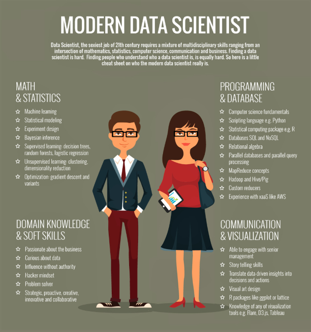
</div>
]


---
# Lern- und Berufsfeld Data Science

.pull-left[
## Berufsbilder im Bereich Data Science sind vielfältig

Data Scientist, Data Analyst, Data Engineer, Machine Learning Engineer, AI Researcher, Business Intelligence Analyst, Data Governance Specialist, Data Privacy Specialist, Data Visualization Specialist

## Ausbildung

- Immer mehr strukturierte Data-Science-Programme; Quereinstieg aus technischen Programmen
- Autodidaktische Lernwege zunehmend unrealistisch; Online-Kurse i.d.R. nicht ausreichend
- **Das Einhorn** "Umfassend ausgebildeter Data Scientist" (siehe rechts) **ist eine Illusion**
]

.pull-right-center[
<div align="center">
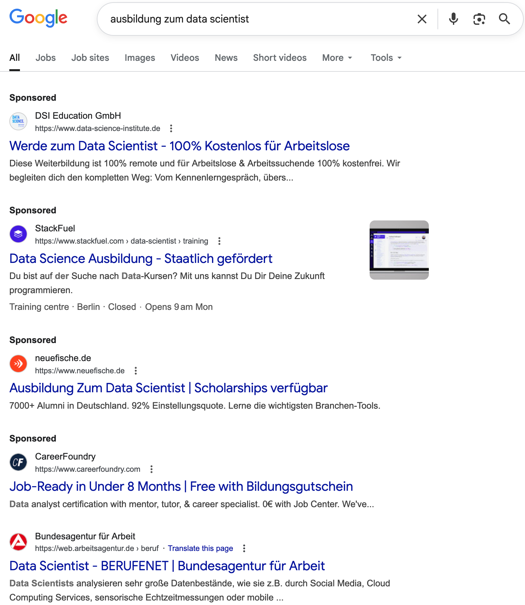
</div>
]


---
# Schwerpunkte in der Ausbildung: CSS-Master-Programme

<div align="center">
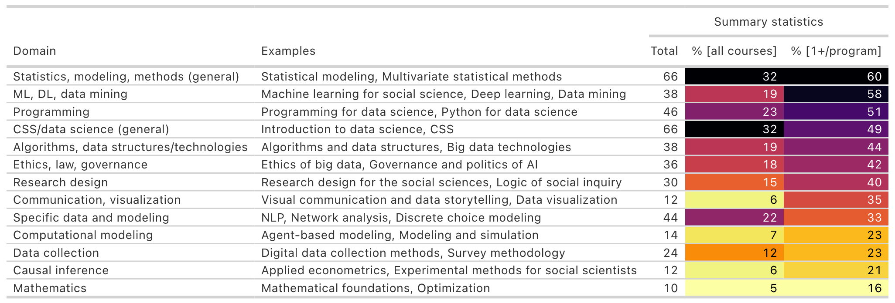
</div>

`Quelle` Eigene Datenerhebung (April 2024), CSS-Master-Programme in Europa und USA


---
# Beispiel: Master of Data Science for Public Policy

.pull-left[
## Hertie School Master of Data Science for Public Policy

- Interdisziplinäres Curriculum: Data Science, Policy, Governance, Leadership
- Hintergründe: Sozialwissenschaften, Informatik, Ingenieurswissenschaften, Mathematik, ...

<div align="center">
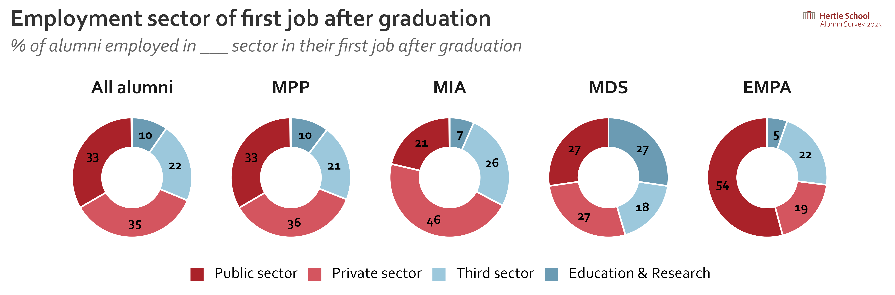
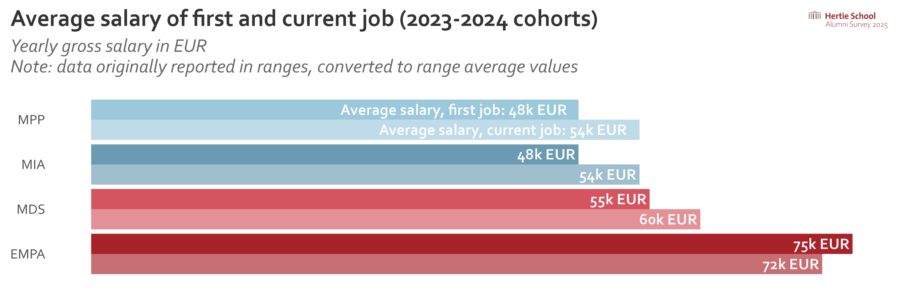
</div>
]

.pull-right[
<div align="center">
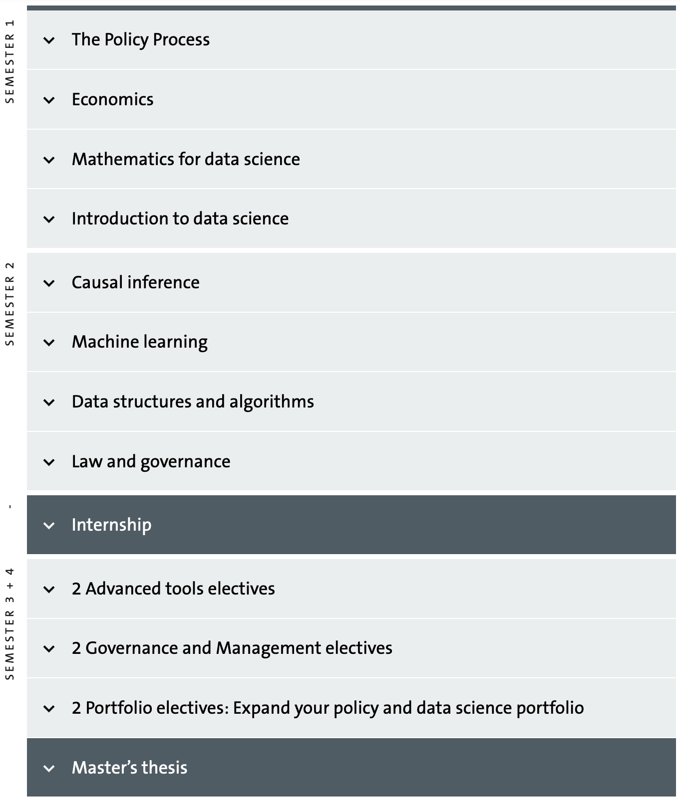
</div>
]


---
# Anforderungen in der Industrie

<div align="center">
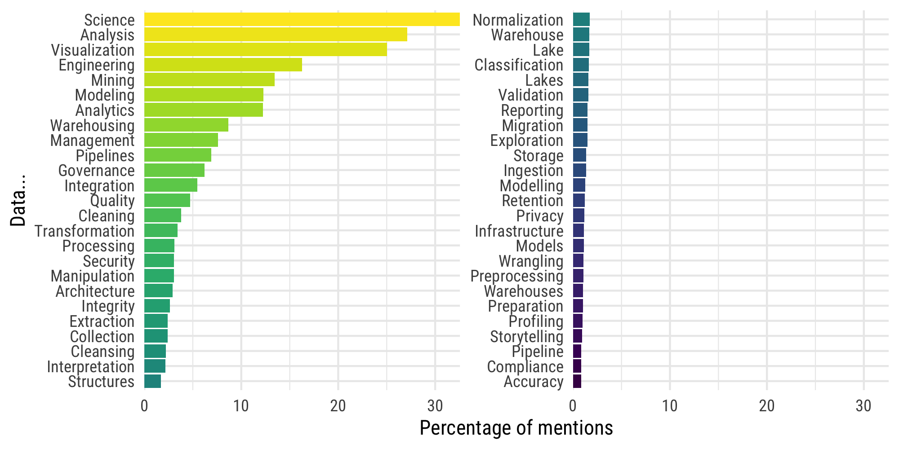
</div>

`Quelle` Eigene Darstellung; Daten: doi.org/10.34740/kaggle/dsv/8217982; scraped „Data Scientist“ job postings from LinkedIn; n=4,342; countries: US, UK, CA, AU

---
# Anforderungen in der Industrie II

<div align="center">
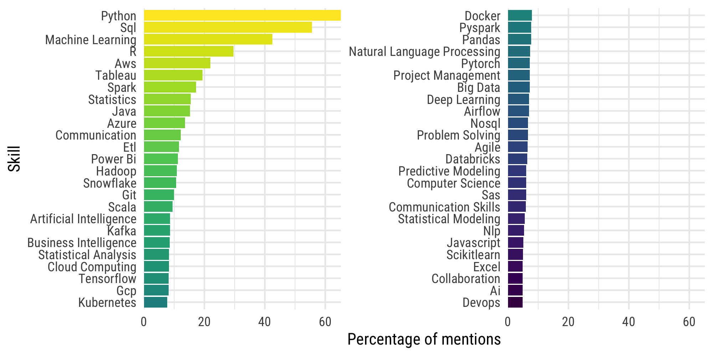
</div>

`Quelle` Eigene Darstellung; Daten: doi.org/10.34740/kaggle/dsv/8217982; scraped „Data Scientist“ job postings from LinkedIn; n=4,342; countries: US, UK, CA, AU


---
class: inverse, center, middle
name: job

# Data Science als Beruf
<html><div style='float:left'></div><hr color='#EB811B' size=1px style="width:1000px; margin:auto;"/></html>


---
# Berufsprofile im Vergleich

<table style="width:100%; table-layout:fixed; border-collapse:collapse; font-size:12px; line-height:1.25;">
  <caption style="caption-side:bottom; font-size:10px; text-align:left; padding-top:6px;">
    Gehaltsangaben: grobe Bandbreiten für Deutschland, brutto/Jahr, abhängig von Erfahrung, Standort, Branche; öffentlicher Dienst eher ~10–25% darunter (TVöD/TV-L).
  </caption>
  <thead>
    <tr>
      <th style="border:1px solid #ccc; padding:6px; text-align:left;">Rolle</th>
      <th style="border:1px solid #ccc; padding:6px; text-align:left;">Typischer Hintergrund</th>
      <th style="border:1px solid #ccc; padding:6px; text-align:left;">Kernfähigkeiten</th>
      <th style="border:1px solid #ccc; padding:6px; text-align:left;">Typische Tools/Tech</th>
      <th style="border:1px solid #ccc; padding:6px; text-align:left;">Einsatzgebiete</th>
      <th style="border:1px solid #ccc; padding:6px; text-align:left;">Gehaltsrange (DE)</th>
    </tr>
  </thead>
  <tbody>
    <tr>
      <td style="border:1px solid #ccc; padding:6px;">Data Scientist</td>
      <td style="border:1px solid #ccc; padding:6px;">Mathematik, Statistik, Informatik, VWL/BWL mit Quant-Fokus</td>
      <td style="border:1px solid #ccc; padding:6px;">Statistik, ML, Experimentdesign, Feature Engineering, Storytelling</td>
      <td style="border:1px solid #ccc; padding:6px;">Python (pandas, scikit-learn), R (tidyverse), SQL, Jupyter, Git</td>
      <td style="border:1px solid #ccc; padding:6px;">Prognosen, Scoring, Wirkungsanalyse, Policy-Analytics</td>
      <td style="border:1px solid #ccc; padding:6px;">55–95k €</td>
    </tr>
    <tr>
      <td style="border:1px solid #ccc; padding:6px;">AI/ML Scientist</td>
      <td style="border:1px solid #ccc; padding:6px;">Informatik/Mathematik, häufig M.Sc./Ph.D.</td>
      <td style="border:1px solid #ccc; padding:6px;">Modellentwicklung (NLP, CV), Evaluierung, Reproducibility, Forschung</td>
      <td style="border:1px solid #ccc; padding:6px;">PyTorch, TensorFlow, Transformers, CUDA, ML-Tracking</td>
      <td style="border:1px solid #ccc; padding:6px;">LLMs, Klassifikation, Generative AI, Prototyping</td>
      <td style="border:1px solid #ccc; padding:6px;">70–120k €</td>
    </tr>
    <tr>
      <td style="border:1px solid #ccc; padding:6px;">Machine Learning Engineer</td>
      <td style="border:1px solid #ccc; padding:6px;">Informatik, Software Engineering mit ML-Kenntnissen</td>
      <td style="border:1px solid #ccc; padding:6px;">Modell-Serving, APIs, Skalierung, Tests, CI/CD</td>
      <td style="border:1px solid #ccc; padding:6px;">Python, FastAPI, Docker/K8s, ONNX, Torch/TensorFlow</td>
      <td style="border:1px solid #ccc; padding:6px;">Produktivsetzung von Modellen, Realtime-Services</td>
      <td style="border:1px solid #ccc; padding:6px;">65–110k €</td>
    </tr>
    <tr>
      <td style="border:1px solid #ccc; padding:6px;">MLOps Engineer</td>
      <td style="border:1px solid #ccc; padding:6px;">Informatik, DevOps/Platform Engineering</td>
      <td style="border:1px solid #ccc; padding:6px;">Pipelines, Monitoring, Daten-/Modell-Governance, Sicherheit</td>
      <td style="border:1px solid #ccc; padding:6px;">Airflow, MLflow, DVC, Docker/K8s, Terraform, Prometheus</td>
      <td style="border:1px solid #ccc; padding:6px;">ML-Lebenszyklus, Compliance, Skalierung</td>
      <td style="border:1px solid #ccc; padding:6px;">70–115k €</td>
    </tr>
    <tr>
      <td style="border:1px solid #ccc; padding:6px;">Data Engineer</td>
      <td style="border:1px solid #ccc; padding:6px;">Informatik, Informationssysteme</td>
      <td style="border:1px solid #ccc; padding:6px;">Datenmodellierung, ETL/ELT, Batch/Stream, Data Quality</td>
      <td style="border:1px solid #ccc; padding:6px;">SQL, Python/Scala, Spark, dbt, Airflow, Kafka, Cloud DWH</td>
      <td style="border:1px solid #ccc; padding:6px;">Datenplattformen, Schnittstellen, Datenintegration</td>
      <td style="border:1px solid #ccc; padding:6px;">60–100k €</td>
    </tr>
    <tr>
      <td style="border:1px solid #ccc; padding:6px;">Analytics Engineer</td>
      <td style="border:1px solid #ccc; padding:6px;">Wirtschaftsinformatik, Data/BI-Background</td>
      <td style="border:1px solid #ccc; padding:6px;">Dimensional Modeling, Transformationslayer, Tests, Dokumentation</td>
      <td style="border:1px solid #ccc; padding:6px;">SQL, dbt, Git, BI-Semantik (LookML/Power BI), Airflow</td>
      <td style="border:1px solid #ccc; padding:6px;">Semantic Layer, Self-Service-BI, KPI-Definition</td>
      <td style="border:1px solid #ccc; padding:6px;">55–90k €</td>
    </tr>
    <tr>
      <td style="border:1px solid #ccc; padding:6px;">Data Analyst</td>
      <td style="border:1px solid #ccc; padding:6px;">BWL/VWL, Sozialwissenschaften, Statistik</td>
      <td style="border:1px solid #ccc; padding:6px;">Exploration, Reporting, A/B-Analyse, Datenerhebung</td>
      <td style="border:1px solid #ccc; padding:6px;">Excel, SQL, Power BI/Tableau, R/Python (grundlegend)</td>
      <td style="border:1px solid #ccc; padding:6px;">Standardberichte, Ad-hoc-Analysen, KPI-Monitoring</td>
      <td style="border:1px solid #ccc; padding:6px;">45–70k €</td>
    </tr>
    <tr>
      <td style="border:1px solid #ccc; padding:6px;">BI Analyst</td>
      <td style="border:1px solid #ccc; padding:6px;">Wirtschaftsinformatik, BWL mit Datenfokus</td>
      <td style="border:1px solid #ccc; padding:6px;">Dashboarding, Requirements, Datenmodellierung leicht</td>
      <td style="border:1px solid #ccc; padding:6px;">Power BI, Tableau, DAX/MDX, SQL</td>
      <td style="border:1px solid #ccc; padding:6px;">Management-Reporting, Fachbereichssteuerung</td>
      <td style="border:1px solid #ccc; padding:6px;">45–75k €</td>
    </tr>
    <tr>
      <td style="border:1px solid #ccc; padding:6px;">Data Product Manager</td>
      <td style="border:1px solid #ccc; padding:6px;">Wi.-Informatik, Produktmanagement, Analytics</td>
      <td style="border:1px solid #ccc; padding:6px;">Roadmaps, Stakeholder mgmt., Priorisierung, Datenschutz</td>
      <td style="border:1px solid #ccc; padding:6px;">Jira, Confluence, SQL (lesen), BI/ML-Toolkenntnisse</td>
      <td style="border:1px solid #ccc; padding:6px;">Datenprodukte, Portale, interne Plattformen</td>
      <td style="border:1px solid #ccc; padding:6px;">70–110k €</td>
    </tr>
    <tr>
      <td style="border:1px solid #ccc; padding:6px;">Data Steward / Data Governance</td>
      <td style="border:1px solid #ccc; padding:6px;">Wi.-Informatik, Verwaltung, Compliance</td>
      <td style="border:1px solid #ccc; padding:6px;">Datenkataloge, Qualität, Metadaten, Richtlinien</td>
      <td style="border:1px solid #ccc; padding:6px;">Collibra, Purview, DSGVO-Tools, SQL (lesen)</td>
      <td style="border:1px solid #ccc; padding:6px;">Governance, Datenschutz, Domänen-Ownership</td>
      <td style="border:1px solid #ccc; padding:6px;">55–90k €</td>
    </tr>
  </tbody>
</table>


---
# Beispiel Berufsbild Data Scientist (von indeed.com)

<div align="center">
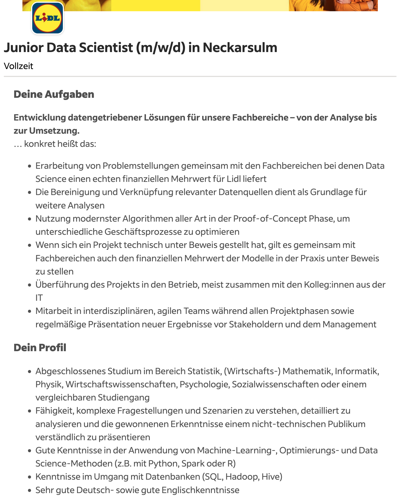
</div>


---
# Beispiel Berufsbild Data Engineer (von indeed.com)

<div align="center">
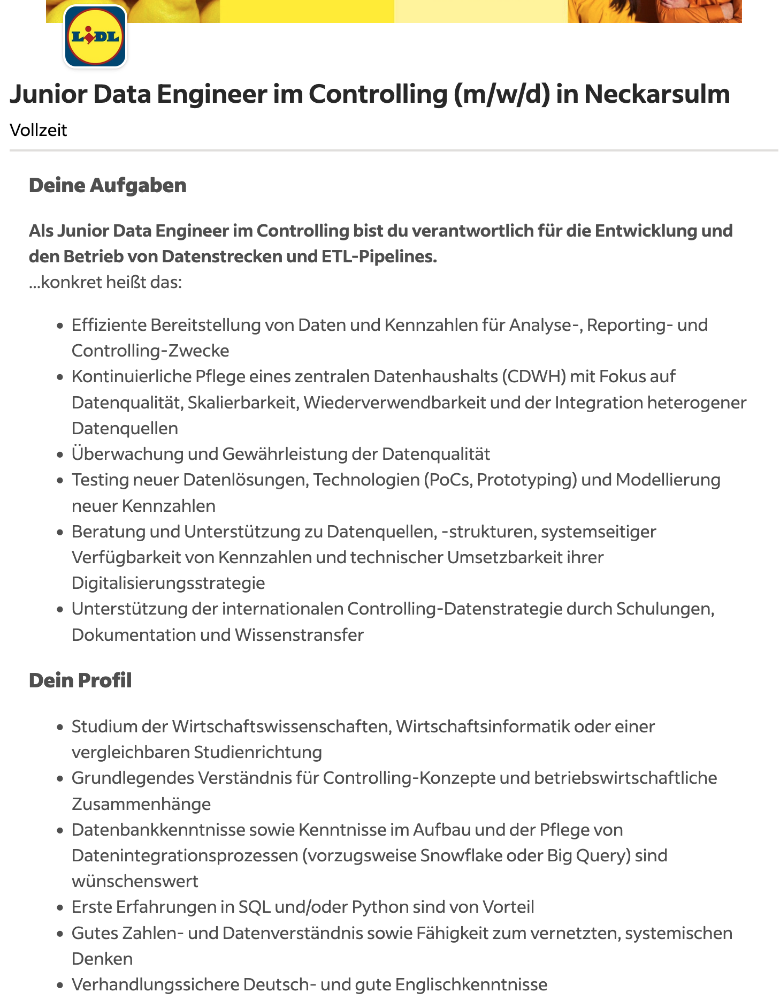
</div>


---
# Beispiel Berufsbild Data Analyst (von indeed.com)

<div align="center">
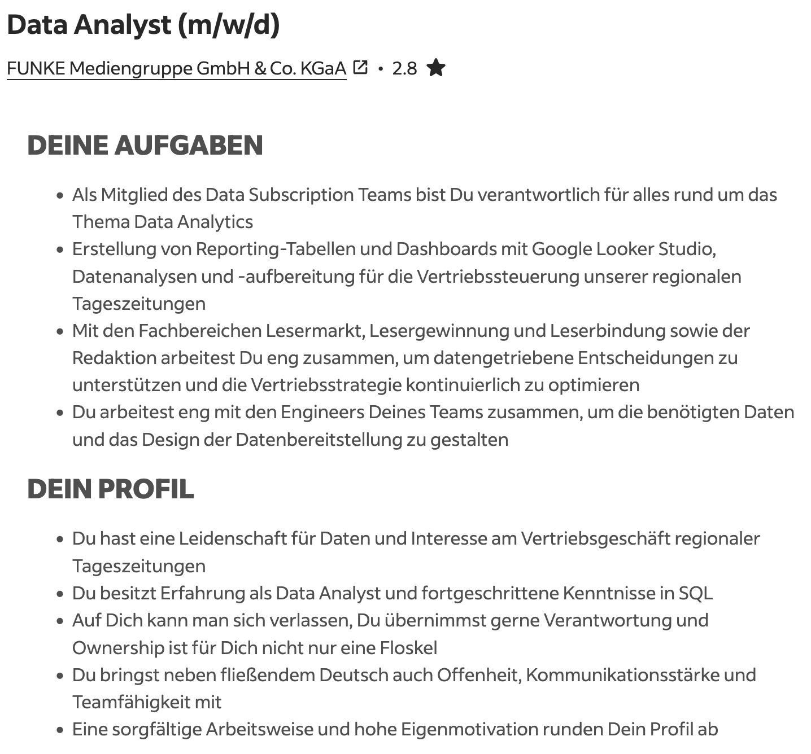
</div>


---
class: inverse, center, middle
name: recruitment

# Rekrutierung und Bindung von Data Scientists
<html><div style='float:left'></div><hr color='#EB811B' size=1px style="width:1000px; margin:auto;"/></html>


---
# Rekrutierung von Data Scientists in Behörden

.pull-left[
<br>
## Herausforderungen

- Hohe Konkurrenz durch Privatwirtschaft und Forschung  
- Eingeschränkte Gehaltsbänder (TVöD/TV-L)  
- Langwierige Bewerbungsprozesse, geringe Flexibilität  
- Unklare Rollenbilder und Karrierepfade  
- Technische Infrastruktur und Datenzugänge  
]

.pull-right[
<br>
<div align="center">

</div>
]

---

# Strategien zur Gewinnung von Data Scientists

.pull-left[
## 1. Attraktivität des Umfelds betonen  
- **Sinnstiftung**: Arbeiten für das Gemeinwohl  
- **Interdisziplinarität**: Schnittstelle zwischen Technik, Gesellschaft, Politik  
- Perspektive **Public Data Career**

## 2. Strukturelle Hürden abbauen  
- Schnellere Verfahren, weniger Formalismus  
- Einstiegsprogramme, duale Pfade (z.B. Trainee, Fellowship)  
- Möglichkeiten für Teilzeit, Remote, flexible Tools  
]

.pull-right[
## 3. Employer Branding  
- Sichtbarkeit auf Tech- und Data-Plattformen (z.B. Kaggle, GitHub)  
- Authentische Team-Vorstellungen (Blog, Konferenzen)  
- Kooperationen mit Hochschulen und Weiterbildungsanbietern  

## 4. Passende Profile suchen  
- Kombination aus **Analytik-** und **Verwaltungskompetenz**  
- Offenheit für Quereinsteiger:innen mit Lernbereitschaft  
- Fokus auf **Team-Komplementarität**, nicht nur Einzelstars  
]

---

# Bindung und Weiterentwicklung von Data Scientists

.pull-left[
## 1. Fachliche Entwicklung fördern  
- Zeit und Budget für Fortbildungen, Konferenzen, Communities  
- Interne Austauschformate, z.B. "Data Fridays" oder Brownbag Talks  

## 2. Karrierepfade schaffen  
- Transparente Beförderungskriterien für Data-Rollen  
- Anerkennung von Impact statt Hierarchie  

## 3. Gute Führungskultur  
- Verständnis für datengetriebene Arbeit im Management  
- Vertrauen, Experimentierfreude, Fehlerkultur  
]

.pull-right[
## 4. Moderne Arbeitsbedingungen  
- Aktuelle Hardware, Cloudzugänge, Entwicklungsumgebungen  
- Austausch mit externen Communities  
- Flexible Arbeitszeiten und Remote-Arbeit

<br><br>
## Zukunftsbild
Eine Verwaltung, die **Datenkompetenz als zentrale Fähigkeit** versteht –
nicht nur für Spezialist:innen, sondern als Teil moderner Governance.  
]


---
class: exercise, center, middle

# Übung

.content-box-white[
**Stellenausschreibungs-Kritik service.bund.de**

<div align="left">
<ol>
  <li>Teams von jeweils 3 Personen</li>
  <li>Eine Ausschreibung pro Team</li>
  <li>Diskussion: 
    <ul>
      <li>Welche Rolle wird gesucht?</li>
      <li>Welche Anforderungen werden gestellt?</li>
      <li>Welche Tools/Skills werden erwartet?</li>
      <li>Was fehlt? Was ist gut?</li>
      <li>Wie könnte die Anzeige verbessert werden?</li>
    </ul>
  </li>
  <li>15 Minuten, dann gemeinsame Diskussion </li>
</ol>
</div>
]
