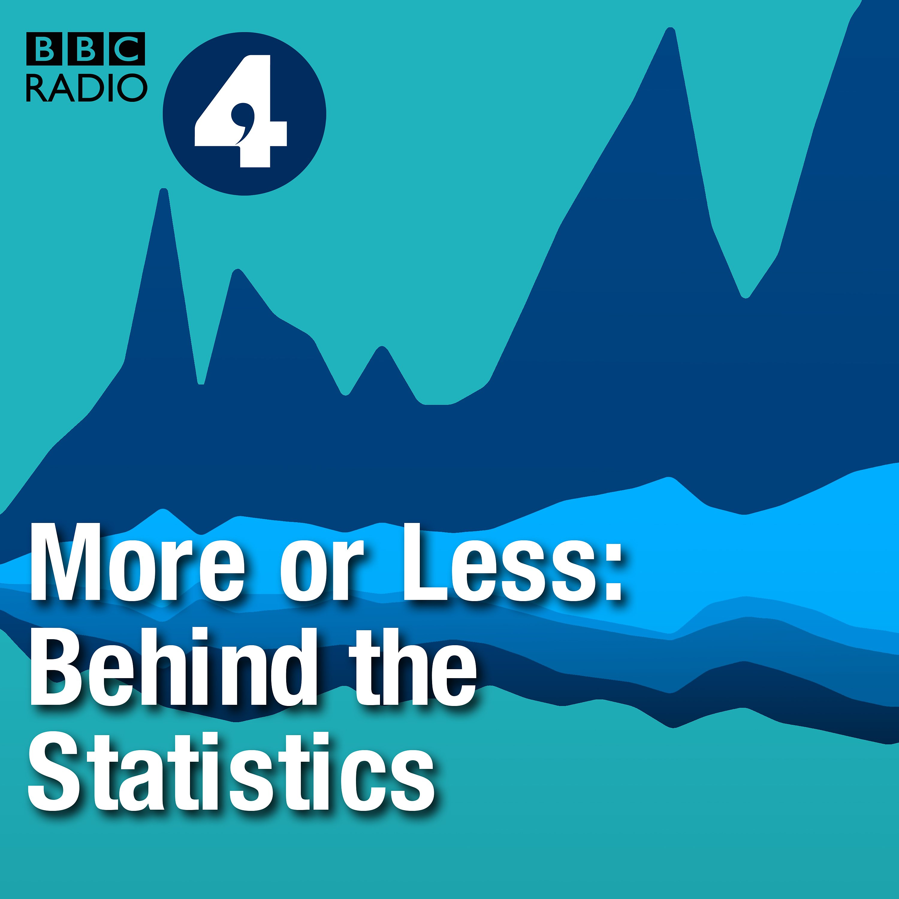

```{css, echo=FALSE} 
@media print { # print out incremental slides; see https://stackoverflow.com/questions/56373198/get-xaringan-incremental-animations-to-print-to-pdf/56374619#56374619
.has-continuation {
display: block !important;
}
}
```

```{r setup, include=FALSE}
# figures formatting setup
options(htmltools.dir.version = FALSE)
library(knitr)
opts_chunk$set(
  prompt = T,
  fig.align="center", #fig.width=6, fig.height=4.5, 
  # out.width="748px", #out.length="520.75px",
  dpi=300, #fig.path='Figs/',
  cache=T, #echo=F, warning=F, message=F
  engine.opts = list(bash = "-l")
)

## Next hook based on this SO answer: https://stackoverflow.com/a/39025054
knit_hooks$set(
  prompt = function(before, options, envir) {
    options(
      prompt = if (options$engine %in% c('sh','bash')) '$ ' else 'R> ',
      continue = if (options$engine %in% c('sh','bash')) '$ ' else '+ '
    )
  })

library(tidyverse)
library(hrbrthemes)
library(fontawesome)
library(RefManageR)

RefManageR::BibOptions(
  check.entries = FALSE,  
  bib.style = "authoryear", 
  cite.style = "authoryear", 
  style = "markdown",
  hyperlink = TRUE, 
  dashed = TRUE)

bib <-  RefManageR::ReadBib("grateful-refs.bib")


```

# Überblick

<br><br><br><br>

1. [Lessons learned, feedback](#lessonslearned)

2. [Abschlussaufgabe](#aufgabe)


<!-- ############################################ -->
---
class: inverse, center, middle
name: lessonslearned

# Lessons learned, feedback

<html><div style='float:left'></div><hr color='#EB811B' size=1px style="width:1000px; margin:auto;"/></html>


---
# Was ich Euch mitgeben wollte

.pull-left[
<br><br><br>
1. **Intuition** für Daten und Datenqualität

2. **Einblick** in das Handwerkszeug eines Data Scientists

3. **"Bullshit detection skills"** für AI-Applikationen, insbesondere bezüglich Dateninput

4. **Inspiration** für die Nutzung von Daten und die Einbindung von Data Scientists in Eurer Behörde
]

.pull-right[
<br>
<div align="center">

</div>
]


---
class: exercise, center, middle

# Abschlussrunde

.content-box-white[
**Was habt Ihr mitgenommen?**

Was sind Daten für Euch? Was ist Data Science für Euch? Was ist die wichtigste Erkenntnis, die Ihr aus den letzten drei Tagen mitnehmt?
]


---
class: exercise, center, middle

# Evaluation

.content-box-white[
**Zeit für die Evaluation!**

Bitte geht auf MyStudies und nehmt dort an der Evaluation teil. Ich bin sind sehr dankbar für Euer Feedback!
]


<!-- ############################################ -->
---
class: inverse, center, middle
name: aufgabe

# Abschlussaufgabe

<html><div style='float:left'></div><hr color='#EB811B' size=1px style="width:1000px; margin:auto;"/></html>


---
# Abschlussaufgabe

.pull-left-vwide[

Erstellen Sie gemeinsam mit einem/einer Kursteilnehmer/in eine Podcast-Aufnahme, die mindestens 2 der 3 folgenden Elemente beinhaltet. 

1. **Einblick in einen Daten-Use-Case aus Ihrer Behörde**: Stellen Sie einen interessanten Fall aus Ihrer Arbeit vor, bei dem Daten eine zentrale Rolle spielen – z.B. ein innovatives Projekt, ein internes Verfahren, etc. Das kann ein Best- oder Worst-Practice-Beispiel sein (oder etwas dazwischen). Gehen Sie dabei auch auf Konzepte aus dem Kurs ein, z.B. Datenqualität, Schnittstellen, Weiternutzung, etc.

2. **Daten-Fail der Woche**: Bringen Sie einen aktuellen Nachrichtenartikel, Blogbeitrag oder Social-Media-Post mit, in dem eine problematische oder missverständliche Datennutzung beschrieben wird (kann, muss aber nicht KI-bezogen sein). Diskutieren Sie gemeinsam, was schiefgelaufen ist und was man daraus für den Umgang mit Daten lernen kann. Als Inspiration kann der Podcast *More or Less: Behind the Stats* dienen.

3.  **Blick in die Zukunft**: Diskutieren Sie Ihre Vision für den zukünftigen Umgang mit Daten in Ihrer Behörde oder Einheit.
]

.pull-right-vsmall[
<br>
<div align="center">

</div>
<br>
<div align="center">

</div>
]


---
# Technische Hinweise

.pull-left-vwide[
## Tonaufnahme

- Schafft Euch bitte kein extra Equipment an. Ein Smartphone oder Laptop reicht aus. (Falls Ihr sowieso mit dem Gedanken spielt: Einfache, günstige Geräte wie [dieses hier](https://www.amazon.de/gp/product/B08CVP2HXP/) funktionieren gut und machen auch Videocalls für die Gegenüber potentiell angenehmer.)
- Nutzt eine App wie [Voice Memos](https://apps.apple.com/us/app/voice-memos/id1069512134) (iOS), [Voice Recorder](https://play.google.com/store/apps/details?id=com.media.bestrecorder.audiorecorder) (Android) oder [Audacity](https://www.audacity.de/) (Windows, Mac, Linux). Nehmt am besten redundant auf, also mit zwei Geräten.
- Nutzt die Aufnahmefunktion von [Zoom](https://www.heise.de/tipps-tricks/Zoom-Meeting-aufzeichnen-so-geht-s-4690035.html), [Teams](https://support.microsoft.com/de-de/office/aufzeichnen-einer-besprechung-in-microsoft-teams-34dfbe7f-b07d-4a27-b4c6-de62f1348c24), etc.
- Nutzt Kopfhörer, um Rückkopplungen zu vermeiden.
]

.pull-right-vsmall[
<br>
<div align="center">

</div>
]

---
# Technische Hinweise

.pull-left-vwide[
## Länge und Gruppen

**Länge der Aufnahme: Maximal 20 Minuten.** Es sind auch Aufnahmen einer dreiköpfigen Gruppe möglich (dann Länge max. 30 Minuten).

**Team-Bildung:** Wenn Ihr Euch schon als Team zusammengefunden habt, teilt mir das bitte bis nächsten Montag, 13. Oktober, 18 Uhr mit. Alle anderen Teams stelle ich zusammen.


## Schnitt/Zusammenführung/Format

- Ich erwarte keine aufwändige Postproduktion. Es reicht, wenn Ihr die Aufnahme am Anfang und am Ende kürzt und die beiden Teile zusammenfügt (wenn nicht sowieso durch Aufnahme mit einem Gerät erledigt).
- Als Format der Aufnahme wählt bitte `mp3` oder `m4a`. Reicht die Datei bis **12. November** über Moodle ein. Ein Upload pro Team reicht.
]

.pull-right-vsmall[
<br>
<div align="center">

</div>
]


