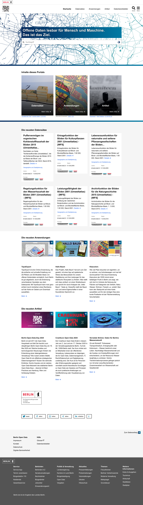
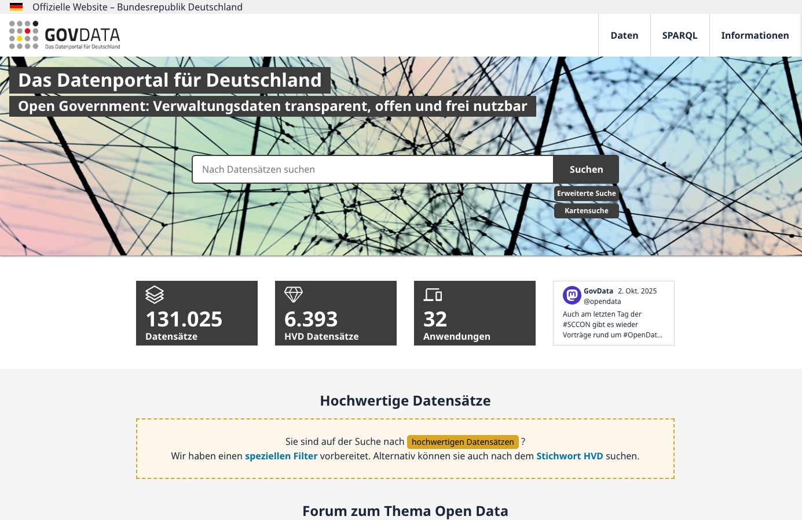

<html><div style='float:left'></div><hr color='#EB811B' size=1px style="width:1000px; margin:auto;"/></html>

---
name: lernziele
# Lernziele

- **Verstehen**, wie vollständige **Daten-Workflows** in Behörden aussehen — von der Datenerzeugung bis zur Veröffentlichung.  
- **Anwenden**, wie **Datenmanagementpläne (DMPs)** gestaltet werden, damit Prozesse nachvollziehbar und rechtssicher sind.  
- **Bewerten**, welche **Infrastruktur-Bausteine** (DB, ETL/ELT, Kataloge, APIs) wofür geeignet sind.  
- **Übertragen** auf ein konkretes Beispiel: ein **behördeninterner Chatbot**, der Akten findet, erklärt und **Quellen transparent** angibt.

.small[Die Folien folgen dem bekannten Stil und fassen Konzepte in **einfacher Sprache** zusammen.]

<html><div style='float:left'></div><hr color='#EB811B' size=1px style="width:1000px; margin:auto;"/></html>

---
name: agenda
# Agenda

1. **Fallstudie**: Der Akten-Chatbot (Zielbild & Nutzen)  
2. **Daten-Workflow**: End-to-End in der Behörde  
3. **Datenmanagementpläne (DMPs)**: Klar, knapp, praxistauglich  
4. **Infrastruktur**: Speichern, Verarbeiten, Bereitstellen  
5. **ELT vs. ETL**: Was passt wozu?  
6. **Open Government Data**: Portale, Metadaten, Lizenzen  
7. **Betrieb & Qualität**: Monitoring, Versionierung, Verantwortlichkeiten  
8. **Mini-Übung**: Metadaten prüfen & Verbesserungen vorschlagen

---
class: middle
name: chatbot-intro
# Fallstudie: Der Akten-Chatbot — Worum geht es?

.pull-left[
**Ziel**  
Mitarbeitende sollen **schnell, verständlich und transparent** Antworten aus Akten erhalten. Der Chatbot:  
- durchsucht **Metadaten** und **Dokumente** (PDF, Word).  
- fasst Inhalte **in Klartext** zusammen.  
- zeigt **genau an**, **woher** die Information stammt (Akte/Seite/Abschnitt, Link).  
- respektiert **Zugriffsrechte** (nur sehen, was erlaubt ist).
]

.pull-right[
**Typische Fragen**  
- *„Wie ist der aktuelle Genehmigungsstand Fall X?“*  
- *„Welche Auflagen wurden im Bescheid vom 12.04.2024 gemacht?“*  
- *„Bitte die wichtigsten Änderungen der letzten 30 Tage zu Vorgang Y.“*  

**Ergebnis**  
- Eine Antwort mit **Quellnachweisen** und ggf. **Originalauszügen** (Snippet + Link).
]

---
name: workflow-ueberblick
# Der Daten-Workflow in der Behörde — End-to-End

.pull-left[
**1) Bedarf klären**  
Welche Fragen soll der Chatbot beantworten? Welche Akten & Felder sind relevant?

**2) Daten gewinnen**  
Metadaten aus Fachverfahren, Dokumente aus Dateiablagen, optional OGD-Ressourcen.

**3) Qualität sichern**  
Plausibilitäten, Duplikate, Dateiformate, fehlende Felder — **automatisiert prüfen**.

**4) Speichern & Zugreifen**  
Rohdaten im Staging, kuratierte Sichten für Suche & Antworten.
]

.pull-right[
**5) Analysieren & aufbereiten**  
Indizes/Embeddings für Suche, SQL-Views für Kennzahlen, Regeln für Zitate.

**6) Bereitstellen**  
Interne API für den Chatbot; optional Veröffentlichung ausgewählter Daten als Open Data.

**7) Betreiben & verbessern**  
Monitoring, Nutzungsfeedback, Änderungslog, regelmäßige DMP-Updates.
]

.small[Wir nutzen diesen Ablauf gleich in jedem Abschnitt am **Chatbot-Beispiel**.]

---
name: dmp-einfach
# Datenmanagementplan (DMP) — kurz & alltagstauglich

.pull-left[
**Wozu?**  
Der DMP ist die **Betriebsanleitung** für Daten: Was liegt wo, warum, wie lange, wer darf was, und welche Regeln gelten?  
**Nutzen**: Nachvollziehbarkeit, Rechtssicherheit (DSGVO), Qualität, Wiederverwendung.
]

.pull-right[
**Was muss rein? (Chatbot-Kontext)**  
- **Bestand**: Akten-Metadaten, Dokumente, Zugriffsrechte.  
- **Rechtslage**: Zweckbindung, Löschfristen, Veröffentlichung.  
- **Struktur**: Tabellenfelder, Dateiformate, Versionierung.  
- **Metadaten**: Titel, Beschreibung, Lizenz, Kontakt (DCAT-AP.de, wo sinnvoll).  
- **Veröffentlichung**: Was bleibt intern? Was kann auf’s Portal?
]

---
name: dmp-checkliste
# DMP-Checkliste für den Chatbot

- **Rollen**: Data Owner (Fachbereich), Data Steward (Qualität/Metadaten), Plattform-Team (Betrieb), Datenschutz.  
- **Datenfluss**: Wie kommen neue Akten/Dokumente ins System? (Rhythmus, Verantwortliche)  
- **Qualität**: Mindestfelder, Pflicht-Metadaten, Prüfregeln (z. B. Datum, Aktenzeichen).  
- **Rechte**: Wer sieht welche Akten? (RBAC/ABAC)  
- **Transparenz**: Wie werden **Quellenangaben** im Chatbot erzeugt und getestet?  
- **Schnittstellen**: Interne API, optional Open-Data-Publikation.

---
name: infra-bausteine
# Infrastruktur — was braucht der Chatbot wirklich?

.pull-left[
**Speichern**  
- **PostgreSQL** (Metadaten, Rechte, kuratierte Sichten)  
- **Objektspeicher** (PDF/Scans)  
- **Suchindex/Embeddings** (schnelle Textsuche)
]

.pull-right[
**Verarbeiten**  
- **Pipelines** (Airflow/Prefect/GitHub Actions) für Import, Qualität, Aktualisierung  
- **Transformationen** in DB (SQL/dbt) — nachvollziehbar & versioniert  
- **API** (REST) für den Chatbot + **Audit-Logs**
]

.small[Einfacher Start, später erweiterbar: erst Metadaten-Suche, dann Volltext/Embeddings.]

---
name: etl-elt
# ETL vs. ELT — einfach erklärt am Chatbot

.pull-left[
**ETL (Extract → Transform → Load)**  
- Vor dem Laden wird stark bereinigt/vereinfacht.  
- **Gut**, wenn Quellsysteme sehr uneinheitlich sind und zuerst „aufgeräumt“ werden muss.  
- **Risiko**: Details gehen verloren, Nachvollziehbarkeit sinkt.
]

.pull-right[
**ELT (Extract → Load → Transform)**  
- **Alles erst laden**, dann **im Zielsystem** aufbereiten (SQL, dbt).  
- **Vorteil**: Rohdaten bleiben erhalten, bessere Reproduzierbarkeit.  
- **Für den Chatbot** ideal: verschiedene Sichten für Suche, Antworten, Open Data.
]

---
name: elt-pipeline
# ELT-Pipeline — Schritt für Schritt (Chatbot)

1. **Extract**: Neue/aktualisierte Akten-Metadaten + Dokument-Verweise abholen (APIs, Dateifreigaben).  
2. **Load**: Rohdaten unverändert ins Staging (DB + Objektspeicher).  
3. **Transform**:  
   - **Kuratierte Tabellen/Views** für Suche & Antworten (z. B. `akten_kern`, `dokumente_index`).  
   - **Qualitätsprüfungen** (Plausibilitäten, Pflichtfelder).  
   - **Provenienzfelder** für transparente Quellenangabe.  
4. **Serve**: Interne API für den Chatbot (Fragen rein → Antwort + **Quellnachweise** raus).  
5. **Publish (optional)**: Freigegebene Tabellen automatisiert ans Open-Data-Portal.

---
name: transparenz
# Transparenz im Chatbot — wie entstehen Quellenangaben?

.pull-left[
**Prinzip**  
Jede Antwort enthält **Zitate** mit: *Akte*, *Dokument*, *Seite/Abschnitt*, *Zeitstempel*, *Link* (oder Pfad).  
So können Mitarbeitende die Antwort **prüfen** und im Original **nachlesen**.
]

.pull-right[
**Umsetzung**  
- Beim Zusammenstellen der Antwort werden die **Trefferstellen** (IDs, Seiten) mitgegeben.  
- In der DB gibt es **Provenienz-Spalten** (z. B. `quelle_dokument_id`, `quelle_seite`).  
- Die API liefert Antwort + **Liste der Quellen**; der Chatbot rendert diese als Fußnoten/Box.
]

---
name: open-data
# Open Government Data — was veröffentlichen wir sinnvollerweise?

.pull-left[
**Nicht alles ist öffentlich**  
Personenbezogenes, vertrauliche Inhalte, laufende Verfahren bleiben **intern**.  
**Öffentlich** sind z. B. aggregierte Kennzahlen, anonymisierte Metadaten, Prozesslaufzeiten.
]

.pull-right[
**Portale & Metadaten**  
- Veröffentlichung auf **daten.berlin.de** (CKAN) oder **GovData** via **DCAT-AP.de**.  
- **Lizenzen** klar und maschinenlesbar angeben (z. B. Datenlizenz Deutschland, CC BY/CC0).  
- **Kontaktstelle** & **Aktualisierungsrhythmus** nennen.
]

---
name: portal-beispiele
# Portale & APIs — Beispiele einbinden

.pull-left[
**Berlin Portal (CKAN)**  
- Nutzer:innen finden Datensätze über Suche/Filter.  
- Metadaten & Ressourcen (CSV/GeoJSON/PDF) sind verlinkt.  
- **Action-API** für Abfragen, z. B. `package_search`.
]

.pull-right[
```{r, echo=FALSE, message=FALSE, warning=FALSE}
# Live-Screenshots beim Rendern erzeugen (Internet & webshot2 nötig)
if (requireNamespace("webshot2", quietly = TRUE)) {
  if (!file.exists("berlin-portal.png")) {
    webshot2::webshot("https://daten.berlin.de/", file = "berlin-portal.png", vwidth = 1400, vheight = 900)
  }
  
} else {
  cat("Hinweis: Paket 'webshot2' nicht installiert – Portal live zeigen.")
}
```
]

.small[Quelle: daten.berlin.de — CKAN]

---
name: ckan-api
# CKAN-API — kurze Demo (lesbar & anpassbar)

.pull-left[
**Suchen**  
`GET https://daten.berlin.de/api/3/action/package_search?q=bau`  

**Details**  
`GET .../api/3/action/package_show?id=<dataset-id>`  

**Ressource**  
`GET .../api/3/action/resource_show?id=<resource-id>`
]

.pull-right[
```{r, eval=FALSE}
# R-Beispiel: CKAN-Suche
library(httr); library(jsonlite)
res <- GET("https://daten.berlin.de/api/3/action/package_search",
           query = list(q = "bau", rows = 5))
dat <- content(res, as="text", encoding="UTF-8") |> fromJSON(flatten=TRUE)
dat$result$results[, c("title","id","organization.title")]
```
]

---
name: govdata
# GovData & DCAT-AP.de

.pull-left[
**GovData** bündelt offene Verwaltungsdaten (Bund/Länder/Kommunen).  
**DCAT-AP.de** sorgt dafür, dass Portale kompatibel sind (gemeinsame Metadatenfelder).  
Unser Chatbot kann — falls erlaubt — auch **OGD-Bestände** referenzieren.
]

.pull-right[
```{r, echo=FALSE, message=FALSE, warning=FALSE}
if (requireNamespace("webshot2", quietly = TRUE)) {
  if (!file.exists("govdata.png")) {
    webshot2::webshot("https://www.govdata.de/", file = "govdata.png", vwidth = 1400, vheight = 900)
  }
  
}
```
]

---
name: qualitaet-betrieb
# Qualität & Betrieb — pragmatisch geregelt

- **Tests**: Pflichtfelder, Wertebereiche, eindeutige Aktenzeichen; automatisiert in der Pipeline.  
- **Versionierung**: SemVer für Sichten/Modelle, **Änderungslog** (Was hat sich geändert? Warum?).  
- **Monitoring**: Ladezeiten, Fehlerraten, API-Verfügbarkeit, Suchqualität (Treffergenauigkeit).  
- **Support**: Kontaktadresse, Ticket-Prozess, Reaktionszeiten.  
- **Datenschutz**: Zugriffsebenen prüfbar (Audit-Logs), Löschfristen automatisiert.

---
name: rollout
# Rollout-Plan in kleinen, sicheren Schritten

1. **Pilot** mit einem Fachbereich (begrenzter Aktenbestand).  
2. **Such-Chat** nur auf **Metadaten** → frühes Feedback zur Treffqualität.  
3. **Dokumenteinbindung** (Auszüge) + **Quellenbox** in Antworten.  
4. **Rechteprüfung** vor Anzeige; Schulung & Leitfaden.  
5. **Skalierung** auf weitere Bereiche; OGD-Teilmengen veröffentlichen.

---
name: mini-uebung
# Mini-Übung (15') — Metadaten & Transparenz einschätzen

1. Wählen Sie zu einem Thema einen Datensatz auf **daten.berlin.de**.  
2. Prüfen Sie die Metadaten: **Lizenz, Aktualität, Kontakt, Ressourcen**.  
3. Notieren Sie 2 Verbesserungen für **Suchbarkeit** und **Transparenz**.  
4. Überlegen Sie, welche Felder/Prüfungen Ihrem **Chatbot** helfen würden (z. B. eindeutige Dokument-IDs).

---
name: weiterfuehrend
# Weiterführende Ressourcen (Auswahl)

- **Berlin Open Data (CKAN)** – Portal & API-Doku  
- **GovData** – Nationales Portal, Infos zu DCAT-AP.de  
- **DCAT-AP.de Leitfäden** – Metadaten für Verwaltungen  
- **dbt, Airflow/Prefect** – Transformation & Orchestrierung  
- **Great Expectations** – Datenqualität als Code

---
class: inverse, center, middle
name: qna
# Fragen? Beispiele aus Ihrer Praxis!
